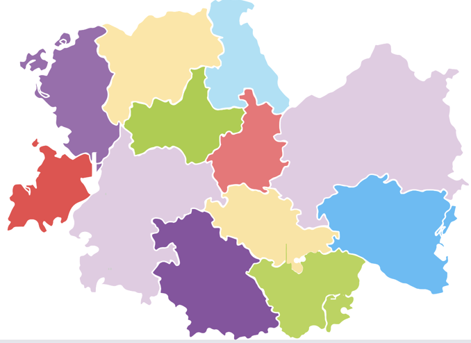

# CSPs VS Search

## What we have learned so far
🔎 In the past two weeks, we discussed a class of problems that can be formulated as a set of states (configurations) and transitions between them. We called these problems search problems. Our goal was to find a sequence of transitions (via actions) that leads from the initial state to a goal state. We have seen how to model these problems and how to solve them using different search algorithms. 

  

We've also learned about situations where we have two agents competing against each other. While discussing this type of search problems, we learned about game theory and adversarial search. We have seen how to model them as games, and how to solve them.

We've also learned about optimization techniques that are very helpful in solving search problems like heuristics, pruning, depth-limiting, and more.

This week, we will discuss a different class of problem called constraint satisfaction problems (CSPs). 

🗺️ Suppose that we have a map of 7 adjacent countries, and we want to color each country with one of 3 colors. We want to make sure that no two adjacent countries have the same color. How can we do that? Is this a search problem?

  

Well, we can perfectly think of this problem as a search problem. We can define the states as the different ways of coloring the countries. We can define the actions as coloring a country with a color. We can define the initial state as the state where no country is colored and so on. But, if you think a bit deeply, this is not a good way to model this problem. Why? Because, we would end up with a huge search space where the problem is actually simpler. Here are a few things to consider:
1. We don’t need a sequence of actions to solve this problem; we can assign colors to countries in any order as the sequence does not affect the outcome. 
2. We don’t need to search for a goal state; instead, we need to find a viable solution.
3. The color of a country doesn't depend on the color of other countries. However, there is a constraint that restricts the colors that a country can take based on the colors of its neighbors.

So, we can model this problem in a different way that's more suitable and more efficient. 

## What is a CSP?
A constraint satisfaction problem (CSP) is a problem where we have a set of variables (like the 7 countries to be colored), each with a domain of possible values (like Red, Green, and Blue), and a set of constraints that restrict the values that these variables can take (i.e. no two adjacent countries can have the same color). You can think of CSPs as a specialized search problems.

Our goal is to find an assignment of values to variables that satisfies all the constraints. 

## Summary:
- Constraint satisfaction problems (CSPs) are a specialized class of search problems that can be modeled as a set of variables, each with a domain of possible values, and a set of constraints that restrict the values that these variables can take. We will learn more powerful techniques to solve these problems that perform better than the search algorithms we learned before.

- Our goal is to find an assignment of values to variables that satisfies all the constraints.

<!-- 
It's important to understand that we made certain assumptions about the world. We assumed that the world is deterministic, fully observable, and static. In other words, we assumed that the world is fully known to us, and that it doesn't change while we are solving the problem and the actions we take are guaranteed to have the expected outcome.
-->
