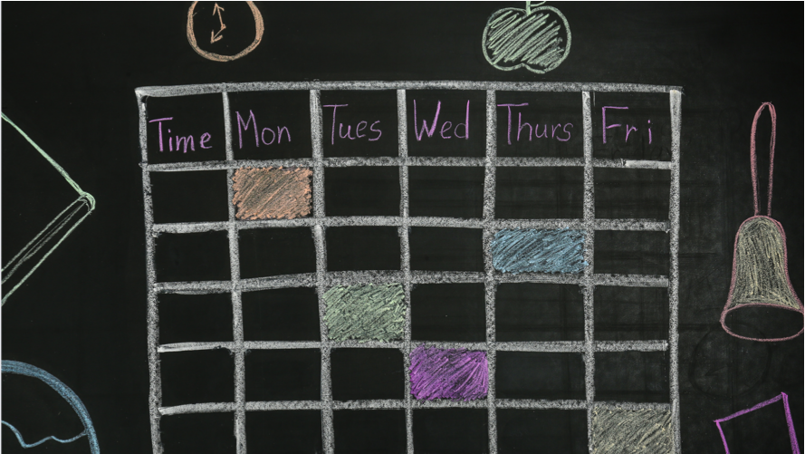

# Constraint Satisfaction Problems

  

🛍️ Imagine you're given the task of designing the layout for a brand-new store. Your goal is to arrange everything—from shelves to checkout counters—in a way that maximizes customer flow and boosts sales. But, there's a catch: you have to work within the limited space of the store. How do you decide where to place each item so that customers can move freely, find what they need easily, and ensure the store can operate efficiently? This is not just a design challenge; it's a classic example of a Constraint Satisfaction Problem (CSP).

🏟️ Now, let us shift gears to sports. Think about organizing a sports league or a tournament. You need to schedule multiple games, ensuring that each team plays at different times and, possibly, at different venues. You must consider the availability of each team, the availability of the venues, and even the travel constraints for the teams. Creating a schedule that avoids any overlaps or conflicts is yet another practical application of CSPs.

🧑🏾‍🏫 Finally, let us look at a scenario you’re all familiar with: class timetabling in schools or universities. The challenge is to schedule all classes so that no two classes that require the same room or teacher are happening at the same time. Also, students should attend all their classes without any time conflicts. This is a complex problem involving multiple constraints that need to be satisfied simultaneously.

  

🧩 In each of these scenarios, we're faced with a set of problems that may seem daunting at first. But, this is where the beauty of Constraint Satisfaction Problems comes into play. CSPs are not just academic exercises; they are practical, real-world challenges that we encounter in various fields like retail, sports, and education. In this lesson, we will delve into the methods and strategies used to solve CSPs. 

### 🚀 Let's get started!