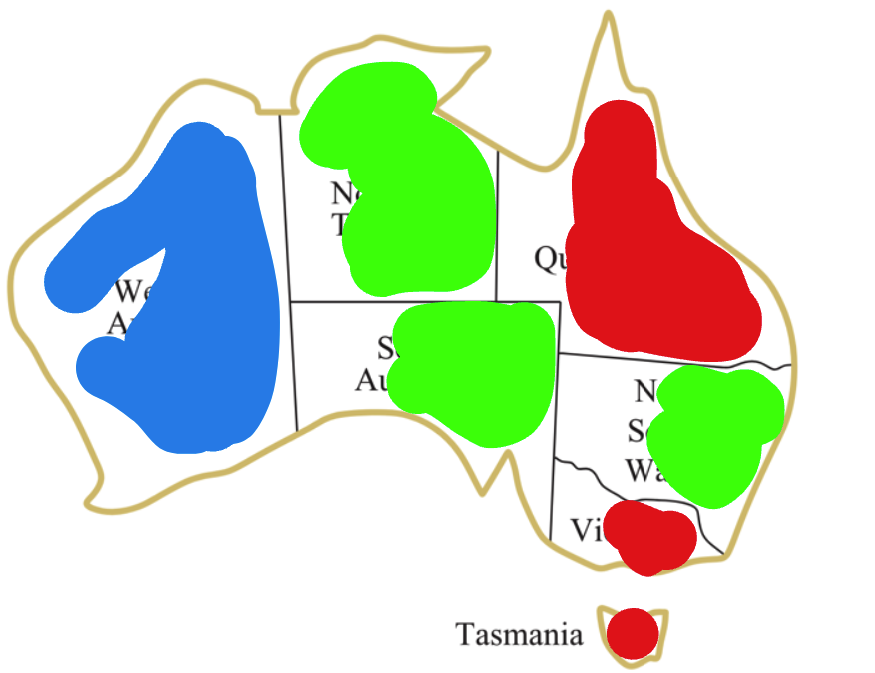
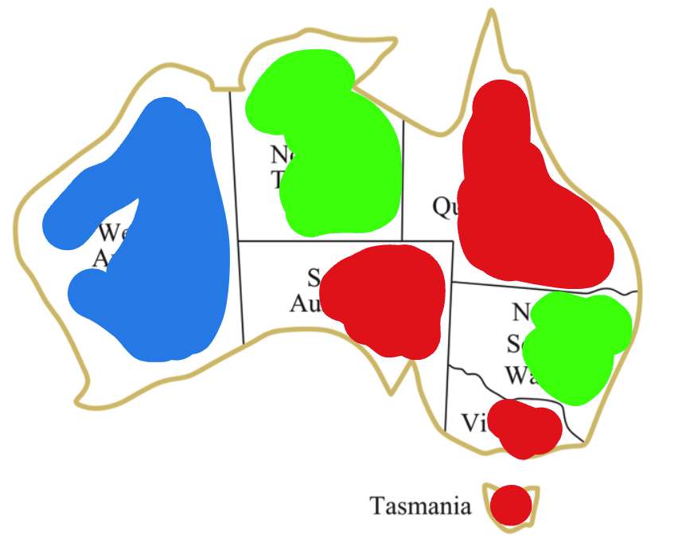
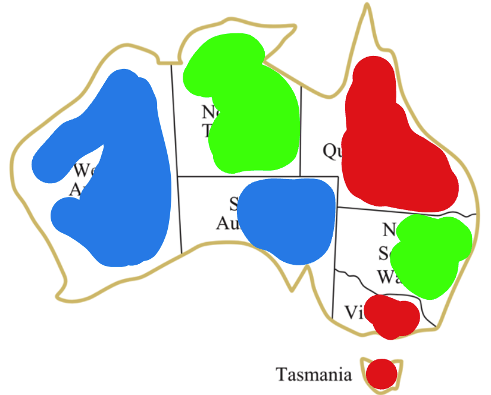
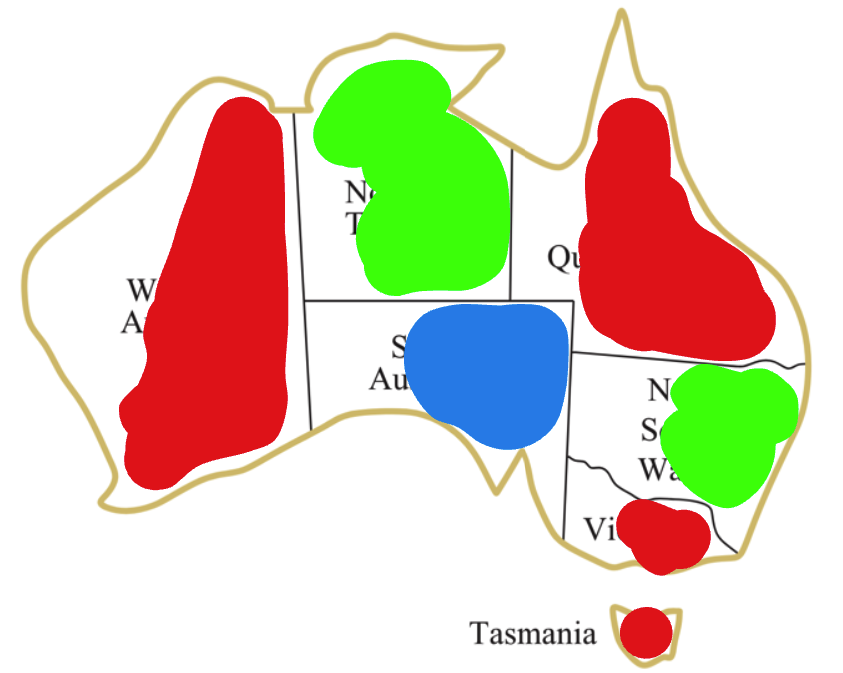

# Iterative Improvement
Now, let's discuss a very interesting idea that can be used to solve not only constraint satisfaction problems but many other problems as well. It is not related to the backtracking algorithm or the improvements we discussed in the previous lesson. 

## Iterative Improvement
The idea is very simple, yet very powerful. It is based on the observation that we can solve the problem by starting with a random solution and then trying to improve it by making small changes to it. Let's see how it works.

Consider the map coloring problem: we begin with a random color assignment for each region. For example:

`{'WA': 'blue', 'NT': 'green', 'SA': 'green', 'Q': 'red', 'NSW': 'green', 'V': 'red', 'T': 'red'}` . 

This initial setup reveals constraint violations among NT, SA, and NSW, due to adjacent regions sharing the same color.

  

Now, we can try to improve this solution by changing the color of one of these regions. We can apply different strategies to choose which region to change. For example, we can choose the region with the highest number of constraint violations. In this case, it is `SA`.

Let's change the color of `SA` to red, resulting in a new assignment:

  

Now, we can see there are constraint violations between `Q`, `SA`, and `V`. The region with the highest number of constraint violations is `SA`. Let's change the color of `SA` to be `blue`. This will result in a new assignment:

  

Now, we can see there is a constraint violation between  `WA` and `SA`. The number of constraint violations is 1 in both. We've just changed the `SA`, let's try to change the color of `WA` this time to be `red`. This will result in a new assignment:

  

### Now we have no more constraint violations. So this is a solution to the problem.

## Watch this video on Iterative Improvement

**Start at time: 1:07:13**

<iframe width="100%" height="480" src="https://www.youtube.com/embed/5qpbj3MTlng?si=d1UHAp7VbvIECSdS&amp;start=4033&end=4581" title="YouTube video player" frameborder="0" allow="accelerometer; autoplay; clipboard-write; encrypted-media; gyroscope; picture-in-picture; web-share" allowfullscreen></iframe>

## Notes on Iterative Improvement Video
- The demo link: [CSP Demo](https://inst.eecs.berkeley.edu/~cs188/fa21/assets/demos/csp/csp_demos.html)
- Iterative Improvement starts by assigning random values to the variables. Then it tries to improve the solution by making small changes to it.
- While the solution is not found, it keeps making small changes to the solution until it finds a solution or it reaches a maximum number of iterations.
- The variables to fix can be chosen randomly, or based on some heuristic.
- Iterative Improvement is effective in practice.