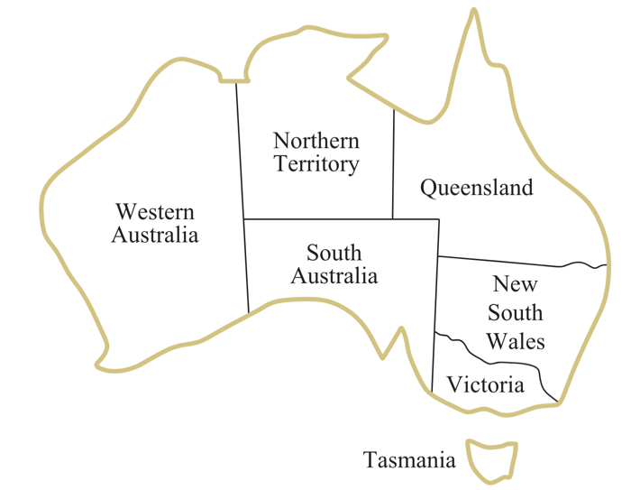

# Modeling CSPs
Modeling the problem, or giving it a mathematical definition, is the first step in solving it. As we did with search problems, we started by formulating the definition of the problem by stating the states, actions, and transitions, then we used algorithms to solve this general model we built.

Similarly, in CSPs, we will start by formulating the definition of the problem by stating the variables, domains, and constraints; then we will use algorithms to solve this general model we built.

## Map Coloring Problem Modeling
Let's start with a simple example of a CSP: the map coloring problem. The goal is to color a map in such a way that no two adjacent regions have the same color. Available colors are red, green, and blue. Below is a map of Australia that we will use to illustrate the problem.

  

To model this problem as a CSP, we need to define the variables, domains, and constraints.

- **Variables**: Each region on the map is a variable. In this case, we have seven variables: `WA, NT, Q, NSW, V, SA, and T`.

- **Domains**: The domain of each variable is the set of colors that can be assigned to it. In this case, the domain is `D = {red, green, blue}`.

- **Constraints**: The constraints are the rules that must be satisfied. In this case, the constraint is that no two adjacent regions can have the same color. One possible way to model this is to just write all rules of the pairs of adjacent regions like this:
    - WA ≠ NT (WA and NT must not have the same color)
    - WA ≠ SA (WA and SA must not have the same color)
    - NT ≠ SA (NT and SA must not have the same color)
    - NT ≠ Q (NT and Q must not have the same color)
    - SA ≠ Q (SA and Q must not have the same color)
    - SA ≠ NSW (SA and NSW must not have the same color)
    - SA ≠ V (SA and V must not have the same color)
    - NSW ≠ Q (NSW and Q must not have the same color)
    - NSW ≠ V (NSW and V must not have the same color)
This will be translated to a piece of code that checks if the constraints are satisfied. 

- **Solutions**: Solutions to this problem are assignments that satisfy all the constraints. For example, one possible solution is `{WA=red, NT=green, Q=red, NSW=green, V=red, SA=blue, T=green}`.
  
  
  
<aside>  
We will discuss how to solve this problem in the next lesson. But first, let's look at other examples of a CSP.
</aside>

## N-Queens Problem Modeling
The N-Queens problem is a classic example of a CSP. The goal is to place N queens on an N x N chessboard in such a way that no two queens are attacking each other. In other words, no two queens should be in the same row, column, or diagonal. Below is an example of a solution for N = 4.

  

Can you think of a way to model this problem as a CSP? Remember, we need to define the variables, domains, and constraints.

### Give it a try before checking the solution below.

Click here to see the solution

Here's one way to model the N-Queens problem as a CSP:

- **Variables**: We can consider the cell indices on the board to be our variables. In this case, we have 16 variables: `x1, x2, x3, ..., x16`.
- **Domains**: The domain of each variable will be either 0 or 1. 0 means that there is no queen in this cell, and 1 means that there is a queen in this cell. So the domain is `{0, 1}`.
- **Constraints**: The constraints here are that no two queens can be in the same row, column, or diagonal. We can model this constraint like that: 
    - Sum Constraint: The sum of each row must be equal to 1.
    - Sum Constraint: The sum of each column must be equal to 1.
    - Diagonal Constraint:  No two queens should threaten each other diagonally.

  In code, this would typically be implemented as a function that verifies these constraints on the board.
  
  The same problem can be modeled in a different way. For example, we can consider the queens as variables and the cells as domains.

## Modeling Sudoku 

  

Can you think of a way to model the Sudoku problem as a CSP? Remember, we need to define the variables, domains, and constraints. Give yourself 15 minutes to think about it before checking the solution below.

Solution

Here is one possible way to model this problem:

- **Variables**: Each cell on the Sudoku board is a variable. In this case, we have 81 variables: `x1, x2, x3, ..., x81`.
- **Domains**: The domain of each variable is the set of numbers that can be assigned to it. In this case, the domain is `{1, 2, 3, 4, 5, 6, 7, 8, 9}`.
- **Constraints**: The constraints here is that no two cells in the same row, column, or 3x3 subgrid can have the same value. We can model this constraint like that: 
    - Row Constraint: Each row must contain exactly one of each digit (9-way alldiff for each row).
    - Column Constraint: Each column must contain exactly one of each digit (9-way alldiff for each column).
    - Subgrid Constraint: Each 3x3 subgrid must contain exactly one of each digit (9-way alldiff for each subgrid)
  In code, it could be as simple as a function that checks the board for theses constraints.

## 

## Constraint Graph
Another helpful way to model CSPs is to use a **constraint grap**h. A constraint graph is a graph where each node represents a variable and each edge represents a constraint. For example, here is the constraint graph for the map coloring problem we discussed earlier.

  

This graph shows the variables as nodes and the constraints as edges. For example, the edge between WA and NT represents a constraint. It does not say what the constraint is, but it tells us there is a constraint between these two variables. The same goes for the other edges.

The graph modeling tool can help us optimize our solution. For example, if we look at the graph above, we can see that the variable T is disconnected from the rest of the graph. This means we can work on this part of the graph separately from the rest of the graph. More on that later.

In case we have constraints that involve more than two variables, we can use a different notation. For example, if we have a constraint that says that the sum of the values of three variables must be equal to 10, we can represent it like this:

  

This graph tells us that there is a constraint between the three variables X1, X2, and X3. This might be helpful in other scenarios as well.

## Summary

- Constraint satisfaction problems (CSPs) are a specialized class of search problems that can be modeled as a set of variables, each with a domain of possible values, and a set of constraints that restrict the values that these variables can take. We will learn more powerful techniques to solve these problems that perform better than the search algorithms we learned before.

- We can model CSPs by identifying the variables, domains, and constraints of the problem.

- Finding a solution to a CSP is finding **an assignment** of values to variables that satisfies all the constraints.