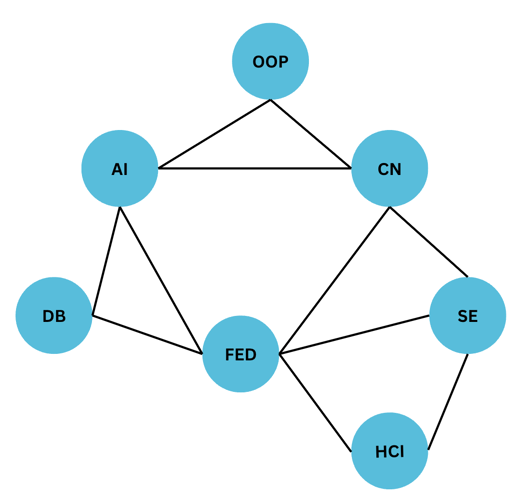

# Practice - Exam Scheduling
Kibo is planning to make exams this semester for year 2 students. Kibo team wants to make the exam schedule such that no student has to take more than 1 exam on the same day. Below is a sample list of students and the courses they are taking. There are 3 days available for exams (Tuesday, Wednesday, and Thursday).

- Aisha is taking OOP , AI, and CN
- Dodze is taking AI and DB, and FED
- Joshy is taking CN, FED, and SE
- Sakira is FED, SE, and HCI

Can you help Kibo team to make the exam schedule for the students?

It is very important to try to solve the problem on your own before looking at the solution below. 

### Step 1: Formulate the problem as a CSP

<Details>
<Summary> Solution </Summary>

**Variables**: {OOP, AI, CN, DB, FED, SE, HCI} 

**Domains**: {Tuesday, Wednesday, Thursday}. Each variable can take one of these values.

**Constraints**: 

    - OOP != AI, OOP != CN, AI != CN, 
    - AI != DB, AI != FED, DB != FED,
    - CN != FED, CN != SE, FED != SE
    - FED != SE, FED != HCI, SE != HCI
Here is the constraint graph for the problem. Each node represents a variable (course) and each edge represents a no equality constraint (no two courses can be scheduled on the same day).

<p align="center">
  
</p>
</Details>

### Step 2: Solve the problem using backtracking search

#### Step 2.1: Represent the variables in code

<Details>
<Summary> Solution </Summary>

```python
    courses = ["OOP", "AI", "CN", "DB", "SE", "FED", "HCI"]
    days = ["Tuesday", "Wednesday", "Thursday"]
    CONSTRAINTS = [("OOP", "AI"), ("OOP", "CN"), ("AI", "CN"), ("AI", "DB"),
               ("AI", "FED"), ("CN", "FED"), ("CN", "SE"), ("DB", "FED"),
               ("FED", "SE"), ("FED", "HCI"), ("SE", "HCI")]
```

</Details>

#### Step 2.2: Represent the constraints check in code
Hint: This is a function that takes the assignment and returns True if the assignment is consistent with the constraints and False otherwise.
<Details>
<Summary> Solution </Summary>

```python
def is_consistent(assignment):
  """Checks to see if an assignment is consistent."""
  for (x, y) in CONSTRAINTS:

    # Only consider arcs where both are assigned
    if x not in assignment or y not in assignment:
      continue

    # If both have same value, then not consistent
    if assignment[x] == assignment[y]:
      return False

  # If nothing inconsistent, then assignment is consistent
  return True

```

</Details>

#### Step 2.3: Implement the backtrack search algorithm
Hint: This is a recursive function that takes the list of variables, the current assignment, and the schedule so far. It returns the schedule if it's complete and valid, and returns False otherwise.

<Details>
<Summary> Solution </Summary>

```python
def backtrack_search(courses, days, assignment):
  if len(assignment) == len(courses):
    return assignment  # All courses are assigned

  current_course = next(course for course in courses
                        if course not in assignment)
  for day in days:
    if is_consistent(assignment):
      assignment[current_course] = day
      result = backtrack_search(courses, days, assignment)
      if result is not None:
        return result
      del assignment[current_course]  # Backtrack if the assignment is not consistent
  return None
```

</Details>

### Putting it all together
<Details>
<Summary> Solution </Summary>

```python
CONSTRAINTS = [("OOP", "AI"), ("OOP", "CN"), ("AI", "CN"), ("AI", "DB"),
               ("AI", "FED"), ("CN", "FED"), ("CN", "SE"), ("DB", "FED"),
               ("FED", "SE"), ("FED", "HCI"), ("SE", "HCI")]


def is_consistent(assignment):
  """Checks to see if an assignment is consistent."""
  for (x, y) in CONSTRAINTS:

    # Only consider arcs where both are assigned
    if x not in assignment or y not in assignment:
      continue

    # If both have same value, then not consistent
    if assignment[x] == assignment[y]:
      return False

  # If nothing inconsistent, then assignment is consistent
  return True


def backtrack_search(courses, days, assignment):
  if len(assignment) == len(courses):
    return assignment  # All courses are assigned

  current_course = next(course for course in courses
                        if course not in assignment)
  for day in days:
    if is_consistent(assignment):
      assignment[current_course] = day
      result = backtrack_search(courses, days, assignment)
      if result is not None:
        return result
      del assignment[
          current_course]  # Backtrack if the assignment is not consistent
  return None


def solve_schedule():
  courses = ["OOP", "AI", "CN", "DB", "FED", "SE", "HCI"]
  days = ["Tuesday", "Wednesday", "Thursday"]
  assignment = {}

  result = backtrack_search(courses, days, assignment)
  return result


if __name__ == "__main__":
  solution = solve_schedule()

  if solution:
    for course, day in solution.items():
      print(f"{course}: {day}")
  else:
    print("No solution found.")
```


