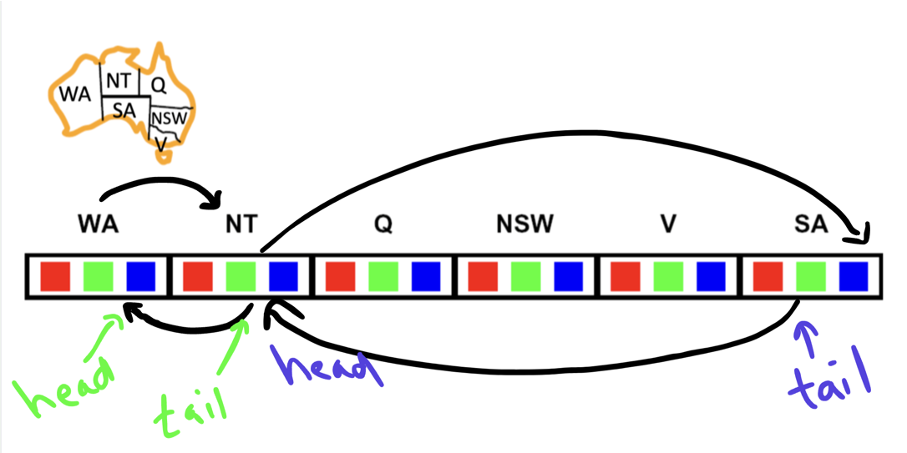
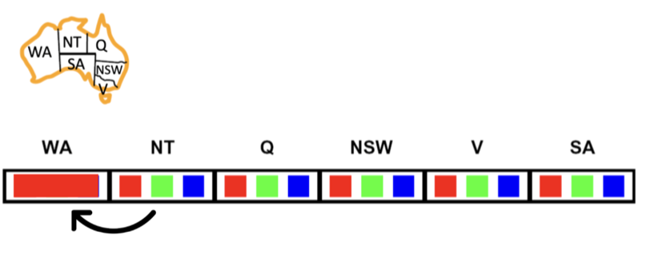
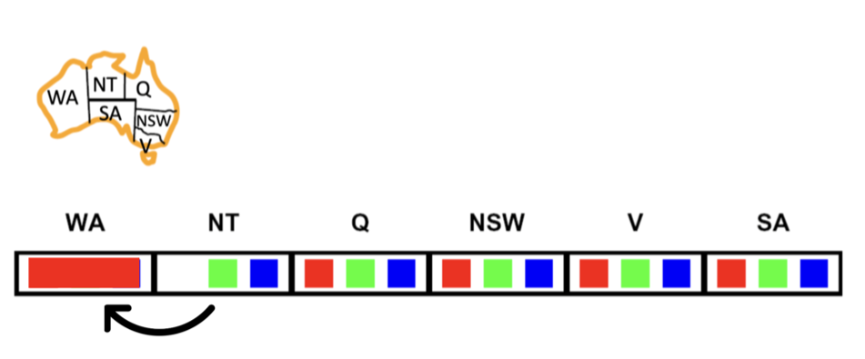
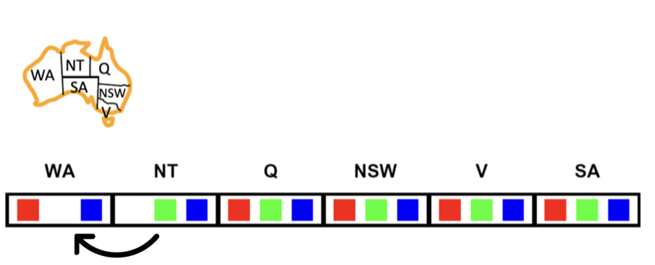
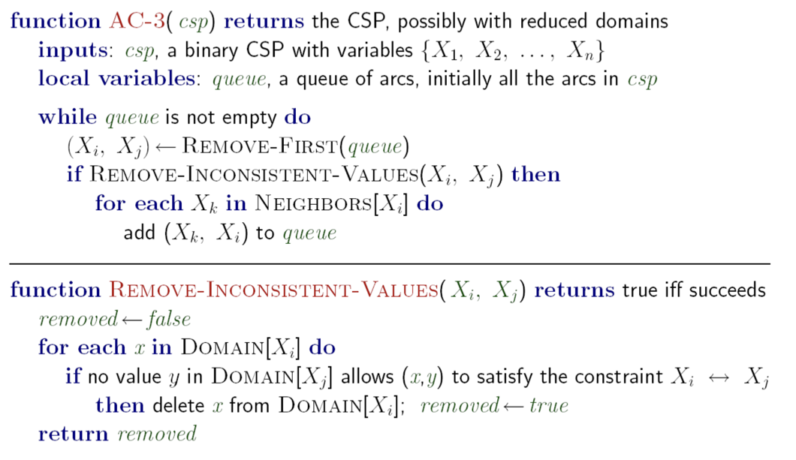

# Solving CSPs Part 2
In this lesson, we will try to improve the performance of our backtracking algorithm used in the previous lesson. 

## Decision Points
Remember when we tried to improve our search algorithms in previous weeks? We looked at the points where there is a decision to be made and tried to make better decisions at that point.

Can you tell what the decision points are in the search algorithms we studied?

Can you tell what the decision points are in the backtracking algorithm we studied in the previous lesson?

Similarly, we can improve our backtracking algorithm by making better decisions at the points where there is a decision to be made. In the case of CSPs, the decision points are the points where we **choose a value for a variable**.

## Forward Checking
The first improvement, called forward checking, involves removing values inconsistent with the constraints from the domains of unassigned variables and checking if any domains become empty as a result. If any of the domains is empty, then we know that we cannot find a solution, so we backtrack.


This is the part of the pseudocode where we will add the forward checking:

```python 
add {var = value} to assignment
```
We will add the forward checking after selecting an unassigned variable. Here is the pseudocode:

```python 
add {var = value} to assignment

for each unassigned var in ORDER-DOMAIN-VALUES(var, assignment, csp) do
   if value is not consistent with assignment given then
        remove value from DOMAIN[var]
```
Here is a demo of this idea:

<iframe width="100%" height="450" src="https://www.youtube.com/embed/iEhywgErk40?si=4IC42SMe5Q2Qzlce&amp;start=4298&end=4787" title="YouTube video player" frameborder="0" allow="accelerometer; autoplay; clipboard-write; encrypted-media; gyroscope; picture-in-picture; web-share" allowfullscreen></iframe>

### Notes on the video:
- The demo tool used in the video: [CSP Demo](https://inst.eecs.berkeley.edu/~cs188/fa21/assets/demos/csp/csp_demos.html)

Here is the code in Python:

<iframe src="https://replit.com/@kibocurriculum/map-coloring-csp-forward-checking?embed=true" width="100%" height="450"></iframe>


The output of the code is:
```
{'WA': 'red', 'NT': 'green', 'SA': 'blue', 'Q': 'red', 'NSW': 'green', 'V': 'red', 'T': 'green'}
```

To measure the performance of the algorithm, we can count the number of times we check the consistency of a value with the assignment. Add a counter variable to the code and increment it every time we check the consistency of a value with the assignment.

Here is the code with the counter:

```python
consistency_check_counter = 0


def consistent(var, value, assignment, csp):
  global consistency_check_counter
  consistency_check_counter += 1

  for other in assignment:
    if other != var and not csp['constraints'](var, other, value,
                                               assignment[other]):
      return False
  return True
```

If you print the counter after running the code, you will get 7 in the forward checking case and 11 in the backtracking case. So forward checking is better than backtracking in this case.


## Constraint Propagation
The second improvement is quite harder to understand. So, if you have been following along, you need to take before moving on.

### Arc
An arc is a pair of variables that are connected by a constraint. For example, in the map coloring problem, the pair (WA, NT) is an arc because there is a constraint between them.

Examples arcs in the map coloring problem:
- (WA, NT)
- (NT, WA)
- (NT, SA)
- (SA, NT)
- ...

<p align="center">

</p>

As you can see, arcs have directions. So (WA, NT) is not the same as (NT, WA). 

### Arc Consistency
An arc X->Y is consistent if for every value in the domain of X, there exists a corresponding value in the domain of Y that does not violate the constraint between X and Y.

In the below image, is the `arc (NT, WA)`  consistent?
<p align="center">

</p>

The answer is No. Why? Because `WA` has a value of red and the value `red` in the domain of NT violates the constraint between NT and WA. So the `arc (NT, WA)` is **not** consistent.

How to make it consistent? We need to remove the values from the domain of X that violate the constraint between X and Y. So, in this case, we need to remove `red` from the domain of NT.

<p align="center">

</p>

Now, it is consistent.

### What about this arc?

<p align="center">

</p>

<Details>
<Summary>Click here to see the answer</Summary>
The answer is Yes. 

Both the blue and green values in the domain of NT have a value in the domain of WA that does not violate the constraint between NT and WA. So the `arc (NT, WA)` is consistent. The available value for the NT's `blue` value is `green` from the WA domain. The available values for the NT's `green` value is `blue` and `red`.
</Details>

Can we make all the arcs consistent? Yes, we can. We can make all the arcs consistent by removing the values from the domains of the variables that violate the constraints between them. This process is called **arc consistency** and this is the second improvement we will look at.

### How to make all the arcs consistent?
Watch this video to see how to make all the arcs consistent:
<iframe width="100%" height="450" src="https://www.youtube.com/embed/5qpbj3MTlng?si=e8UIiFgyGzjWelcf&amp;start=971&end=1639" title="YouTube video player" frameborder="0" allow="accelerometer; autoplay; clipboard-write; encrypted-media; gyroscope; picture-in-picture; web-share" allowfullscreen></iframe>

<br>

### Here is pseudocode for the algorithm for making all the arcs consistent. It is called AC-3:

<p align="center">

</p>


## Ordering and Problem Structure
There are two additional strategies to enhance the performance of CSP solving algorithms. The first one is to choose the variables in a different order. The second one is to examine the structure of the problem and use that information to improve the performance of the algorithm. Let's discuss these two ideas briefly.

### Ordering
While solving the map coloring problem, we chose the variables in the order they appear in the list of variables. Will choosing a different order affect the performance of the algorithm? It turns out that it does. Instead of choosing the variables in the order they appear in the list of variables, we can choose the variables in the order of the number of constraints on the variable. This is called the **least constraining value (LCV)** heuristic. Another heuristic is to choose the variable with the fewest remaining values in its domain. This is called the **minimum remaining values (MRV)** heuristic.

### Problem Structure
The structure of the problem can provide us with information that can help us improve the performance of the algorithm. For example, if the problem is a tree-structured CSP, then we can solve it in polynomial time with less runtime and space complexity.

This is all what we need you to know about Ordering and Problem Structure. If you want to learn more about these two ideas, you can watch this [video](https://youtu.be/5qpbj3MTlng?si=ueZsfRgm-96YimTu&start=2354&end=4031).


# Summary

The effectiveness of algorithms used to solve CSPs can be significantly improved by optimizing decision-making at critical points within the search process.

- We can improve the performance of the algorithm by removing the values that are inconsistent with the constraints from the domains of the unassigned variables and then check if any of the domains is empty. If any of the domains is empty, then we know that we cannot find a solution, so we backtrack. This is called **forward checking**. 
- Another idea is to make all the arcs consistent. This is called **arc consistency**. We can make all the arcs consistent by removing the values from the domains of the variables that violate the constraints between them. 
- The third idea is to choose the variables in a different order. Choosing the variables in the order of the number of constraints or the fewest remaining values in its domain can improve the performance of the algorithm.
- The fourth idea is to examine the structure of the problem and use that information to improve the performance of the algorithm.