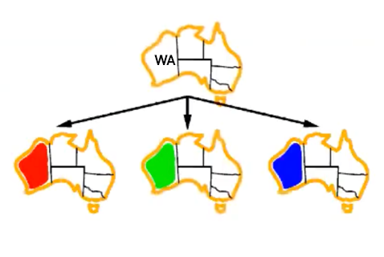
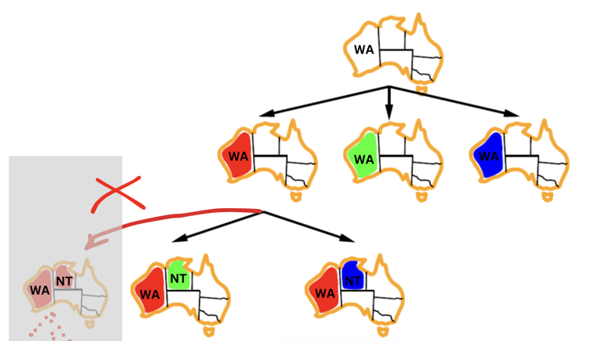
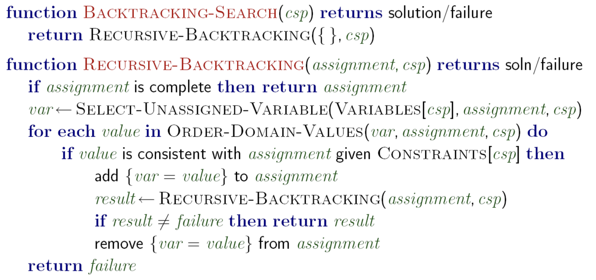

# Solving CSPs
Now that we know how to model a CSP, let's look at how to solve it. 


## Backtracking Search

**Backtracking Search** is a general algorithm that can be used to solve any CSP. The idea is to assign values to variables one at a time, and backtrack when we reach a dead end. The mechanism of the backtracking search algorithm is similar to depth-first search (DFS) algorithm. The difference is that backtracking search will backtrack when it reaches a dead end (and we have a way to check that), while DFS will continue to search until it reaches the end. 


### Let's start by solving the map coloring problem using backtracking search.
Remember, the goal is to color a map in such a way that no two adjacent regions have the same color. Available colors are red, green, and blue. Below is a map of Australia that we will use to illustrate the problem.

<p align="center">
  
</p>

</br>
</br>

### Watch how we solve the problem in the video below:

<div style="position: relative; padding-bottom: 56.25%; height: 0;">
<iframe src="https://www.youtube.com/embed/iEhywgErk40?start=3930&end=4233" frameborder="0" webkitallowfullscreen mozallowfullscreen allowfullscreen style="position: absolute; top: 0; left: 0; width: 100%; height: 100%;"></iframe>
</div>

### Notes on the video:
- The first step is to select an unassigned variable. We started with `WA`. We did not consider every possible configuration from that initial empty assignment. We just picked `WA` and started exploring the possible values for it.

    

- From this point, we will explore the possible values for `WA` one at a time (red, green, and blue). At this point, we did **not** check every possible value from the initial assignment. 

    

- From the `WA = red` branch, we will only explore the values for NT **that are consistent with the constraints**. Some assignments, such as WA = red and NT = red, are not consistent with the constraints, so we will not explore them.

    

- Link to the demo tool used in the video: [CSP Demo](https://inst.eecs.berkeley.edu/~cs188/fa21/assets/demos/csp/csp_demos.html)


## Let's Code It!
<br>
<p align="center">

</p>

### Here is the pseudocode for backtracking search:

<p align="center">
  
</p>

### Here is the code in Python:

<iframe src="https://replit.com/@kibocurriculum/map-coloring-csp?embed=true" width="100%" height="450"></iframe>


## 🎉 Congratulations!🎉
You've just learned a way to solve CSP. You can see that the algorithm has found a solution to the map coloring problem.


<!--
### Here is a breakdown of the pseudocode:

```python
function BACKTRACKING-SEARCH(csp) returns solution/failure 
```
Defines a function `BACKTRACKING-SEARCH` that takes a `csp` (constraint satisfaction problem) and will return either a solution or indicate failure. csp is a tuple or dictionary containing the variables, domains, and constraints of the problem.

```python 
return RECURSIVE-BACKTRACKING({ }, csp)
```
Initiates the backtracking algorithm by calling `RECURSIVE-BACKTRACKING` with an empty assignment and the `csp`.

```python
 function RECURSIVE-BACKTRACKING(assignment, csp) returns soln/failure
```
Defines the recursive function `RECURSIVE-BACKTRACKING` that takes a partial `assignment` and `csp`, aiming to return a complete solution or failure.


```python
 if assignment is complete then return assignment
```
Checks if the current assignment is complete (all variables have values) and returns it as a solution if so.

```python 
var ← SELECT-UNASSIGNED-VARIABLE(VARIABLES[csp], assignment, csp)
```
Selects an unassigned variable from the `csp` that is not yet in the current `assignment`.

```python 
for each value in ORDER-DOMAIN-VALUES(var, assignment, csp) do
```
Starts a loop over the ordered values in the domain (i.e. red,green, and blue) of the selected variable `var`.

```python 
if value is consistent with assignment given CONSTRAINTS[csp] then
```
Checks if a value for `var` is consistent with the current `assignment` and the `csp`'s constraints.

```python
add {var = value} to assignment
```
If the value is consistent, add it to the `assignment`.

```python
result ← RECURSIVE-BACKTRACKING(assignment, csp)
```
Then calls `RECURSIVE-BACKTRACKING` recursively with the new partial `assignment` to extend it towards a complete solution.

```python
 if result ≠ failure then return result
```
If the recursive call finds a solution (result is not a failure), it returns this result.

```python
remove {var = value} from assignment
```
If the recursive call results in a failure, the added `{var = value}` is removed from `assignment` (backtracking).

```python
 return failure
 ```
If no values lead to a solution, the function returns failure, indicating the partial `assignment` cannot lead to a full solution.

-->
