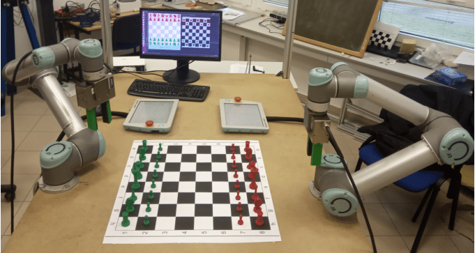

# Intelligence via Search II

  
  

         https://www.researchgate.net/figure/Collaborative-robot-system-for-playing-chess_fig4_345377838 
    

Hello, and welcome to the second part of the "Intelligence via Search" lesson. In this lesson, we will continue to explore search algorithms and their applications in the field of artificial intelligence. More specifically, we will discuss game playing and how search algorithms can be used.

## This Week's Work:
- Study the material and solve the practical exercises.
- Complete the quiz and coding assignment for this week. 
    - The coding assignment will involve building a tic-tac-toe game-playing agent using the minimax with alpha-beta pruning algorithm.

## Upon completing this week's work, you will be able to:
- Explain the concept of game playing and its relevance to artificial intelligence.
- Describe the minimax algorithm and its application in game playing.
- Develop a game-playing agent capable of playing tic-tac-toe using the minimax algorithm.

