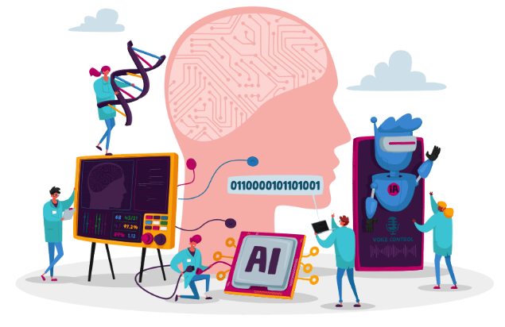

# AI: What and Why

  

### Intelligence

If a robot navigates city streets without colliding with anything, would you consider this robot intelligent? Many would agree, including myself. However, if a human performs the same task, you might hesitate to describe them as intelligent. On the other hand, when a person tackles a challenging math problem or quickly learns a new language, we are more inclined to label them as intelligent.

<aside>
As humans, we hold different perceptions of intelligence, employing distinct criteria for evaluating machines versus humans.
</aside>
Some have seen intelligence as the ability to use language, form abstractions and concepts, solve problems, and acquire knowledge.

## The Turing Test

In the 1950s, Alan Turing, a British computer scientist, proposed a test to determine whether a machine can think. The test, known as the Turing test, involves a human evaluator who engages in a natural language conversation with two other parties, one human and one machine. If the evaluator cannot distinguish between the human and the machine, the machine is considered intelligent. This test is still used today to assess the intelligence of machines.

### (Optional) Watch the video below to learn more about the Turing test:

<iframe src="https://www.youtube.com/embed/3wLqsRLvV-c" frameborder="0" webkitallowfullscreen mozallowfullscreen allowfullscreen style="position: absolute; top: 0; left: 0; width: 100%; height: 100%;"></iframe>

## Defining Intelligence

An established and common definition of intelligence is **the ability to make the correct decisions.** But what does it mean to make the correct or right decision? To answer this question, we need to delve into the concept of rationality.

### Rationality

From a scientific standpoint, rationality is the quality of being grounded in reason and logic. Therefore, a person or a machine is considered rational if their decisions are based on reasoning and logic and are also guided by specific goals.

  

**Example of rationality:**

Suppose we have an agent (a software, a person or a machine) playing chess. In this context, making the move expected to maximize the chances of winning the game is the right decision. This exemplifies rationality because the agent is taking a decision based on reasoning and logic and towards a specific goal which is winning the game.

**Another example of rationality**

Imagine an agent operating a vehicle. Here, making choices aimed at maximizing the likelihood of reaching the destination safely and, perhaps, in a short time is the right course of action. This too embodies rationality, with decisions derived from reasoning and logic in pursuit of the specific goal of arriving safely and efficiently.

<aside>

**Intelligence** is the ability to make rational decisions (decision grounded in reason, logic, and knowledge).

</aside>

<aside>

An **agent** is anything that can perceive its environment through sensors and act upon that environment through actuators (Stuart Russell and Peter Norvig). A human agent has eyes, ears, and other organs for sensors and hands, legs, vocal tract, and so on for actuators. A robotic agent might have cameras and infrared range finders for sensors and various motors for actuators. A software agent receives keystrokes, file contents, and network packets as sensory inputs and acts on the environment by displaying on the screen, writing files, and sending network packets.

</aside>

## Artificial Intelligence (AI)

<aside>
AI is the science of building systems that can think and act rationally.

</aside>

In addition to this definition, there are many definitions of AI, and the one we just discussed is just one of them.

### Machine Learning

Machine learning, a subfield of AI, focuses on building systems that can learn from data or, in other words, make rational decisions based on knowledge acquired from the data.

### Deep Learning

Deep learning is a subset of machine learning that centers on developing machines capable of learning from data using **deep neural networks**. Further insights into this topic will be gained in your machine learning course.

# Why AI Now?

The history of AI dates back to the 1950s. If you'd like a quick three-minute recap of AI's history, you can watch this video:

<iframe src="https://www.youtube.com/embed/056v4OxKwlI" frameborder="0" webkitallowfullscreen mozallowfullscreen allowfullscreen style="position: absolute; top: 0; left: 0; width: 100%; height: 100%;"></iframe>

The question we want to address here is why AI is currently experiencing a surge in attention. There are several significant factors contributing to this phenomenon, I will highlight the two most important ones:

## Data

The availability of extensive public datasets has profoundly transformed the AI landscape. These datasets, often curated and made accessible by organizations, government agencies, or academic collaborations, provide copious amounts of diverse, well-structured, and labeled data. Prominent examples include ImageNet for image recognition, the Common Crawl for natural language processing, and the Human Genome Project for genomics. Access to such extensive public datasets has enabled AI researchers to train their models on data that represents a broader spectrum of real-world scenarios, leading to substantial improvements in AI system performance and accuracy.

## Hardware

Advancements in hardware technology, especially the development of high-performance graphics processing units (GPUs) and specialized AI accelerators like TPUs (Tensor Processing Units), have significantly increased the computational power available for AI tasks. AI models, particularly deep learning neural networks, demand substantial computational resources for training and inference. The enhancement in computational capabilities has empowered researchers to work with more extensive and complex models, resulting in improved AI performance.

Although GPUs and TPUs can be costly to purchase and operate, they are now widely accessible in the cloud, making them affordable for a broader audience. This accessibility has facilitated AI researchers and practitioners in experimenting with more intricate models and larger datasets without requiring substantial investments in expensive hardware.

Here is a screenshot of the [Google Cloud Platform](https://cloud.google.com/) which provides access to GPUs and TPUs:

  

## Summary:

- AI is the field of building systems that can think and act rationally (guided by reasoning, logic, knowledge, and specific goals).

- The term "agent" is used to describe an entity striving to achieve specific objectives. An agent can be a person, a machine, software, or a combination of these.

- AI is getting so much attention now due to many reasons including the availability of large public datasets and the advancement of hardware technologies.

## Check your understanding:

- Explain AI to a 10-year-old.
- List two reasons for the current surge of interest in AI.

## Explore, Share and Discuss:

- Search the web and find some of the latest hardware devices that empower AI applications.

  💬 Share your findings with us on Discord <a target = "_blank" href="https://discord.com/channels/1167059986019520563/1167060638300913786">here</a>.
  

