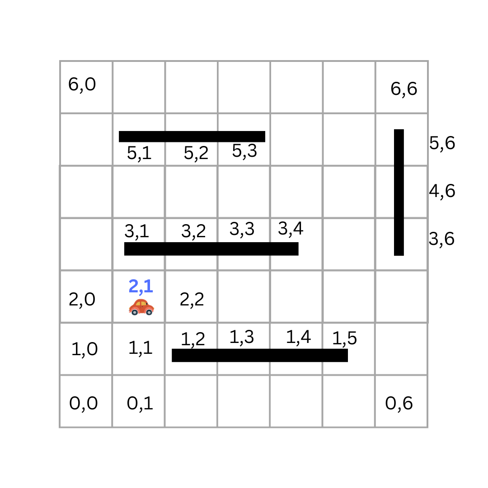

# Informed Search

_Estimated time to finish: 90 - 180 minutes_

In our previous lessons, we learned about the breadth-first search and depth-first search algorithms. Both of these algorithms are blind search algorithms, which means that they do not use any additional information to guide their search. The technical term for blind search algorithms is **uninformed** search algorithms.

Using uninformed search algorithms can be inefficient and computationally expensive because they do not use any additional information to guide their search. We saw that when we applied BFS to the 15-Puzzle problem. We waited for a long time for the algorithm to find the solution and most of the time we ran out of memory.

In this lesson and the following one, we will learn about the greedy best-first and the A\* search algorithms, which are **informed** search algorithms.

Informed search algorithms use additional information to guide their search. This should make them more efficient and less computationally expensive than uninformed search algorithms. We will use the A\* search algorithm to solve the 15-Puzzle problem and the car path problem and compare its performance with uninformed search algorithms.

## Informed Search

To get a sense of how informed search algorithms work, let's consider our car example. Take a look at this image:

<p align="center">
  
</p>

If the car is at position `(2,1)` , as humans, we can easily determine that the next step should be to move to `(2,2)`. The `(1,1)` cell will take us further away from the goal state. This is an example of an informed decision. We use our knowledge of the problem to make a better decision.

## Greedy best-first search

Greedy best-first search is an informed search algorithm that uses a heuristic function to guide its search.

A **heuristic function** is a function that assesses alternatives in search algorithms at each branching step, utilizing available information to determine which branch to follow (which next state to explore).

In our previous car example, if we can inform the algorithm to prioritize the point `(2,2)` as it is closer to the goal state than `(1,1)` , then the algorithm will be able to make a better decision. In a grid world, we can use the direct line distance between the goal state and each state as a heuristic function.

A good heuristic function for the 15-Puzzle problem could be the number of misplaced tiles. The number of misplaced tiles is the number of tiles that are not in their correct position. To implement this heuristic function, we can simply compare the current state with the goal state and count the number of misplaced tiles.

```python
def count_misplaced_tiles(board, goal_board):
  out_of_place_tiles_count = 0
  for i in range(N * N):
    if board[i] != goal_board[i]:
      out_of_place_tiles_count += 1
  return out_of_place_tiles_count

```

Let's solve the 15-Puzzle problem using the greedy best-first search algorithm and see how it performs.

## Solving the 15-Puzzle Problem with Greedy Best-First Search

```python
from collections import deque
import heapq
# Board dimension
N = 4


def count_misplaced_tiles(board, goal_board):
  out_of_place_tiles_count = 0
  for i in range(N * N):
    if board[i] != goal_board[i]:
      out_of_place_tiles_count += 1
  return out_of_place_tiles_count


def is_valid_move(pos, move):
  row, col = divmod(pos, N)
  if move == 'up' and row == 0:
    return False
  if move == 'down' and row == N - 1:
    return False
  if move == 'left' and col == 0:
    return False
  if move == 'right' and col == N - 1:
    return False
  return True


def make_move(board, move):
  empty_pos = board.index(0)

  if not is_valid_move(empty_pos, move):
    return None

  row, col = divmod(empty_pos, N)
  if move == 'up':
    target_pos = (row - 1) * N + col
  elif move == 'down':
    target_pos = (row + 1) * N + col
  elif move == 'left':
    target_pos = row * N + (col - 1)
  elif move == 'right':
    target_pos = row * N + (col + 1)

  new_board = board[:]
  new_board[empty_pos], new_board[target_pos] = new_board[
      target_pos], new_board[empty_pos]

  return new_board


def greedy_best_first_search(initial_board, goal_board):
  visited = set()
  priority_queue = []

  heapq.heappush(priority_queue, (0, (initial_board, [])))

  while priority_queue:
    _, (board, path) = heapq.heappop(priority_queue)
    #print((board, path))
    if board == goal_board:
      return path

    visited.add(tuple(board))

    for move in ['up', 'down', 'left', 'right']:
      next_board = make_move(board, move)
      if next_board and tuple(next_board) not in visited:
        heuristic = count_misplaced_tiles(next_board, goal_board)
        if heuristic is not None:
          heapq.heappush(priority_queue,
                         (heuristic, (next_board, path + [move])))

  return None

def print_solution(board, solution):
  print("Initial board:")
  print_board(board)
  for move in solution:
    board = make_move(board, move)
    print(f"\nMove {move}:")
    print_board(board)
  print(len(solution))
    #input()


def print_board(board):
  for i in range(N):
    print(board[i * N:i * N + N])
  print()


if __name__ == "__main__":
  # Adjust for a 4x4 board
  goal_board = [1, 2, 3, 4, 5, 6, 7, 8, 9, 10, 11, 12, 13, 14, 15, 0]
  # Provide a valid initial configuration for a 4x4 board
  #initial_board = [7, 9, 4, 15, 3, 0, 11, 6, 13, 8, 14, 5, 1, 12, 2, 10]
  #initial_board = [14, 12, 7, 15, 4, 13, 1, 2, 10, 9, 3, 6, 11, 8, 0, 5]
  #initial_board = [4,0,8,1,14,7,10,13,3,6,5,2,11,15,12,9]
  initial_board = [2,11,1,9,15,5,6,13,8,7,12,4,10,0,3,14]

  gbfs_solution = greedy_best_first_search(initial_board, goal_board)

  print("\nGreedy BFS Solution:")
  if gbfs_solution:
    print_solution(initial_board, bfs_solution)
  else:
    print("No solution found with Greedy BFS")


```

My computer was able to show me the solution of the 15-Puzzle problem in less than a second This is a huge improvement over the BFS algorithm. The BFS algorithm took a long time to find the solution and most of the time it ran out of memory.

### Different Heuristic Functions

Depending on the specific characteristics of the problem at hand, various heuristic functions can be designed to guide the search algorithm effectively. In our car example, the direct line distance, known as Euclidean distance, between the goal state and each state serves as one heuristic function. Manhattan distance, which is the distance between two points measured along axes at right angles, serves as another one. In maze-solving problems, a heuristic could involve estimating the remaining steps to the goal based on the current position.

## Summary

In conclusion, the transition from blind search algorithms, such as breadth-first search and depth-first search, to informed search algorithms marks a significant leap in computational efficiency. The drawbacks of uninformed searches, as exemplified by the 15-Puzzle problem, underscore the need for additional information to guide the search process effectively.

In this lesson, we delved into the greedy best-first algorithm, which leverages heuristic functions to make informed decisions during exploration. The practical application of this algorithm in solving the 15-Puzzle problem showcased its ability to find solutions more efficiently, addressing the limitations of uninformed searches.

As we progress, exploring various heuristic functions in upcoming lessons, we continue to uncover their diverse applications and refine our understanding of their impact on algorithmic performance.
