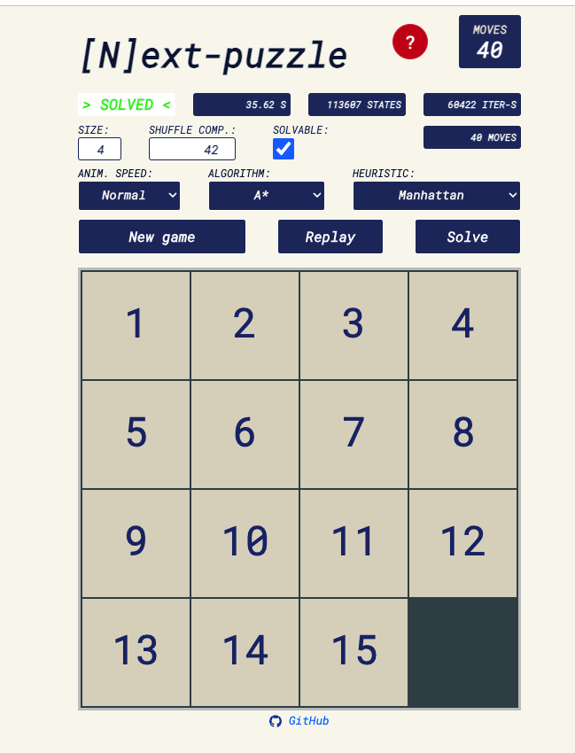

# More Heuristics

As discussed in our previous lessons, various heuristic functions can guide the search. We used the number of misplaced tiles as our heuristic function in the 15-puzzle example and the Manhattan distance in our car example. Here are a few more common heuristics with sample implementations for you to explore.

### Euclidean Distance

The Euclidean distance is the straight-line distance between two points in Euclidean space. It is named after the ancient Greek mathematician Euclid, who introduced the concept of Euclidean space.

```python
def euclidean_distance(board, goal_board):
  distance = 0
  for i in range(N * N):
    if board[i] != 0:  # Skip the empty tile
      correct_pos = goal_board.index(board[i])
      current_row, current_col = divmod(i, N)
      correct_row, correct_col = divmod(correct_pos, N)
      distance += math.sqrt((current_row - correct_row)**2 +
                            (current_col - correct_col)**2)
  return distance

```

### Hamming Distance

The Hamming distance is the number of positions at which two strings of equal length differ. It is named after the American mathematician Richard Hamming.

```python
def hamming_distance(board, goal_board):
  distance = 0
  for i in range(N * N):
    if board[i] != 0 and board[i] != goal_board[i]:
      distance += 1
  return distance

```

### Manhattan Distance

The Manhattan distance is the sum of the horizontal and vertical distances between two points on a grid. It is named after the grid-like layout of the streets in Manhattan.

```python
def manhattan_distance(board, goal_board):
  distance = 0
  for i in range(N * N):
    if board[i] != 0:  # Skip the empty tile
      correct_pos = goal_board.index(board[i])
      current_row, current_col = divmod(i, N)
      correct_row, correct_col = divmod(correct_pos, N)
      distance += abs(current_row - correct_row) + abs(current_col -
                                                       correct_col)
  return distance

```

### Linear Conflict

The linear conflict heuristic is a modification of the Manhattan distance heuristic. It is calculated by adding the number of moves required to resolve each linear conflict to the Manhattan distance.

A linear conflict occurs when two tiles are in their goal row or column, but are reversed relative to their goal positions. For example, if the tile 1 is in the second row and the tile 2 is in the first row, then they are in a linear conflict. To resolve this conflict, we need to move one of the tiles out of the way, so that the other tile can move into its correct position. This requires two moves, one for each tile.

```python
def linear_conflict(board, goal_board):
  conflict_count = 0
  for i in range(N * N):
    if board[i] != 0:  # Skip the empty tile
      correct_pos = goal_board.index(board[i])
      current_row, current_col = divmod(i, N)
      correct_row, correct_col = divmod(correct_pos, N)
      if current_row == correct_row and current_col == correct_col:
        continue
      if current_row == correct_row:
        for j in range(i + 1, N * N):
          if board[j] != 0 and goal_board.index(board[j]) < correct_pos:
            conflict_count += 1
      if current_col == correct_col:
        for j in range(i + N, N * N, N):
          if board[j] != 0 and goal_board.index(board[j]) < correct_pos:
            conflict_count += 1
  return conflict_count * 2

```

### Online N-Puzzle Solver

<a href="https://igorgarbuz.github.io/n-puzzle/">Here</a> is a cool online repository that solves the 15-puzzle problem using various algorithms and heuristics.



## Summary

Heuristic functions are used to guide the search algorithm to find the optimal solution faster. A heuristic function is admissible if it never overestimates the cost of reaching the goal, and it is consistent if the estimated cost of reaching the goal from node `n` is less than or equal to the cost of reaching node `n'` from node `n` plus the estimated cost of reaching the goal from node `n'`.

Different problems require different heuristic functions. The design of an effective heuristic function is a challenging task and requires a good understanding of the problem. It significantly affects the performance of the search algorithm.
