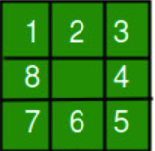
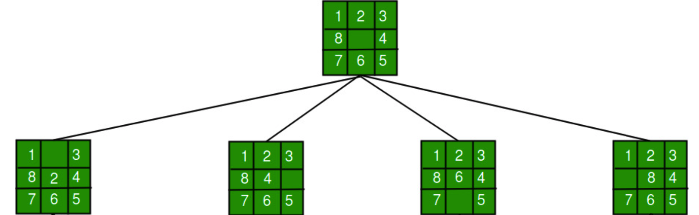
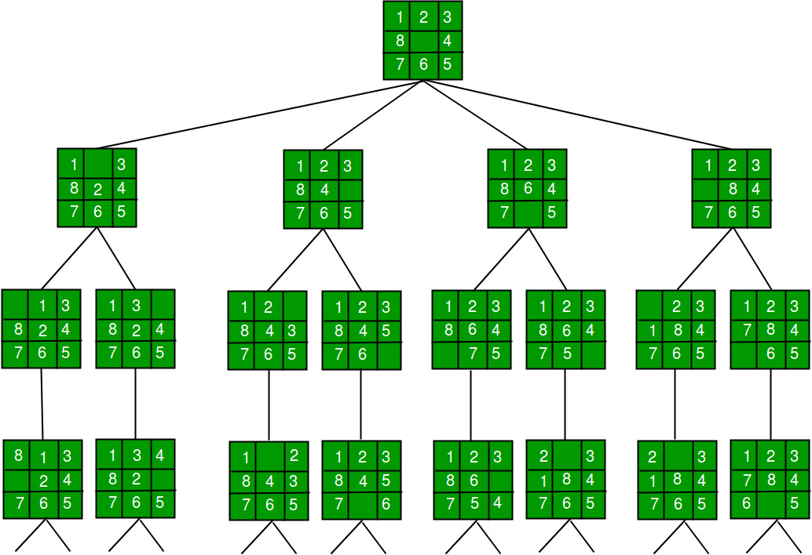
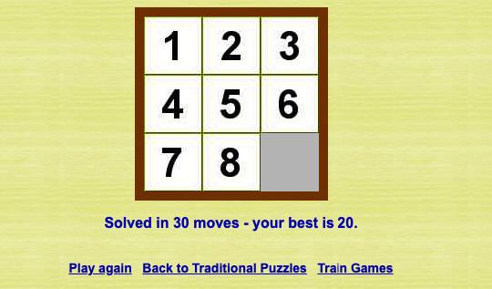

# Practice Problems

In this lesson we will solve the 8-Puzzle and the 15-Puzzle Problem using DFS and BFS.

## 8-Puzzle Problem

In the 8-puzzle game, we want to find a path from an initial state(scrambled tiles) to the goal state (tiles in the correct order).

Here is a snapshot of our search tree:

<p align="center">

</p>

From this state, we can move the tiles 2,8,4, and 6. Each of these moves will result in a new state like this:

<p align="center">

</p>

From each new state, we can again move different tiles. Each of these moves will result in a new state until we reach the goal state.

<p align="center">

</p>

## Solving the 8-Puzzle Problem with BFS

```python
from collections import deque

# Board dimension
N = 3

def is_valid_move(pos, move):
  row, col = divmod(pos, N)
  if move == 'up' and row == 0:
    return False
  if move == 'down' and row == N - 1:
    return False
  if move == 'left' and col == 0:
    return False
  if move == 'right' and col == N - 1:
    return False
  return True


def make_move(board, move):
  empty_pos = board.index(None)

  if not is_valid_move(empty_pos, move):
    return None

  row, col = divmod(empty_pos, N)
  if move == 'up':
    target_pos = (row - 1) * N + col
  elif move == 'down':
    target_pos = (row + 1) * N + col
  elif move == 'left':
    target_pos = row * N + (col - 1)
  else:  # move == 'right':
    target_pos = row * N + (col + 1)

  new_board = board[:]
  new_board[empty_pos], new_board[target_pos] = new_board[
      target_pos], new_board[empty_pos]
  return new_board


def bfs(initial_board, goal_board):
  visited = set()
  queue = deque([(initial_board, [])])

  while queue:
    board, path = queue.popleft()

    if board == goal_board:
      return path

    visited.add(tuple(board))

    for move in ['up', 'down', 'left', 'right']:
      next_board = make_move(board, move)
      if next_board and tuple(next_board) not in visited:
        queue.append((next_board, path + [move]))

  return None


def print_solution(board, solution):
  print("Initial board:")
  print_board(board)
  for move in solution:
    board = make_move(board, move)
    print(f"\nMove {move}:")
    print_board(board)


def print_board(board):
  for i in range(N):
    print(board[i * N:i * N + N])
  print()


if __name__ == "__main__":
  goal_board = [1, 2, 3, 4, 5, 6, 7, 8, None]
  #initial_board = [1, 2, 3, 4, None, 6, 7, 5, 8]
  #initial_board = [5, 4, 3, 7, 1, 2, 6, 8, None]
  initial_board = [8,3,1,7,2,6,5,4, None]

  bfs_solution = bfs(initial_board, goal_board)

  print("\nBFS Solution:")
  if bfs_solution:
    print_solution(initial_board, bfs_solution)
  else:
    print("No solution found with BFS")


```

## Play it!

<p align="center">

</p>
<h4>

Test the algorithm's correctness by playing the game online using the generated result from the algorithm. An online game can be found [here](https://www.tilepuzzles.com/default.asp?p=12).

</h4>

### Solve it using DFS

<aside>

🌠 Try to solve the 8-puzzle problem above using DFS. Print the visited nodes and compare them with the visited nodes of BFS. What do you notice? Share your thoughts with us on Discord [here](https://www.discord.com/default.asp?p=12)

</aside>

## 15-Puzzle Problem

<p align="center">

</p>

The 15-puzzle is the same as the 8-puzzle, but with 15 tiles instead of 8. The tiles are numbered from 1 to 15. The goal state is to arrange the tiles in ascending order from left to right and top to bottom, with the empty space in the bottom right corner.

## Solving the 15 Puzzle Problem using BFS

Here is a sample initial state, goal state, and transition model for the 15 puzzle problem:

```python
from collections import deque

# Board dimension
N = 4


def is_valid_move(pos, move):
  row, col = divmod(pos, N)
  if move == 'up' and row == 0:
    return False
  if move == 'down' and row == N - 1:
    return False
  if move == 'left' and col == 0:
    return False
  if move == 'right' and col == N - 1:
    return False
  return True


def make_move(board, move):
  empty_pos = board.index(None)

  if not is_valid_move(empty_pos, move):
    return None

  row, col = divmod(empty_pos, N)
  if move == 'up':
    target_pos = (row - 1) * N + col
  elif move == 'down':
    target_pos = (row + 1) * N + col
  elif move == 'left':
    target_pos = row * N + (col - 1)
  elif move == 'right':
    target_pos = row * N + (col + 1)

  new_board = board[:]
  new_board[empty_pos], new_board[target_pos] = new_board[
      target_pos], new_board[empty_pos]

  return new_board


def bfs(initial_board, goal_board):
  visited = set()
  queue = deque([(initial_board, [])])

  while queue:
    board, path = queue.popleft()

    if board == goal_board:
      return path

    visited.add(tuple(board))

    for move in ['up', 'down', 'left', 'right']:
      next_board = make_move(board, move)
      if next_board and tuple(next_board) not in visited:
        queue.append((next_board, path + [move]))

  return None


def print_solution(board, solution):
  print("Initial board:")
  print_board(board)
  for move in solution:
    board = make_move(board, move)
    print(f"\nMove {move}:")
    print_board(board)


def print_board(board):
  for i in range(N):
    print(board[i * N:i * N + N])
  print()


if __name__ == "__main__":
  # Adjust for a 4x4 board
  goal_board = [1, 2, 3, 4, 5, 6, 7, 8, 9, 10, 11, 12, 13, 14, 15, None]
  # Provide a valid initial configuration for a 4x4 board
from collections import deque

# Board dimension
N = 4


def is_valid_move(pos, move):
  row, col = divmod(pos, N)
  if move == 'up' and row == 0:
    return False
  if move == 'down' and row == N - 1:
    return False
  if move == 'left' and col == 0:
    return False
  if move == 'right' and col == N - 1:
    return False
  return True


def make_move(board, move):
  empty_pos = board.index(None)

  if not is_valid_move(empty_pos, move):
    return None

  row, col = divmod(empty_pos, N)
  if move == 'up':
    target_pos = (row - 1) * N + col
  elif move == 'down':
    target_pos = (row + 1) * N + col
  elif move == 'left':
    target_pos = row * N + (col - 1)
  elif move == 'right':
    target_pos = row * N + (col + 1)

  new_board = board[:]
  new_board[empty_pos], new_board[target_pos] = new_board[
      target_pos], new_board[empty_pos]

  return new_board


def bfs(initial_board, goal_board):
    visited = set()
    queue = deque([(initial_board, [])])

    while queue:

        board, path = queue.popleft()
        #print(f"Current board: {board}, Path: {path}")  # Debug print

        if board == goal_board:
            return path

        visited.add(tuple(board))

        for move in ['up', 'down', 'left', 'right']:
            next_board = make_move(board, move)
            if next_board and tuple(next_board) not in visited:
                #print(f"Adding move: {move}, Board: {next_board}")  # Debug print
                queue.append((next_board, path + [move]))

    return None

def print_solution(board, solution):
  print("Initial board:")
  print_board(board)
  for move in solution:
    board = make_move(board, move)
    print(f"\nMove {move}:")
    print_board(board)


def print_board(board):
  for i in range(N):
    print(board[i * N:i * N + N])
  print()


if __name__ == "__main__":
  # Adjust for a 4x4 board
  goal_board = [1, 2, 3, 4, 5, 6, 7, 8, 9, 10, 11, 12, 13, 14, 15, None]
  # Provide a valid initial configuration for a 4x4 board

  #initial_board = [8, 3, 1, 7, 2, 6, 5, 4, None, 9, 10, 11, 12, 13, 14, 15]
  initial_board = [1,8, 2, 4,5,7,3,None,9,6,11,12,13,10,14,15] # solvable
  # initial_board = [5,15,9,14,7,11,3,1,2,None,13,4,10,6,12,8] # solvable but takes a long time
  # initial_board = [1,8, 2, 13,5,7,3,None,9,6,11,12,4,10,14,15]# unsolvable

  bfs_solution = bfs(initial_board, goal_board)

  print("\nBFS Solution:")
  if bfs_solution:
    print_solution(initial_board, bfs_solution)
  else:
    print("No solution found with BFS")


  bfs_solution = bfs(initial_board, goal_board)

  print("\nBFS Solution:")
  if bfs_solution:
    print_solution(initial_board, bfs_solution)
  else:
    print("No solution found with BFS")

```

## 🛑 Critical Warning: Diving into Complexity

I've included a straightforward and solvable configuration in the code above for us to test. However, numerous other configurations will take an extensive amount of time to solve. In fact, your computer's memory will mostly run out, and the program will crash before completing the solution.

Additionally, there are configurations that are unsolvable. You can find solvable configurations on online games, such as [this one](https://15puzzle.netlify.app/).

## 🙎🏽 Failure of BFS and DFS

The 15-puzzle problem is way more complex than the 8-puzzle problem. The 8-puzzle problem has `9! = 362,880` states, while the 15-puzzle problem has `16! = 20,922,789,888,000 `states. This is a huge number of states to explore. Even with the BFS algorithm, it will take a long time to find the solution. With DFS, it will take even longer. In fact, it will take so long that it will be impractical to use any of them to solve the 15-puzzle problem.

That's why we need to use more efficient algorithms to takle this complexity. In the next lesson, we will learn about informed search algorithms and how to use them to efficiently solve this problems.
