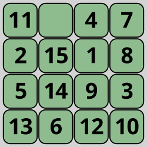

# Practice Problems

_Estimated time to finish: 90 - 120 minutes_

In this lesson we will solve the 8-Puzzle and the 15-Puzzle Problem using DFS and BFS.

## 8-Puzzle Problem

In the 8-puzzle game, we want to find a path from an initial state(scrambled tiles) to the goal state (tiles in the correct order).

Here is a snapshot of our search tree:

<p align="center">

</p>

From this state, we can move the tiles 2,8,4, and 6. Each of these moves will result in a new state like this:

<p align="center">

</p>

From each new state, we can again move different tiles. Each of these moves will result in a new state until we reach the goal state.

<p align="center">

</p>

## Solving the 8-Puzzle Problem with BFS

```python
from collections import deque

# Board dimension
N = 3

# Board move directions
MOVES = {'up': -N, 'down': N, 'left': -1, 'right': 1}


def is_valid_move(pos, move):
  if move == 'up' and pos < N:
    return False
  if move == 'down' and pos >= N * (N - 1):
    return False
  if move == 'left' and pos % N == 0:
    return False
  if move == 'right' and (pos + 1) % N == 0:
    return False
  return True


def make_move(board, move):
  empty_pos = board.index(None)
  if is_valid_move(empty_pos, move):
    new_board = board[:]
    target_pos = empty_pos + MOVES[move]
    new_board[empty_pos], new_board[target_pos] = new_board[
        target_pos], new_board[empty_pos]
    return new_board
  return None


def bfs(initial_board, goal_board):
  visited = set()
  queue = deque([(initial_board, [])])

  while queue:
    board, path = queue.popleft()

    if board == goal_board:
      return path

    visited.add(tuple(board))

    for move in MOVES.keys():
      next_board = make_move(board, move)
      if next_board and tuple(next_board) not in visited:
        queue.append((next_board, path + [move]))

  return None


def print_solution(board, solution):
  print("Initial board:")
  print_board(board)
  for move in solution:
    board = make_move(board, move)
    print(f"\nMove {move}:")
    print_board(board)


def print_board(board):
  for i in range(N):
    print(board[i * N:i * N + N])
  print()


if __name__ == "__main__":
  goal_board = [1, 2, 3, 4, 5, 6, 7, 8, None]
  initial_board = [1, 2, 3, 4, None, 6, 7, 5, 8]
  #initial_board = [2, 4, 3, 1, None, 6, 7, 5, 8]
  #initial_board = [5, 4, 3, 7, 1, 2, 6, 8, None]

  bfs_solution = bfs(initial_board, goal_board)

  print("\nBFS Solution:")
  if bfs_solution:
    print_solution(initial_board, bfs_solution)
  else:
    print("No solution found with BFS")

```

<aside>
Try to solve the 8-puzzle problem above using DFS. Print the visited nodes and compare them with the visited nodes of BFS. What do you notice?
</aside>

## 15-Puzzle Problem

<p align="center">

</p>

The 15-puzzle is the same as the 8-puzzle, but with 15 tiles instead of 8. The tiles are numbered from 1 to 15. The goal state is to arrange the tiles in ascending order from left to right and top to bottom, with the empty space in the bottom right corner.

## Solving the 15 Puzzle Problem using BFS

Here is a sample initial state, goal state, and transition model for the 15 puzzle problem:

```python
# an unoptimized incompelte model for the 15 puzzle problem
from collections import deque

# Board dimension
N = 4

# Board move directions
MOVES = {'up': -N, 'down': N, 'left': -1, 'right': 1}


def is_valid_move(pos, move):
  if move == 'up' and pos < N:
    return False
  if move == 'down' and pos >= N * (N - 1):
    return False
  if move == 'left' and pos % N == 0:
    return False
  if move == 'right' and (pos + 1) % N == 0:
    return False
  return True


def make_move(board, move):
  empty_pos = board.index(None)
  if is_valid_move(empty_pos, move):
    new_board = board[:]
    target_pos = empty_pos + MOVES[move]
    new_board[empty_pos], new_board[target_pos] = new_board[
        target_pos], new_board[empty_pos]
    return new_board
  return None


def bfs(initial_board, goal_board):
  visited = set()
  queue = deque([(initial_board, [])])

  while queue:
    board, path = queue.popleft()

    if board == goal_board:
      return path

    visited.add(tuple(board))

    for move in MOVES.keys():
      next_board = make_move(board, move)
      if next_board and tuple(next_board) not in visited:
        queue.append((next_board, path + [move]))

  return None


def print_solution(board, solution):
  print("Initial board:")
  print_board(board)
  for move in solution:
    board = make_move(board, move)
    print(f"\nMove {move}:")
    print_board(board)


def print_board(board):
  for i in range(N):
    print(board[i * N:i * N + N])
  print()


if __name__ == "__main__":
  goal_board = [1, 2, 3, 4, 5, 6, 7, 8, 9, 10, 11, 12, 13, 14, 15, None]
  initial_board = [1, 2, 3, 4, 5, 6, 7, 8, 9, 10, 11, 12, 15, 14, 13, None]
  #initial_board = [2, 4, 3, 1,9,10,11,12,15,14,13,None, 6, 7, 5, 8]
  #initial_board = [5, 4, 3, 7, 1, 2, 6, 8, None]

  bfs_solution = bfs(initial_board, goal_board)

  print("\nBFS Solution:")
  if bfs_solution:
    print_solution(initial_board, bfs_solution)
  else:
    print("No solution found with BFS")

```

## Failure of BFS and DFS

The 15-puzzle problem is a more complex problem than the 8-puzzle problem. The 8-puzzle problem has 9! = 362,880 states, while the 15-puzzle problem has 16! = 20,922,789,888,000 states. This is a huge number of states to explore. Even with the BFS algorithm, it will take a long time to find the solution. With DFS, it will take even longer. In fact, it will take so long that it will be impractical to use any of them to solve the 15-puzzle problem.

That's why we need to use more efficient algorithms to takle this complexity. In the next lesson, we will learn about informed search algorithms and how to use them to efficiently solve this problems.
