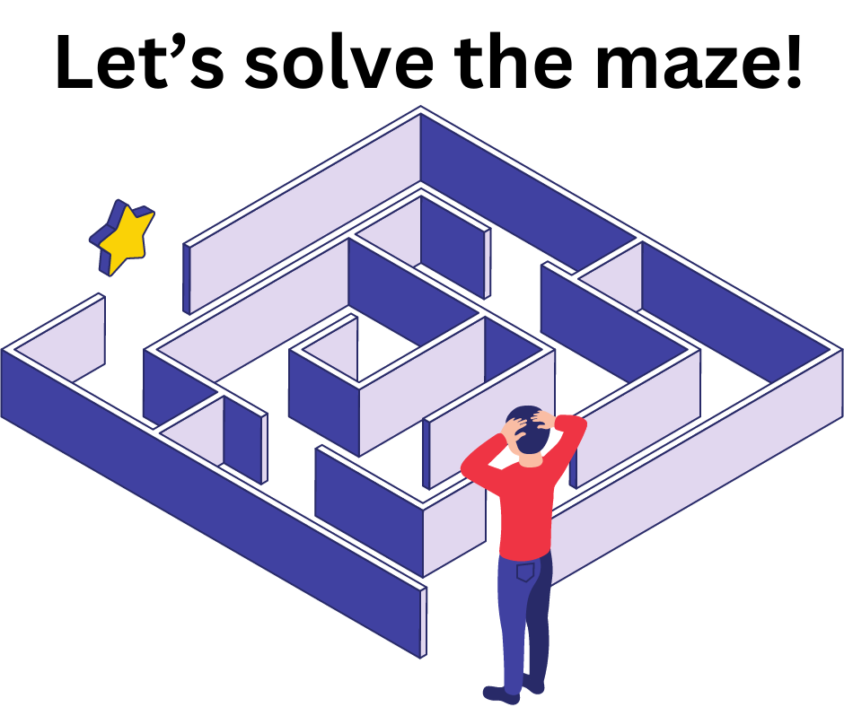
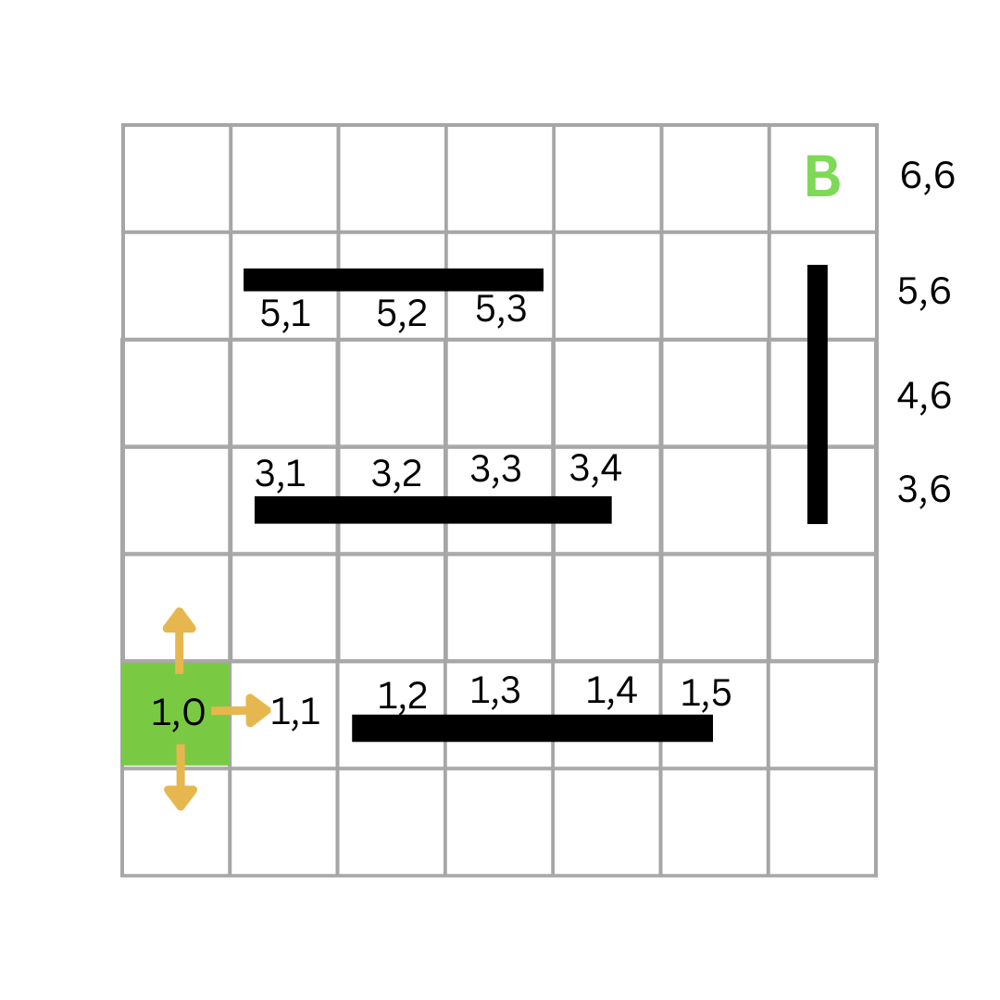
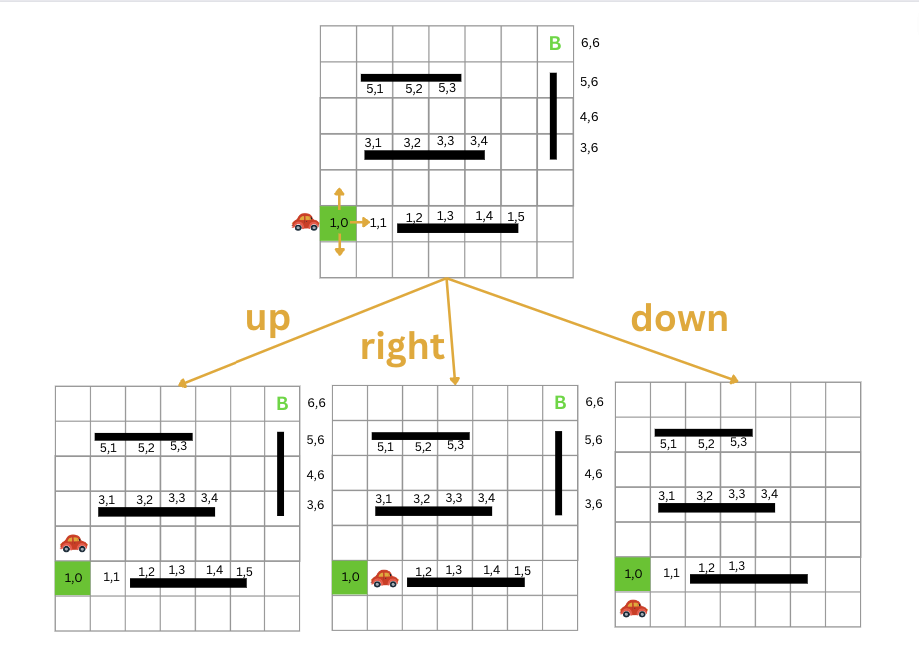
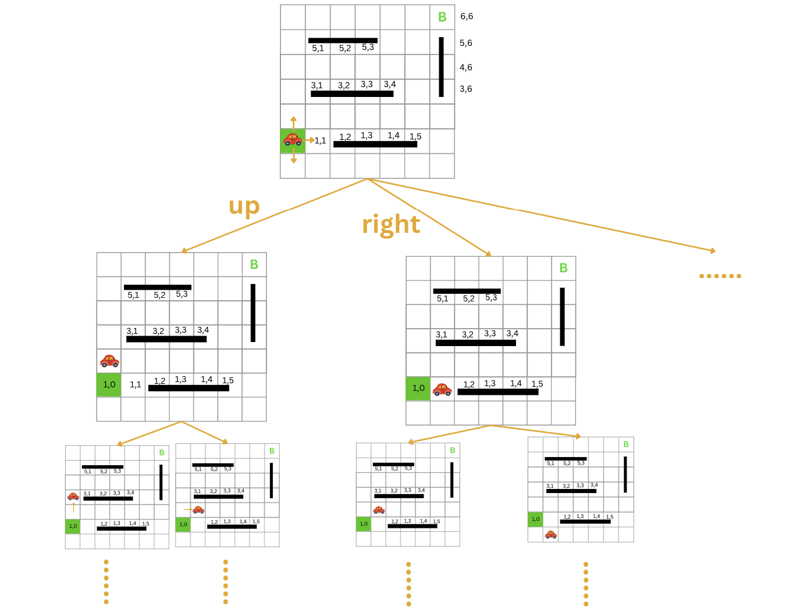

# Search Algorithms

_Estimated Time: 90 - 180 minutes_



<aside>

A **search algorithm** takes a search problem as input and returns a solution or indicates that no solution exists.

</aside>

## Search Trees

Before writing any code, it is useful to visualize our search space. Starting from an initial state, there are typically several actions that can be taken to transition to a new state. From that new state, there are again several actions that can be taken to move to yet another state, and so on. This process repeats until a goal state is reached. Here is a simple example:

Suppose we have an 8-puzzle game, and we want to find a path from the initial state to the goal state. The initial state might be something like this:

<p align="center">

</p>

From this state, we can move the tiles 2,8,4, and 6. Each of these moves will result in a new state like this:

<p align="center">

</p>

From each new state, we can again move different tiles. Each of these moves will result in a new state until we reach the goal state.

<p align="center">

</p>

As we see, this process can be visualized as a tree, where each node represents a state, and each edge represents an action. This is called a **search tree**. Each node in the serach tree corresponds to a state in the state space and each edge corresponds to an action. The root node of the tree represents the initial state.The complete tree can be very large to visualize here, but you get the idea.

## Search Tree for Car Example

In our car example, the starting state is the point `(1, 0)` on our modeled grid.

<p align="center">

</p>

From this point, the car can move to points `(0, 0), (2, 0), or (1, 1`).

<p align="center">

</p>

From the point `(2, 0)`, the car can move to point `(2, 1)` or `(3, 0)` . Similarly, from the point `(1, 1)`, the car can move to points `(0, 1), (2, 1), or (1, 2)`, and so on.

<p align="center">

</p>

## Modeling Search Trees in Code

There are different ways to model a search tree, which represents our state space, in code. A search tree, like any other tree, is a special type of graph. As you might recall from your DSA class, a graph is a non-linear data structure consisting of nodes connected by edges. Each node can have zero or more child nodes.

Below is a typical graph representation in Python:

```python
class Vertex:
    def __init__(self, name, **kwargs):
        self.name = name

    def __repr__(self):
        return self.name

    def __eq__(self, other):
        return isinstance(other, Vertex) and self.name == other.name

    def __hash__(self):
        return hash(self.name)


class Graph:
    def __init__(self):
        self.graph = {}  # dictionary of vertex name -> list of connected vertices

    def add_vertex(self, vertex: Vertex):
        self.graph.setdefault(vertex, [])

    def add_edge(self, vertex1: Vertex, vertex2: Vertex):
        if vertex1 not in self.graph:
            self.add_vertex(vertex1)
        if vertex2 not in self.graph:
            self.add_vertex(vertex2)
        if vertex2 not in self.graph[vertex1]:  # Prevent duplicate edges
            self.graph[vertex1].append(vertex2)

    def get_neighbors(self, vertex: Vertex):
        return self.graph.get(vertex, None)

    def __str__(self):
        return "\n".join(f"{vertex.name}: {edges}" for vertex, edges in self.graph.items())

```

### Graphs Refresher

If the above code doesn't look familiar to you, or you need a refresher on Graphs, check out this [lesson](../../refreshers/graphs.md).

Here is a slightly modified version of the code above that will help us model our search tree better:

```python
class Node:

  def __init__(self, state, parent=None, attributes=None):
    self.state = state  # for each node to hold its state
    self.parent = parent  # the node to keep track of its parent
    self.attributes = attributes  # to hold any other attributes

  def __repr__(self):
    return str(self.state)

  def __eq__(self, other):
    return isinstance(other, Node) and self.state == other.state

  def __hash__(self):
    return hash(self.state)


class Graph:

  def __init__(self):
    self.graph = {}  # dictionary of node -> list of connected vertices

  def add_node(self, node: Node):
    self.graph.setdefault(node, [])

  def add_edge(self, node1: Node, node2: Node, weight=1):
    if node1 not in self.graph:
      self.add_node(node1)
    if node2 not in self.graph:
      self.add_node(node2)
    if (node2, weight) not in self.graph[node1]:  # Prevent duplicate edges
      self.graph[node1].append((node2, weight))

  def get_neighbors(self, node: Node):
    return self.graph.get(node, None)

  def get_node(self, state):
  # This function should return a node with a given state if it exists in the graph
    for node in self.graph:
        if node.state == state:
            return node
    return None


  def __str__(self):
    return "\n".join(
        f"{node.state}: {', '.join([f'{v.state} ({w})' for v, w in edges])}"
        for node, edges in self.graph.items())

```

Here are the changes I made to the code above:

- Changed the name of the class `Vertex` to `Node` to better reflect what it represents and also to match the terminology we use in our lessons.
- Changed the name of the attribute `name` to `state`.
- Added a new attribute `parent` to keep track of the parent node.
- Added a new attribute `attributes` to hold any other attributes we might need.

## Coding the Car Example Search Tree

```python
def build_car_nav_graph(blocked_cells):
  graph = Graph()
  GRID_SIZE = 7
  for i in range(GRID_SIZE):
      for j in range(GRID_SIZE):
          if (i, j) in blocked_cells:
              continue

          current_node = Node((i, j))
          graph.add_node(current_node)

          # Check and add right neighbor
          if j + 1 < GRID_SIZE:
              right_node = Node((i, j + 1))
              if right_node.state not in blocked_cells:
                  graph.add_edge(current_node, right_node)

          # Check and add bottom neighbor
          if i + 1 < GRID_SIZE:
              bottom_node = Node((i + 1, j))
              if bottom_node.state not in blocked_cells:
                  graph.add_edge(current_node, bottom_node)

          # Check and add left neighbor
          if j - 1 >= 0:
              left_node = Node((i, j - 1))
              if left_node.state not in blocked_cells:
                  graph.add_edge(current_node, left_node)

          # Check and add top neighbor
          if i - 1 >= 0:
              top_node = Node((i - 1, j))
              if top_node.state not in blocked_cells:
                  graph.add_edge(current_node, top_node)

  return graph


blocked_cells = [(1,2), (1,3) ,(1,4) ,(1,5), (3,1), (3,2), (3,3), (3,4), (5,1), (5,2),(5,3),(3,6), (4,6), (5,6)]

graph = build_car_nav_graph(blocked_cells)
print(graph)
```

# Solving Search Problems

You are also likely familiar with some algorithms that can be employed to traverse a tree. Two of the most common traversal algorithms are depth-first search (DFS) and breadth-first search (BFS). We can use these algorithms to traverse the search tree and find a path from the starting state to the goal state.

For a refresher on these algorithms, you can refer to this lesson: [DFS and BFS](../../refreshers/search-algorithms.md).

## Finding a Path Using DFS and BFS

Here is the code for the car example using DFS and BFS. A video explaining the code is also provided below.

```python
def bfs(graph, start_node, end_node):
  queue = deque([start_node])
  visited = set()
  visited_order = []  # List to store the order of visited nodes

  while queue:
      current_node = queue.popleft()

      # Add the current node to the visited list before marking it as visited
      visited_order.append(current_node)

      if current_node == end_node:
          return reconstruct_path(current_node, visited_order)  # Pass the visited_order list

      visited.add(current_node)

      for neighbor, _ in graph.get_neighbors(current_node):
          if neighbor not in visited and neighbor not in queue:
              neighbor.parent = current_node
              queue.append(neighbor)

  return None


def reconstruct_path(end_node, visited_order):
  path = []
  while end_node:
      path.append(end_node)
      end_node = end_node.parent
  path.reverse()

  # Print the order of visited nodes
  print("Visited Order:", " -> ".join(map(str, visited_order)))

  return path

start_node = Node((1, 0))
end_node = Node((6, 6))
path = bfs(graph, start_node, end_node)
if path:
    print("Path:", " -> ".join(map(str, path)))
else:
    print("No path found.")

```

Notes on the code above:

- The visited_order list is used to store the order of visited nodes. This is useful for debugging and visualization purposes. It is not required for the algorithm to work.
- The reconstruct_path function is used to reconstruct the path from the starting node to the goal node. It takes the goal node and moves backward to the starting node using the parent attribute of each node. It returns a list of nodes that represent the path from the starting node to the goal node.

## DFS

```python

def dfs(graph, start_node, end_node):
  stack = [start_node]
  visited = set()
  visited_order = []  # to store the visited nodes in order

  while stack:
      current_node = stack.pop()
      if current_node in visited:
          continue

      visited_order.append(current_node)  # append the node to the visited_order list

      if current_node == end_node:
          print("Visited Order:", " -> ".join(map(str, visited_order)))
          return reconstruct_path(current_node, visited_order)

      visited.add(current_node)
      for neighbor, _ in graph.get_neighbors(current_node):
          if neighbor not in visited:
              neighbor.parent = current_node
              stack.append(neighbor)

  print("Visited Order:", " -> ".join(map(str, visited_order)))
  return None


def reconstruct_path(end_node, visited_order):
  path = []
  while end_node:
      path.append(end_node)
      end_node = end_node.parent
  path.reverse()

  # Print the order of visited nodes
  print("Visited Order:", " -> ".join(map(str, visited_order)))

  return path


path = dfs(graph, graph.get_node((1, 0)), graph.get_node((6, 6)))
if path:
    print("Path:", " -> ".join(map(str, path)))
else:
    print("No path found.")

```

## Understanding Our Objective

In our previous examples, our primary objective was to find **a path** from the starting state to the goal state. We used BFS and DFS to solve the problem. However, it's important to note that not all paths are equal; some paths are better than others. Later this week, we will explore how to find the optimal path from the starting state to the goal state.

## Evaluating Search Algorithms

When evaluating search algorithms, we typically consider the following criteria:

- Completeness
- Optimality
- Time complexity
- Space complexity

### Completeness

If the algorithm is guaranteed to find a solution if one exists, then we say that the algorithm is complete. **Both BFS and DFS are complete algorithms**.

### Optimality

If the algorithm is guaranteed to find the optimal solution (lowest path code), then we say that the algorithm is optimal. **BFS is optimal, but DFS is not**.

### Time Complexity

Time complexity is the number of nodes that are expanded during the search. We typically use big-O notation to express the time complexity of an algorithm.
The time complexity of a Breadth-First Search (BFS) algorithm is typically **O(V + E)**, where V is the number of vertices and E is the number of edges in the graph being traversed. The time complexity of a Depth-First Search (DFS) algorithm is typically **O(V)** where V is the number of vertices (nodes) in the tree.

### Space Complexity

Space complexity is the maximum number of nodes that are stored in memory during the search. We use big-O notation to express the space complexity as well.
The space complexity of a Breadth-First Search (BFS) algorithm is typically O(V), where V is the number of vertices in the graph being traversed.In the case of an iterative DFS using a stack on a tree, the space complexity is O(h) where "h" is the height of the tree.

A simple indicator for us to use could be the number of nodes expanded during the search(how many nodes we visit during the search until we reach the goal).

## Which one is better?

The choice between Breadth-First Search (BFS) and Depth-First Search (DFS) depends on the specific characteristics of the problem you are trying to solve. Neither one is universally "better" than the other; they each have their own strengths and weaknesses.

Here are some considerations for when to use each search algorithm:

Use **BFS** when:

- You want to find the shortest path or the minimum number of steps to reach a goal. BFS explores nodes level by level, so it is guaranteed to find the shortest path in an unweighted graph.
- You need to visit all nodes at a given level before moving on to the next level.
- The graph has a tree structure, and you want to visit all nodes at the same depth before moving to the next level.
- You want to avoid deep recursion, which can be an issue in DFS on very deep graphs.

Use **DFS** when:

- You are interested in exploring as deeply as possible along a branch before backtracking. DFS is well-suited for tasks like finding paths or cycles.

- You have limited memory resources because, in general, DFS can use less memory (stack space) than BFS.

- You are working with a tree or a graph with a limited depth, and you prefer a simple recursive implementation.

- You want to find multiple solutions or all possible paths from a start node to a goal node.

## More Search Algorithms

There are many other search algorithms ou there.Here is a list of some of them:

- Greedy Best-First Search
- A\* Search
- Iterative Deepening Search
- Bidirectional Search
- Depth-Limited Search
- Iterative Deepening Depth-First Search
- Recursive Best-First Search
- Hill Climbing Search
- Beam Search

And more. You can read more about them [here](https://www.geeksforgeeks.org/searching-algorithms/).

In this week, besides BFS and DFS, we will also learn about A\* Search algorithm. Next week, we will learn more search algorithms suitable for solving more complex problems.

## Self Assesment:

- Pick a search problem and write a complete solution for it using BFS and DFS. You can use the code above as a starting point. Example problems include:
  - 8-puzzle
  - 8-queens
  - Maze
