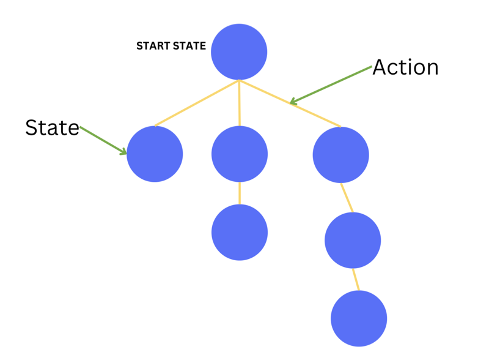

# Search Algorithms


Now that we have learned about search problems, it's time to learn how to solve them. In this lesson, we will learn about search algorithms and how to use them to solve search problems.

## Search Algorithm

<aside>

A **search algorithm** takes a search problem as input and returns a solution or indicates that no solution exists.

</aside>

We know from the previous lesson that in our search problems, we have a **starting state** and a **goal state**. We also have a set of **actions** that we can take to move from one state to another. Each action leads to a new state. 
If we try to visualize this, we can think of it as a tree where the starting state is the root, and the actions are the edges that connect the nodes.

<p align="center">
  
</p>

In our car example, the starting state is the point `(1, 0)` on our modeled grid.

<p align="center">

</p>

From this point, the car can move to points `(0, 0), (2, 0), or (1, 1`).

<p align="center">

</p>

From point `(2, 0)`, the car can move to point `(2, 1)` or `(3, 0)`. Similarly, from point `(1, 1)`, the car can move to points `(0, 1), (2, 1), or (1, 2)`, and so on.

<p align="center">

</p>

We refer to these trees as **search trees**. They represent our state space in which we search for a solution. Each node in the search tree corresponds to a state in the state space, and each edge corresponds to an action. The root node of the tree represents the initial state.

This mental model of search trees will help us in finding solutions to our search problems. We can employ various algorithms to navigate the search tree and discover a path from the initial state to the goal state.

## Breadth-First Search (BFS) and Depth-First Search (DFS)

You are likely familiar with the depth-first search (DFS) and breadth-first search (BFS) algorithms. Here we will employ these algorithms to traverse the search tree and find a path from the starting state to the goal state.

## Solving The Car Journey Example Using BFS

Let's solve the car journey example using BFS. We will define the grid, the initial state, the goal state, the actions, and the blocked cells. Then, we will implement the transition model, goal test, and the BFS algorithm to find the path from the initial state to the goal state.


### World Representation
Our world is a 7x7 grid. The car starts at position `(1, 0)` and needs to reach position `(6, 6)`. The car can move up, down, left, or right. The cells `(2, 3), (2, 4), (3, 2), (3, 3), and (3, 4)` are blocked and cannot be visited.

```python
GRID_SIZE = 7 # 7x7 grid
initial_state = (1, 0)  # index of car's starting position
goal_state = (6, 6)  # index of the car's destination.
actions = ["up", "down", "left", "right"]
blocked_cells = [(2, 3), (2, 4), (3, 2), (3, 3), (3, 4)]
```

### Transition Model
Our transition model defines how the car can move from one state to another based on the action taken. The car can move up, down, left, or right, as long as it stays within the grid bounds and does not move to a blocked cell.

In our representation of the grid world, moving up means decreasing the y-coordinate by 1, moving down means increasing the y-coordinate by 1, moving right means increasing the x-coordinate by 1, and moving left means decreasing the x-coordinate by 1. We also check if the new state is within the grid bounds by ensuring that the x and y coordinates are within the range `[0, GRID_SIZE - 1]`.
```python
def transition_model(state, action):
  x, y = state # unwrap the state tuple

  if action == 'up' and y > 0:
    return (x, y - 1)
  elif action == 'down' and y < GRID_SIZE - 1:
    return (x, y + 1)
  elif action == 'right' and x < GRID_SIZE - 1:
    return (x + 1, y)
  elif action == 'left' and x > 0:
    return (x - 1, y)
  else:
    return None
```


### Goal Test
Given a state, we need to check if it is the goal state. In our car journey example, the goal state is `(6, 6)`. We need to check if the current state is equal to the goal state.

```python
def goal_test(state):
  return state == goal_state
```

### Breadth-First Search (BFS) Algorithm
Breadth-First Search (BFS) explores the search tree level by level. It starts at the root node and explores all the neighbor nodes at the present depth before moving on to the nodes at the next depth level.

Watch these two videos to understand how BFS works:

<iframe width="100%" height="450" src="https://www.youtube.com/embed/1wu2sojwsyQ?si=wgfVF8u4ukzATfCj" title="YouTube video player" frameborder="0" allow="accelerometer; autoplay; clipboard-write; encrypted-media; gyroscope; picture-in-picture; web-share" referrerpolicy="strict-origin-when-cross-origin" allowfullscreen></iframe>

<iframe width="100%" height="450" src="https://www.youtube.com/embed/n3fPL9q_Nyc?si=-dAm3GrAMoycsMWT" title="YouTube video player" frameborder="0" allow="accelerometer; autoplay; clipboard-write; encrypted-media; gyroscope; picture-in-picture; web-share" referrerpolicy="strict-origin-when-cross-origin" allowfullscreen></iframe>

In our implementation of BFS, we use a queue to keep track of the nodes to be visited. We start with the initial state and an empty path. We keep track of the visited nodes to avoid revisiting them. We explore the nodes level by level until we find the goal state.

```python
def solve_bfs():
  # deque, is an efficient implementation of a queue in Python.
  # We start with the initial state and an empty path.
  queue = deque([
      (initial_state, [])
  ]) 

  visited = set()  # keep track of the visited nodes to avoid revisiting

  while queue: # while there are nodes to visit
    state, path = queue.popleft() # get the first node in the queue

    if goal_test(state): # check if the current state is the goal state
      return path + [state] # if so, return the path to the goal

    if state not in visited: # if the state has not been visited
      visited.add(state) # mark the state as visited
      for action in actions: # for each possible action
        next_state = transition_model(state, action) # get the next state based on the action
        
        # if the next state is valid, not visited, and not blocked
        if next_state and next_state not in visited and is_valid_state(
            next_state):
            # add it to the queue
          queue.append((next_state, path + [state]))

  return None
```

Note that, in our implementation, we keep track of the path from the initial state to the current state stored in the queue. You can choose to do this differently. For example, you could use a node data structure that contains the state, the parent node, and the action that led to the current state.

Let's put it all together and run the BFS algorithm to find the path from the initial state `(1, 0)` to the goal state `(6, 6)`.

Click on "Open in Replit" to open the code in Replit and run the BFS algorithm to find the path to the goal.

<iframe src="https://replit.com/@kibocurriculum/Car-Journey-BFS?embed=true" width="100%" height="450"></iframe>


## Solving The Car Journey Example Using DFS
Now, let's solve the car journey example using Depth-First Search (DFS). 

The world representation, transition model, and goal test are the same as in the BFS example. The main difference is in the implementation of the DFS algorithm.

Watch this video to understand how DFS works:

<iframe width="100%" height="450" src="https://www.youtube.com/embed/h1RYvCfuoN4?si=-xB73nU4vAhqjfmC;start=0&end=419" title="YouTube video player" frameborder="0" allow="accelerometer; autoplay; clipboard-write; encrypted-media; gyroscope; picture-in-picture; web-share" referrerpolicy="strict-origin-when-cross-origin" allowfullscreen></iframe>

So, the difference between BFS and DFS is that Depth-First Search explores the search tree by going as deep as possible along each branch before backtracking.
Here is the code for the car example using DFS.

Here is the implementation of the DFS algorithm:

```python
def solve_dfs():
  stack = [(initial_state, [])]
  visited = set()

  while stack:
    state, path = stack.pop()
    if goal_test(state):
      #print(visited)
      return path + [state]

    if state not in visited:
      visited.add(state)
      for action in actions:
        next_state = transition_model(state, action)
        if next_state and next_state not in visited and is_valid_state(
            next_state):
          stack.append((next_state, path + [state]))

  #print(visited)
  return None
```

As we can see, using a stack instead of a queue, the DFS algorithm explores the search tree by going as deep as possible along each branch before backtracking.

> Isn't it cool how switching from a queue to a stack for DFS links back to what we learned in our data structures and algorithms class? It's amazing to see these basic ideas in action!

Here is the full code for the car journey example using DFS:

<iframe src="https://replit.com/@kibocurriculum/Car-Journey-DFS?embed=true" width="100%" height="450"></iframe>
The output of the above code:

```bash
DFS path to goal:
[(1, 0), (2, 0), (3, 0), (4, 0), (5, 0), (6, 0), (6, 1), (5, 1), (4, 1), (3, 1), (2, 1), (1, 1), (0, 1), (0, 2), (1, 2), (1, 3), (0, 3), (0, 4), (1, 4), (1, 5), (2, 5), (3, 5), (4, 5), (5, 5), (6, 5), (6, 6)]
```

## Evaluating Search Algorithms
Now that we have implemented both Breadth-First Search (BFS) and Depth-First Search (DFS) algorithms, and we will implement more later, let's learn a way how to evaluate these search algorithms.

When evaluating search algorithms, we typically consider the following criteria:

- Completeness
- Optimality
- Time complexity
- Space complexity

### Completeness

If the algorithm is guaranteed to find a solution if one exists, then we say that the algorithm is complete. **Both BFS and DFS are complete algorithms**.

### Optimality

If the algorithm is guaranteed to find the optimal solution, then we say that the algorithm is optimal. In our problem definition, we defined the cost of each action to be the same and our graph is not weighted. In this case, **BFS is optimal, but DFS is not**. In other scenarios, BFS may not be optimal.

### Time Complexity
We typically use big-O notation to express the time complexity of an algorithm.
The time complexity of a Breadth-First Search (BFS) algorithm is typically **O(V + E)**, where V is the number of vertices and E is the number of edges in the graph being traversed. The time complexity of a Depth-First Search (DFS) algorithm is typically **O(V)** where V is the number of vertices (nodes) in the tree.

### Space Complexity

Space complexity is the maximum number of nodes that are stored in memory during the search. We use big-O notation to express the space complexity as well.
The space complexity of a Breadth-First Search (BFS) algorithm is typically O(V), where V is the number of vertices in the graph being traversed. In the case of an iterative DFS using a stack on a tree, the space complexity is O(h) where "h" is the height of the tree.

## Which one is better?

The choice between Breadth-First Search (BFS) and Depth-First Search (DFS) depends on the specific characteristics of the problem you are trying to solve. Neither one is universally "better" than the other; they each have their own strengths and weaknesses.

Here are some considerations for when to use each search algorithm:

Use **BFS** when:

- You want to find the shortest path or the minimum number of steps to reach a goal. BFS explores nodes level by level, so it is guaranteed to find the shortest path in an unweighted graph.
- The graph has a tree structure, and you want to visit all nodes at the same depth before moving to the next level.
- You want to avoid deep recursion, which can be an issue in very deep graphs.

Use **DFS** when:

- You are interested in exploring as deeply as possible along a branch before backtracking.

- You are working with a tree or a graph with a limited depth, and you prefer a simple recursive implementation.

- You want to find multiple solutions or all possible paths from a start node to a goal node.

## More Search Algorithms

There are many other search algorithms out there.Here is a list of some of them:

- Greedy Best-First Search
- A\* Search
- Iterative Deepening Search
- Bidirectional Search
- Depth-Limited Search
- Iterative Deepening Depth-First Search
- Recursive Best-First Search
- Hill Climbing Search
- Beam Search

In this week, besides BFS and DFS, we will also learn about Greedy Best-First Search and A\* Search algorithm. Next week, we will learn more search algorithms suitable for solving more complex problems.

## Self Assessment::

- Pick a search problem and write a complete solution for it using BFS and DFS. You can use the code above as a starting point. Example problems include:
  - 8-puzzle
  - 8-queens
  - 2D maze represented by a grid
  - [Word Ladder](https://leetcode.com/problems/word-ladder/)
