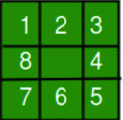
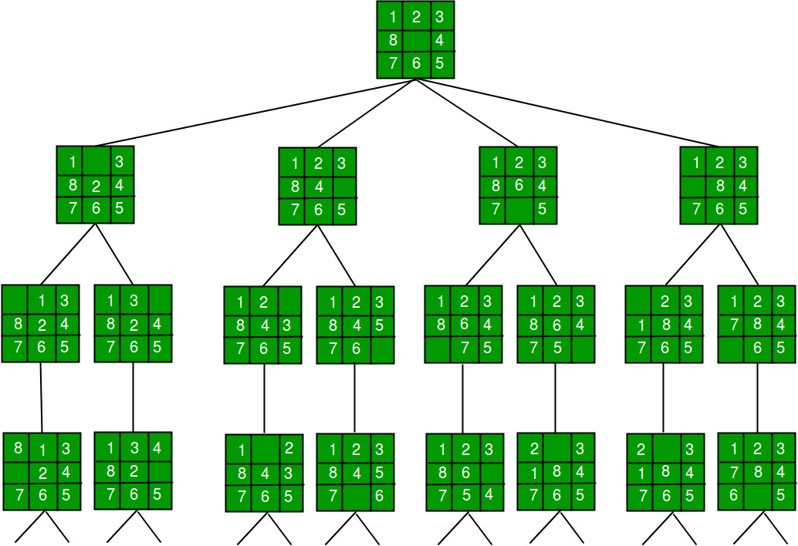

# Search Algorithms

_Estimated Time: 90 minutes_

Now that we understand how to model a problem as a search problem, we can begin to explore how to solve it. In this lesson, we will examine some of the most common search algorithms used to solve search problems.

## Search Trees

Starting from an initial state, there are typically several actions that can be taken to transition to a new state. From that new state, there are again several actions that can be taken to move to yet another state, and so on. This process repeats until a goal state is reached. Here is a simple example:

Suppose we have an 8-puzzle game, and we want to find a path from the initial state to the goal state. The initial state might be something like this:

<p align="center">

</p>

From this state, we can move the tiles 2,8,4, and 6. Each of these moves will result in a new state like this:

<p align="center">

</p>

From each new state, we can again move different tiles. Each of these moves will result in a new state until we reach the goal state.

<p align="center">

</p>

As we see, this process can be visualized as a tree, where each node represents a state, and each edge represents an action. This is called a **search tree**. The complete tree can be very large to visualize here, but you get the idea.

## Search Tree for Car Example

In our car example, the starting state is the point `(1, 0)` on our modeled grid.

<p align="center">

</p>

From this point, the car can move to points `(0, 0), (2, 0), or (1, 1`).

<p align="center">

</p>

From the point `(2, 0)`, the car can move to point `(2, 1)` or `(3, 0)` . Similarly, from the point `(1, 1)`, the car can move to points `(0, 1), (2, 1), or (1, 2)`, and so on.

<p align="center">

</p>

## Modeling Search Trees in Code

There are different ways to model a search tree, our state space, in code. Search tree, as any other tree, is a special type of graph and, as you know from your DSA class, a graph is a non-linear data structure that consists of nodes connected by edges. Each node can have zero or more child nodes.

Below is a typical graph data structure in Python:

```python
class Vertex:
    def __init__(self, name, **kwargs):
        self.name = name

    def __repr__(self):
        return self.name

    def __eq__(self, other):
        return isinstance(other, Vertex) and self.name == other.name

    def __hash__(self):
        return hash(self.name)


class Graph:
    def __init__(self):
        self.graph = {}  # dictionary of vertex name -> list of connected vertices

    def add_vertex(self, vertex: Vertex):
        self.graph.setdefault(vertex, [])

    def add_edge(self, vertex1: Vertex, vertex2: Vertex):
        if vertex1 not in self.graph:
            self.add_vertex(vertex1)
        if vertex2 not in self.graph:
            self.add_vertex(vertex2)
        if vertex2 not in self.graph[vertex1]:  # Prevent duplicate edges
            self.graph[vertex1].append(vertex2)

    def get_neighbors(self, vertex: Vertex):
        return self.graph.get(vertex, None)

    def __str__(self):
        return "\n".join(f"{vertex.name}: {edges}" for vertex, edges in self.graph.items())

```

If this code doesn't look familiar to you, check out this [video](https://www.youtube.com/watch?v=zaBhtODEL0w) for a refresher on graphs.

Here is a slightly modified version of the code above that will help us model our search tree better (I will explain the modifications below):

```python
class Node:
     """A node in a search tree. Contains a pointer to the parent (the node
    that this is a successor of) and to the actual state for this node. Note
    that if a state is arrived at by two paths, then there are two nodes with
    the same state. Also includes the action that got us to this state, and
    the total path_cost (also known as g) to reach the node."""
    def __init__(self, state, parent, action):
        self.state = state
        self.parent = parent
        self.action_to_self = action

    def __repr__(self):
        return self.state

    def __eq__(self, other):
        return isinstance(other, Node) and self.state == other.state

    def __hash__(self):
        return hash(self.state)


class Graph:
    def __init__(self):
        self.graph = {}  # dictionary of node -> list of connected vertices

    def add_node(self, node: Node):
        self.graph.setdefault(node, [])

    def add_edge(self, node1: Node, node2: Node, weight: int):
        if node1 not in self.graph:
            self.add_node(node1)
        if node2 not in self.graph:
            self.add_node(node2)
        if (node2, weight) not in self.graph[node1]:  # Prevent duplicate edges
            self.graph[node1].append((node2, weight))

    def get_neighbors(self, node: Node):
        return self.graph.get(node, None)

    def __str__(self):
        return "\n".join(f"{node.state}: {', '.join([f'{v.state} ({w})' for v, w in edges])}" for node, edges in self.graph.items())
```

Here are some notes about the modified code above:

- I changed the name of the class `Vertex` to `Node` to better reflect what it represents and also to match the terminology we use in our lessons.

# Solving Search Problems

You are also likely familiar with some algorithms that can be employed to traverse a tree. Two of the most common traversal algorithms are depth-first search (DFS) and breadth-first search (BFS). We can use these algorithms to traverse the search tree and find a path from the starting state to the goal state.

For a refresher on these algorithms, you can refer to the following resources:

TODO: Add links below

- [Depth-First Search](https://www.geeksforgeeks.org/depth-first-search-or-dfs-for-a-graph/)
- [Breadth-First Search](https://www.geeksforgeeks.org/breadth-first-search-or-bfs-for-a-graph/)
- [Depth-First Search vs Breadth-First Search](https://www.geeksforgeeks.org/difference-between-bfs-and-dfs/)

Here is also a video that explains both of them applied to a search problem:

TODO: Add video

## Car Example Solution

Following the same approach, we can use DFS or BFS to find a path from the starting state to the goal state in our car example problem.

Here is the code for the car example using DFS and BFS. A video explaining the code is also provided below.

```python
def build_maze_graph(blocked_cells):
    graph = Graph()

    for i in range(6):
        for j in range(6):
            if (i, j) not in blocked_cells:
                current_node = Node((i, j), None, None)
                graph.add_node(current_node)

                # Check and add left neighbor
                if j > 0 and (i, j-1) not in blocked_cells:
                    left_node = Node((i, j-1), None, None)
                    graph.add_edge(current_node, left_node, 1)

                # Check and add top neighbor
                if i > 0 and (i-1, j) not in blocked_cells:
                    top_node = Node((i-1, j), None, None)
                    graph.add_edge(current_node, top_node, 1)

    return graph


```

```python
from collections import deque

def bfs(graph, start_state, goal_state):
    start = Node(start_state, None, None)
    goal = Node(goal_state, None, None)
    frontier = deque([start])
    explored = set()

    while frontier:
        current_node = frontier.popleft()

        if current_node == goal:
            # reconstruct the path
            path = []
            while current_node:
                path.append(current_node.state)
                current_node = current_node.parent
            return path[::-1]

        explored.add(current_node)

        for neighbor, _ in graph.get_neighbors(current_node) or []:
            if neighbor not in frontier and neighbor not in explored:
                neighbor.parent = current_node
                frontier.append(neighbor)

    return None

```

```python
def dfs(graph, start_state, goal_state):
    start = Node(start_state, None, None)
    goal = Node(goal_state, None, None)
    stack = [start]
    explored = set()

    while stack:
        current_node = stack.pop()

        if current_node == goal:
            # reconstruct the path
            path = []
            while current_node:
                path.append(current_node.state)
                current_node = current_node.parent
            return path[::-1]

        explored.add(current_node)

        for neighbor, _ in graph.get_neighbors(current_node) or []:
            if neighbor not in stack and neighbor not in explored:
                neighbor.parent = current_node
                stack.append(neighbor)

    return None

```

```python
blocked_cells = [(1,2),(1,3),(1,4),(1,5), (3,1), (3, 2), (3, 3), (3, 4), (5,1),(5,2),(5, 3),(3,6),(4,6),(5,6)]
maze_graph = build_maze_graph(blocked_cells)

# Using BFS
path_bfs = bfs(maze_graph, (0,1), (5,5))
print("Path using BFS:", path_bfs)

# Using DFS
path_dfs = dfs(maze_graph, (0,1), (5,5))
print("Path using DFS:", path_dfs)

```

```python
from collections import deque

class CarPath():
    def __init__(self):
        self.start_state = (1,0)
        self.goal_state = (6,6)

        self.state_space = []
        self.visited = []
        self.blocked_cells = [(1,2),(1,3),(1,4),(1,5), (3,1), (3, 2), (3, 3), (3, 4), (5,1),(5,2),(5, 3),(3,6),(4,6),(5,6)]

        for i in range(7):
            for j in range(7):
                if (i, j) in self.blocked_cells:
                    self.state_space.append(0)
                else:
                    self.state_space.append(1)
    def find_path_bfs(self):
       pass

    def find_path_dfs(self):
        pass

    def get_neighbors(self, state):
        neighbors = []
        if state[0] > 0:
            neighbors.append((state[0] - 1, state[1]))
        if state[0] < 6:
            neighbors.append((state[0] + 1, state[1]))
        if state[1] > 0:
            neighbors.append((state[0], state[1] - 1))
        if state[1] < 6:
            neighbors.append((state[0], state[1] + 1))
        return neighbors


road = CarRoad()
path_found = road.find_path_bfs()
print(path_found , road.visited)

```

You can try to complete the code above yourself before watching the video below.

TODO: Add video

## Understanding Our Objective

In our previous examples, our primary objective was to find **a path** from the starting state to the goal state. We used BFS and DFS to solve the problem. However, it's important to note that not all paths are equal; some paths are better than others. Later this week, we will explore how to find the shortest path from the starting state to the goal state.
