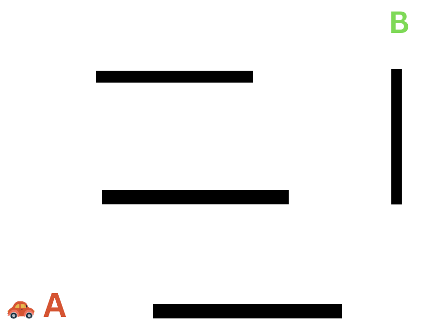
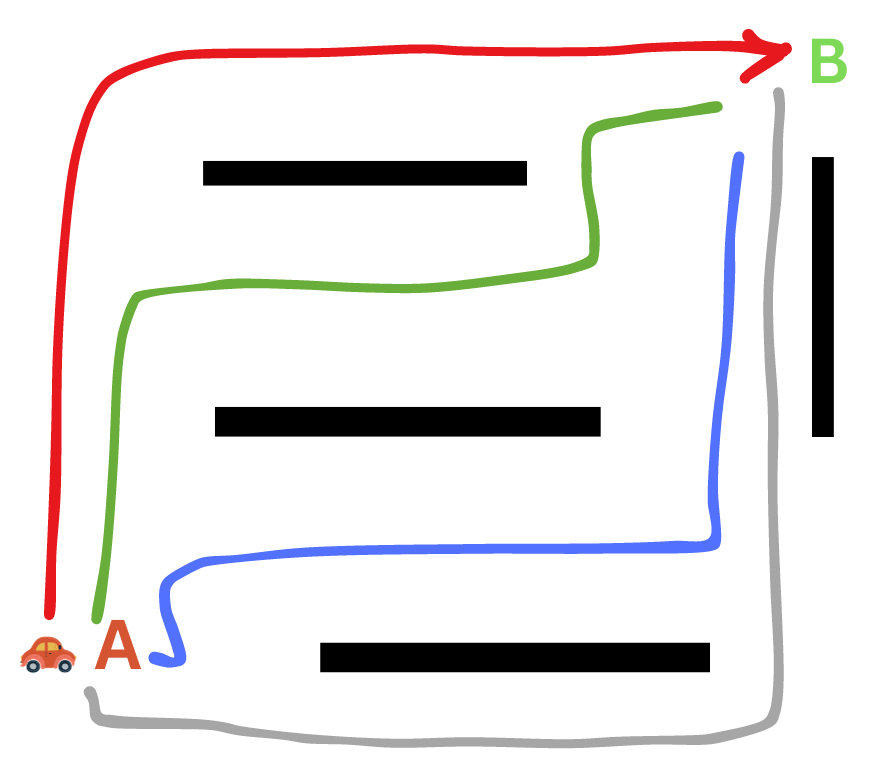
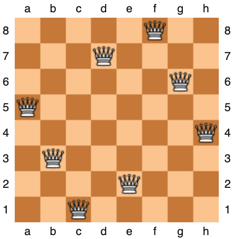
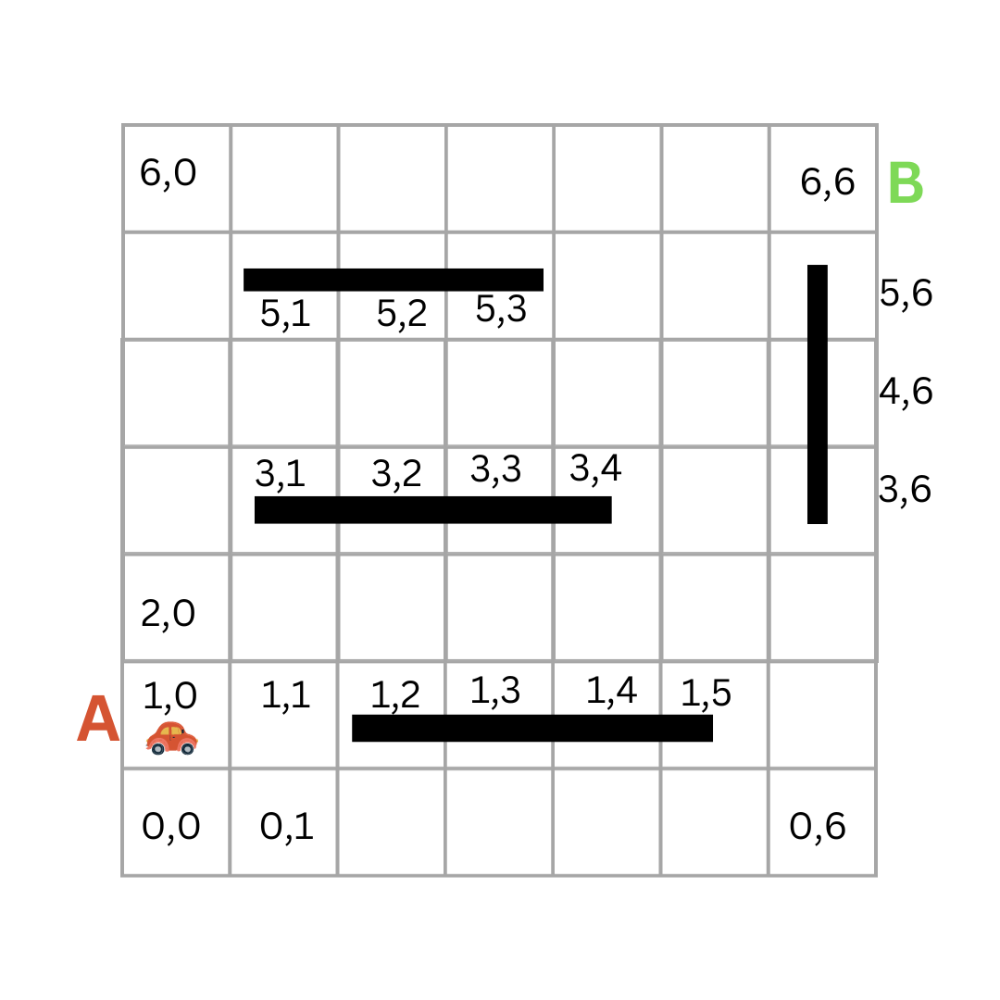
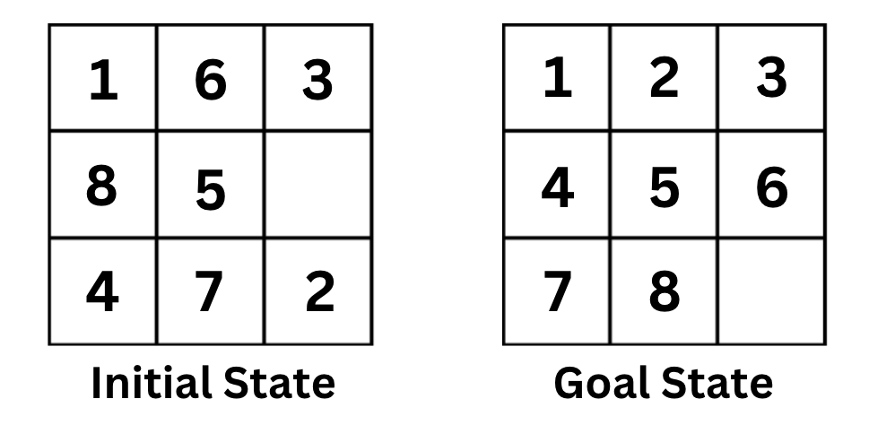
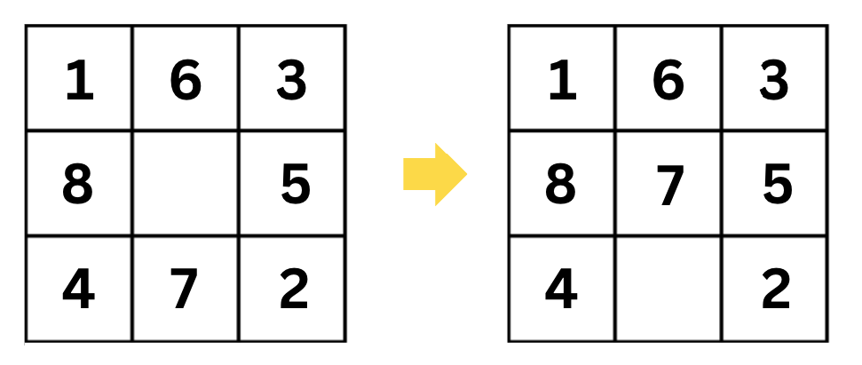

# Intelligence with Search

_Estimated time to finish: 60-90 minutes_

## Ready for some fun?

Would you be interested in learning how to program a computer to solve mazes, puzzles, find paths, or optimize item arrangements? What if you could also use this knowledge to minimize your time spent in traffic or create a system that plays chess or solves a Rubik's cube? This is precisely the essence of our lesson on "**Search**."

## Search Problems

A search problem is a specific type of computational problem that involves exploring a set of possible states or configurations (known as the state space) and finding a sequence of actions to achieve a goal within this state space. This is a broad definition, so let's clarify it with an example.

Consider the scenario of a car moving from point A to point B, as illustrated below:

<p align="center">

</p>

To reach point B, the car can follow various paths, as shown in the image below:

<p align="center">


</p>
Each of these paths represents distinct solutions to our problem. The decisions made throughout the journey generate various states or configurations for the car.

**This is a search problem identified by the following:**

- We have an agent (the car) that is trying to find a solution (the path) within a defined problem space (the road).
- The problem space, or **state space**, consists of various states or configurations (the different positions of the car).
- The goal is to find a sequence of actions that will lead from an initial state (the starting position of the car) to a desired goal state (the destination).

### The 8 Queens Problem

Let's consider another example. If we have a chessboard and eight queens, how can we place the queens on the chessboard so that no queen can attack another queen? This is known as the **8 queens problem**.

<p align="center">

</p>

**This is also a search problem identified by the following:**

- There are various configurations (states) of the queens on the chessboard.
- The goal is to find a sequence of actions that will lead from an initial state (the starting position of the queens) to a desired goal state (the configuration of the queens on the chessboard so that no queen can attack another queen).

### More Examples

There are many other examples of search problems. Retrieving relevant web pages or documents in response to a search query, finding the optimal path for data packets to travel from a source to a destination, solving some puzzles like sudoku or Rubik's cube, and determining the optimal route between two locations on a map are all examples of search problems.

## Understanding Our Objective

One might question whether we are genuinely searching for something in this context. Well, you can think of the path itself as the object of our search. In the car example, our mission is to discover the path leading us to point B (by searching possible states). In the 8-queens problem, our mission is to find the configuration of the queens on the chessboard (by searching possible states starting with an initial one).

## Modeling Search Problems

To tackle these problems with a computer, we aim to create a computer-friendly representation, a computational model. A typical model of a search problem consists of the following:

### State Space:

This represents the different configurations of the problem space. For instance, the different positions of the car, the different arrangements of tiles in a puzzle, or the different configurations of a robot.

### Initial State:

The starting state of the problem. For example, the starting position of the car, the initial arrangement of tiles in a puzzle, the initial position of a robot, etc.

### Goal State:

The desired state of the problem. For example, it could be the car's destination, the desired puzzle tile arrangement, or the robot's target position.

### Goal Test:

A function that determines whether a given state is a goal state. For instance, checking if the car has reached its destination, if the puzzle tiles are in the correct order, or if the robot has arrived at its destination.

### Actions:

Actions are the possible moves or steps that can transition the system from one state to another. These can include actions like moving up, down, left, or right.

### Transition Model:

The transition model (or Successor Function) is a function that accepts a state and an action as input and yields a new state as output. For example, the transition model for the car problem would take the car's current position and the desired direction, `Up` for example, as input and return the new position as output.

### Solution:

The solution is a series of actions that lead from the initial state to the goal state. This could be the path the car takes from its starting point to its destination, the sequence of moves needed to solve the puzzle, or the route the robot follows to reach its goal.

## Modeling the Car's Journey

Let's explore our previous example of a car journeying from point A to point B and frame it as a search problem.

### State Space:

To model the state space, we need to consider all the possible configurations of the car. To do that, we need to decide how we will represent the car's position and the **environment** in which it is moving.

To simplify things, we can represent the car's position as a coordinate on a grid. For example, the car's position at point A can be represented as `(1,0)`, and its position at point B can be represented as `(6,6)`.

<p align="center">

</p>

So, the **state space** is all the possible positions of the car on the grid. This is a finite set of states, and we can represent it as a **list** in Python.

```python
state_space = []
GRID_SIZE = 6
for i in range(GRID_SIZE):
    for j in range(GRID_SIZE):
        state_space.append(1)

```

We can also consider the blocked cells as part of the state space. In our example, blocked cells are: `(2,3) (2,4) (3,2) (3,3) (3,4)`

```python
# 6 * 6 grid with blocked cells marked with 0
# blocked cells are the cells that the car can't navigate to.
# In our example, blocked cells are: (2,3) (2,4) (3,2) (3,3) (3,4)
state_space = []
blocked_cells = [(2, 3), (2, 4), (3, 2), (3, 3), (3, 4)]
GRID_SIZE = 6
for i in range(GRID_SIZE):
    for j in range(GRID_SIZE):
        if (i, j) in blocked_cells:
            state_space.append(0)
        else:
            state_space.append(1)

```

### Initial State:

After modeling the state space, it is clear now that our initial state is the position of the car at point A, which is `(1,0)`. We can represent the initial state as a tuple in Python.

```python
initial_state = (1, 0)
```

### Goal State and Goal test:

The goal state is the position of the car at point B, which is `(6,6)`. Similarly, We can represent the goal state as a tuple in Python.

```python
goal_state = (6, 6)
```

The goal test will be a function that checks if the car's current position is the same as the goal position. If so, it returns `True`; otherwise, it returns `False`.

```python
def goal_test(state):
    return state == goal_state
```

### Actions:

Actions are the possible moves or steps that can transition the system from one state to another. In our example, the car can move up, down, left, or right. We can represent the actions as a list in Python.

```python
actions = ["up", "down", "left", "right"]
```

### Transition Model (Successor Function)

At a specific state (cell), the agent can take one of the possible actions: up, down, left, or right. For each specific action, the agent will end up in a new state (cell).

Take 10 minutes and try to write a transition model function for our can example. It's a function that takes a state and an action as input and returns a new state as output.

The state in our car example is the position of the car within the grid. The action is the direction the car is moving in. For example, if the car is at position `(1,1)` and the action is `up`, the new returned position will be `(2,1)`.

<p align="center">

</p>

Don't rush through it; take the 10 minutes and try. This is a crucial step in your learning process. If you can't do it, that's totally fine. You can check the solution below. But, please, try to do it first.

<p align="center">

</p>

Unfold the sample code below for an idea of how a transition model for this environment can be implemented.

<Details>

<Summary>Transition Model Function</Summary>

```python
def transition_model(state, action):
    action in the given state. The action should be a string
    taken from the list ['up', 'down', 'left', 'right'] and
    state should be a tuple of the form (x, y) where x and y
    are integers.
    """
    x, y = state
    if action == 'up':
        return (x, y + 1)
    elif action == 'down':
        return (x, y - 1)
    elif action == 'left':
        return (x - 1, y)
    elif action == 'right':
        return (x + 1, y)
    else:
        raise ValueError(f"Unknown action: {action}")
```

- Note: The sample code above does not check if the new state is valid or not.
</Details>

## Exercise: The 8-Puzzle Problem

Now, it's your turn to model a search problem.

The 8-puzzle problem is a puzzle invented and popularized by Noyes Palmer Chapman in the 1870s. It is played on a 3-by-3 grid with 8 square blocks labeled 1 through 8 and a blank square. Your goal is to rearrange the blocks so that they are in order. You are permitted to slide blocks horizontally or vertically into the blank square.

<p align="center">

</p>

Take 10 minutes and try to model this problem. State the **state space, initial state, goal test, actions, and transition model.**

This is a crucial step in your learning process. Don't rush through it; take the 15 minutes and try. If you can't do it, that's totally fine. You can check the solution below. But, please, try to do it first.

<p align="center">

</p>

Unfold the solution below and match it with your solution.

<Details>
<Summary>
Solution
</Summary>

**State Space**: The state space is all the possible configurations of the puzzle tiles. `[[1, 3, 2], [6, 4, 7], [7, 8, None]]` and `[3, 1, 2], [6, 4, 7], [8, 7, None]]` are two examples of states in the state space.

**Initial State**: The initial state is the starting configuration of the puzzle, which may initially be a scrambled arrangement of the tiles. For example, `[[1, 3, 2], [6, 4, 7], [7, 8, None]]`.

**Goal State**: The goal state is the desired configuration where the tiles are arranged in ascending order. For example, `[[1, 2, 3], [4, 5, 6], [7, 8, None]]`. The **Goal Test** is a function that checks if the current state is the goal state.

**Actions**: Moving the blank tile up, down, left, or right.

**Transition Model**: This function defines the outcome of applying an action to a given state, resulting in a new state. For example, if the current state is `[[1, 6, 3], [8, None, 5], [4, 7, 2]]` and the action is `up`, the new state will be `[[1, 6, 3], [8, 7, 5], [4, None, 2]]`

<p align="center">

</p>

</Details>

## 🎉 Congratulations!🎉

You have just completed modeling your first search problem!

## More Practice

If you feel confident about modeling search problems, you can move on to the next lesson in which we discuss searching algorithms. If not, please try the exercises in the link below. Remember to reach out for help if you need.

### Self Assessment!

- What is a search problem?
- What are the components of a search problem?
- Give a complete problem formulation for each of the following problems. Choose a formulation that is precise enough to be implemented.
  - There is an n×n grid of squares, each square initially being either unpainted floor or a bottomless pit. You start standing on an unpainted floor square, and can either paint the square under you or move onto an adjacent unpainted floor square. You want the whole floor painted.
  - Your goal is to navigate a robot out of a maze. The robot starts in the center of the maze facing north. You can turn the robot to face north, east, south, or west. You can direct the robot to move forward a certain distance, although it will stop before hitting a wall.

<!--
We hear you saying, "I want to practice more." We got you covered! I have prepared a set of exercises for you to practice modeling search problems.


the `1st Search Model Badge. ⭐`
Write your name or nickname in the form below to get it.

If you came up with a different model, that's totally fine. There are many ways to model a problem. The important thing is that you understand the concept and can model a problem in a way that makes sense to you.

Self-check!
Need more exercises to practice modeling search problems? Try the exercises in this link.

If you feel confident about modeling search problems, you can move on to the next lesson. If not, please try the exercises in the link above. Reach out for help here.

A 5-point (optional) exercise
Read the problem in this link and explain it in your own words to one of your colleagues. Then, try to solve it together. Submit your solution to this link. These 5 points will be added to your final project grade.
Share the link with your colleagues on Discord.
```
