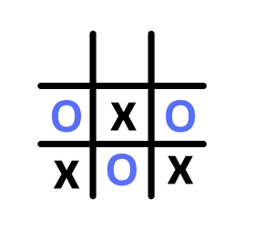
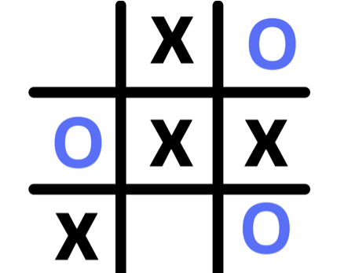
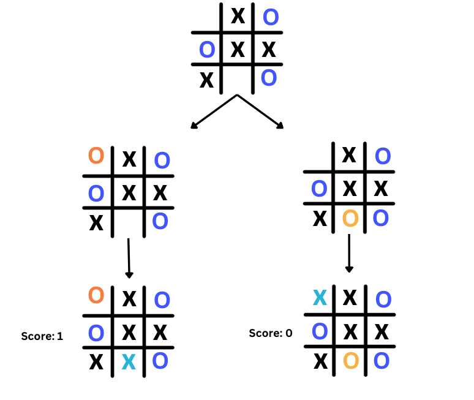

[DRAFT]: # "Lesson is being edited"

# Adversarial Search


So far, the problems we have examined have been single-agent problems. In other words, there is only one agent (such as a car or a player of a 15-puzzle game) attempting to solve the problem, such as finding a path to a goal point or rearranging the tiles to the correct order. However, in many problems, especially games like tic-tac-toe, there are two agents trying to solve the problem, each one acting against the other. In this lesson, we will explore how to address such problems.

## Adversarial Scenarios

In a [pacman](https://en.wikipedia.org/wiki/Pac-Man) game, the pacman agent is trying to eat all the food pellets while avoiding the ghosts. The ghosts are trying to eat the pacman. In a [chess](https://en.wikipedia.org/wiki/Chess) game, the white player is trying to checkmate the black player, while the black player is trying to checkmate the white player. In a [tic-tac-toe](https://en.wikipedia.org/wiki/Tic-tac-toe) game, the two players are trying to get three of their pieces in a row before the other player does. In all of these games, the two agents are trying to solve the same problem, but they are acting against each other. This is called an adversarial search problem. Adversarial search is not just limited to games. It can be applied to any problem where there are two agents trying to solve the same problem, but each one is acting against the other. Examples include automated trading,multi-robot motion planning, and even politics.

### Solving Adversarial Search Problems

Let's dig deeper into how to solve adversarial search problems. Let's start with the tic-tac-toe game.

In a tic-tac-toe game like the one shown below, if you are the X player, what would be your next move and why?

<p align="center">

</p>

I bet you choose to place X at position 5. Why? Because it is the move to prevent the O player from winning.

<p align="center">

</p>
What about this game? if you are the X player, What would be your next move and why?

<p align="center">

</p>
The right move here is to place X at position 1. Why? Because it is the move to make you win.

<p align="center">

</p>

We know this because we are humans and we have played this game many times. But how can we teach a computer to play this game? Fortunately, scientists have come up with many strategies to solve it. One of these strategies is called the **minimax** algorithm. Let's explore it next.

## Minimax Algorithm

The minimax algorithm is a strategy used in decision making, particularly in game theory and artificial intelligence, for minimizing the possible loss while maximizing the potential gain. It's often applied in two-player games like chess or tic-tac-toe. Here's how it works:

In a game, there are two players. One is the **maximizer**, who tries to get the highest score possible, while the other is the **minimizer**, who tries to do the opposite and minimize the score.

In a tic-tac-toe game, the maximizer for example is the player who has the `X` symbol and the minimizer is the player who has the `O` symbol. When `X` makes a move, it tries to **maximize** the score, while `O` tries to **minimize** it.

Considing the 3 possible outcomes of the game, `X` can either win, lose, or draw. If `X` wins, it gets a score of `1`. If `X` loses, it gets a score of `-1`. If the game ends in a draw, both players get a score of `0`.

To illustrate this, let's consider the game shown below.

<p align="center">

</p>

It is player `O`'s turn to make a move. `O` has two possible moves, either place `O` at position `1` or position `8`. The algorithm will **look ahead** and examine the consequences of each possible move.

If `O` places its symbol at position `1`, the player `X` will put its symbol at position `8` leading to a game score of `1` (X wins) .

If `O` places its symbol at position `8`, the player `X` will put its symbol at position `1` leading to a game score of `0` (tie).

Because `O` is a minimizer, it will choose the move that minimizes the score so the minimizer `O` will choose to place O at position 8.

<p align="center">

</p>

## Utility Values

The scores 1, 0, and -1 are called utility values. They are used to represent the outcome of a particular game state. A score of 1 typically indicates a win for the player whose turn it is to move. A score of 0 often represents a draw or a neutral outcome. A score of -1 usually denotes a loss for the player whose turn it is to move. You can use other numbers to represent the outcome of a game state. For example, you can use 10 to represent a win, 0 to represent a draw, and -10 to represent a loss but the convention is to use 1, 0, and -1.

### Many Possible States

In an early stage of the game, there are many possible moves. Each move leads to a different game state. Before each move, the algorithm will look ahead and examine the consequences of each possible move. It will assume that the other player is also playing optimally. (trying to maximize its score). The algorithm will compute the score of each possible move and return the move with the highest score.

<p align="center">

</p>

### Recursive Algorithm

You might have guessed that the algorithm is [recursive](<https://en.wikipedia.org/wiki/Recursion_(computer_science)>). It will keep looking ahead until it reaches a **terminal state** (a state where one of the players wins or the game is a tie).

Watch this video to learn more about the minimax algorithm.

<iframe width="100%" height="450" src="https://www.youtube.com/embed/6ELUvkSkCts?si=w2vL7Gk9lUwoJPCm&amp;start=378" title="YouTube video player" frameborder="0" allow="accelerometer; autoplay; clipboard-write; encrypted-media; gyroscope; picture-in-picture; web-share" allowfullscreen></iframe>

### Minimax Tree Traversal Exercise

In the below two-ply game tree, which move should the maximizer choose? What is the minimizer's best move?

<p align="center">

</p>

<Details>
<Summary>Answer</Summary>

- We will first examine move #1. If the maximizer chooses move #1, the minimizer, in the following move, will choose between move #3,#4, #5, and #6 terminal states. Because the states are terminal, the algorithm will return the score of each one as given in the picture. Because the minimizer is trying to minimize the score, it will choose move #3 because it has a lower score of 99. Therfore, the score the maximizer will get if it chooses move #1 is 99.

- Then we examine move #2. If the maximizer chooses move #2, the minimizer will choose between move #7, #8, #9, and #10. Because the minimizer is trying to minimize the score, it will choose move #7 or move #10 because they have the lowest score. Let's go with move #7. So the resulting score of move #2 is 100.

- Between move #1 and move #2, the maximizer will choose move #2 because it has a higher score. Therefore, the score of move #1 is 100.

<p align="center">

</p>

</Details>

### Minimax Pseudocode

```
function mini_max(state, is_maximizer_turn):
    if state is terminal
        return utility(state)
    if state is maximizer's turn
        max_value = -infinity
        for each action of available_actions(state)
            eval = mini_max(result(state,action)) # recursive call
            max_value = max(max_value, eval)
        return max_value
    if state is minimizer's turn
        min_value = +infinity
        for each action of available_actions(state)
            eval = mini_max(result(state,action)) # recursive call
            min_value = min(min_value, eval)
        return min_value
```

### Here is a sample implementation in Python for the above minimax algorithm.

```python
def minimax(board, is_maximizer_turn):
  # recursive terminal condition
  is_terminal = is_terminal_state(board)

  if is_terminal:
    return evaluate_utility(board)

  # else, keep expanding
  if is_maximizer_turn:
    best = float('-inf')
    for i in range(BOARD_SIZE):
      for j in range(BOARD_SIZE):
        if board[i][j] == EMPTY_CELL:  # the empty cell is a potential move
          board[i][j] = 'O'  # next player is 'O'
          score = minimax(board, not is_maximizer_turn) # it's the minimizer's turn
          best = max(best, score ) # get the max score of all possible moves
          board[i][j] = EMPTY_CELL # Undo the move to keep the board unchanged
    return best
  else:
    best = float('inf')
    for i in range(BOARD_SIZE):
      for j in range(BOARD_SIZE):
        if board[i][j] == EMPTY_CELL:  #the empty cell is a potential move
          board[i][j] = 'X'   #next player is 'X'
          score = minimax(board, not is_maximizer_turn)
          best = min(best, score) # get the minimum score of all possible moves
          board[i][j] = EMPTY_CELL
    return best
```

## Tick-Tac-Toe AI

You may recall th below example of a tic-tac-toe game from your programming 1 class. Take a look at the code and run it to see how it works.

```python
print("Welcome to Tic-Tac-Toe")
print("Here is our playing board:")

# Constants
EMPTY_CELL = ' '
BOARD_SIZE = 3

# The play board
play_board = [[EMPTY_CELL for _ in range(BOARD_SIZE)]
              for _ in range(BOARD_SIZE)]


def evaluate_utility(board):
  # Checking for Rows for X or O victory.
  for row in range(BOARD_SIZE):
    if board[row][0] == board[row][1] == board[row][2]:
      if board[row][0] == 'O':
        return 1
      elif board[row][0] == 'X':
        return -1

  # Checking for Columns for X or O victory.
  for col in range(BOARD_SIZE):
    if board[0][col] == board[1][col] == board[2][col]:
      if board[0][col] == 'O':
        return 1
      elif board[0][col] == 'X':
        return -1

  # Checking for Diagonals for X or O victory.
  if board[0][0] == board[1][1] == board[2][2]:
    if board[0][0] == 'O':
      return 1
    elif board[0][0] == 'X':
      return -1

  if board[0][2] == board[1][1] == board[2][0]:
    if board[0][2] == 'O':
      return 1
    elif board[0][2] == 'X':
      return -1

  # Else if none of them have won then return 0
  return 0


def is_terminal_state(board):
  for i in range(BOARD_SIZE):
    for j in range(BOARD_SIZE):
      if board[i][j] == EMPTY_CELL:
        return False
  return True


# Prints the board
def print_board():
  print("   1  2  3")
  for i in range(BOARD_SIZE):
    print(i + 1, end=" ")
    for j in range(BOARD_SIZE):
      print("[" + play_board[i][j] + "]",
            end="")  # print elements without new line
    print()  # print empty line after each row
  print('--------------')


# Check for a win
def check_win():
  for i in range(BOARD_SIZE):
    # Check all rows and columns
    if play_board[i][0] == play_board[i][1] == play_board[i][2] != EMPTY_CELL:
      return play_board[i][0]
    if play_board[0][i] == play_board[1][i] == play_board[2][i] != EMPTY_CELL:
      return play_board[0][i]

  # Check diagonals
  if play_board[0][0] == play_board[1][1] == play_board[2][2] != EMPTY_CELL:
    return play_board[1][1]
  if play_board[2][0] == play_board[1][1] == play_board[0][2] != EMPTY_CELL:
    return play_board[1][1]

  return None


# Check for a full board
def is_board_full():
  return all(EMPTY_CELL not in row for row in play_board)


print_board()


def get_player_input(player):
  while True:
    try:
      position = input(f'{player}, Enter play position (i.e. 1,1): ')
      x, y = map(int, position.split(','))
      if x in range(1, BOARD_SIZE + 1) and y in range(1, BOARD_SIZE + 1):
        return x, y
      else:
        print(
          "Invalid input. Please enter row and column numbers between 1 and 3."
        )
    except ValueError:
      print(
        "Invalid input. Please enter row and column numbers between 1 and 3.")


def play(player, row, col):
  if play_board[row-1][col-1] == EMPTY_CELL:
    play_board[row-1][col-1] = player
    print_board()
    return True
  else:
    print("Position is not empty. Please try again.")
    return False


while True:
  # Player X's turn
  while True:
    pos_x, pos_y = get_player_input('X')
    if play('X', pos_x, pos_y):  # False for not zero_based
      break

  winner = check_win()
  if winner:
    print(f"{winner} wins")
    break
  if is_board_full():
    print("The game is a tie!")
    break

  # AI (Player O's) turn
  pos_O_x, pos_O_y = get_player_input('O')
  play('O', pos_O_x, pos_O_y)  # AI uses zero-based indexing

  winner = check_win()
  if winner:
    print(f"{winner} wins")
    break
  if is_board_full():
    print("The game is a tie!")
    break

```

### Let's add the AI logic to the game

<div style="position: relative; padding-bottom: 56.25%; height: 0;">
<iframe src="https://www.youtube.com/embed/" frameborder="0" webkitallowfullscreen mozallowfullscreen allowfullscreen style="position: absolute; top: 0; left: 0; width: 100%; height: 100%;"></iframe>
</div>

## Tic-Tac-Toe AI

```python
print("Welcome to Tic-Tac-Toe")
print("Here is our playing board:")

# Constants
EMPTY_CELL = ' '
BOARD_SIZE = 3

# The play board
play_board = [[EMPTY_CELL for _ in range(BOARD_SIZE)]
              for _ in range(BOARD_SIZE)]


def evaluate(board):
  # Checking for Rows for X or O victory.
  for row in range(BOARD_SIZE):
    if board[row][0] == board[row][1] == board[row][2]:
      if board[row][0] == 'O':
        return 1
      elif board[row][0] == 'X':
        return -1

  # Checking for Columns for X or O victory.
  for col in range(BOARD_SIZE):
    if board[0][col] == board[1][col] == board[2][col]:
      if board[0][col] == 'O':
        return 1
      elif board[0][col] == 'X':
        return -1

  # Checking for Diagonals for X or O victory.
  if board[0][0] == board[1][1] == board[2][2]:
    if board[0][0] == 'O':
      return 1
    elif board[0][0] == 'X':
      return -1

  if board[0][2] == board[1][1] == board[2][0]:
    if board[0][2] == 'O':
      return 1
    elif board[0][2] == 'X':
      return -1

  # Else if none of them have won then return 0
  return 0


def minimax(board, depth, is_maximizing):
  score = evaluate(board)

  if score == 1:  # AI wins
    return score
  if score == -1:  # Player wins
    return score
  if is_board_full():  # Tie
    return 0

  if is_maximizing:
    best = -1000
    for i in range(BOARD_SIZE):
      for j in range(BOARD_SIZE):
        if board[i][j] == EMPTY_CELL:
          board[i][j] = 'O'  # Assuming AI is 'O'
          best = max(best, minimax(board, depth + 1, not is_maximizing))
          board[i][j] = EMPTY_CELL
    return best
  else:
    best = 1000
    for i in range(BOARD_SIZE):
      for j in range(BOARD_SIZE):
        if board[i][j] == EMPTY_CELL:
          board[i][j] = 'X'  # Assuming human is 'X'
          best = min(best, minimax(board, depth + 1, not is_maximizing))
          board[i][j] = EMPTY_CELL
    return best


def find_best_move(board):
  best_val = -1000
  best_move = (-1, -1)

  for i in range(BOARD_SIZE):
    for j in range(BOARD_SIZE):
      if board[i][j] == EMPTY_CELL:
        board[i][j] = 'O'  # AI makes a move
        move_val = minimax(board, 0, False)
        board[i][j] = EMPTY_CELL  # Undo the move

        if move_val > best_val:
          best_move = (i, j)
          best_val = move_val

  return best_move


# Prints the board
def print_board():
  print("   1  2  3")
  for i in range(BOARD_SIZE):
    print(i + 1, end=" ")
    for j in range(BOARD_SIZE):
      print("[" + play_board[i][j] + "]",
            end="")  # print elements without new line
    print()  # print empty line after each row
  print('--------------')


# Check for a win
def check_win():
  for i in range(BOARD_SIZE):
    # Check all rows and columns
    if play_board[i][0] == play_board[i][1] == play_board[i][2] != EMPTY_CELL:
      return play_board[i][0]
    if play_board[0][i] == play_board[1][i] == play_board[2][i] != EMPTY_CELL:
      return play_board[0][i]

  # Check diagonals
  if play_board[0][0] == play_board[1][1] == play_board[2][2] != EMPTY_CELL:
    return play_board[1][1]
  if play_board[2][0] == play_board[1][1] == play_board[0][2] != EMPTY_CELL:
    return play_board[1][1]

  return None


# Check for a full board
def is_board_full():
  return all(EMPTY_CELL not in row for row in play_board)


print_board()


def get_player_input(player):
  while True:
    try:
      position = input(f'{player}, Enter play position (i.e. 1,1): ')
      x, y = map(int, position.split(','))
      if x in range(1, BOARD_SIZE + 1) and y in range(1, BOARD_SIZE + 1):
        return x, y
      else:
        print(
            "Invalid input. Please enter row and column numbers between 1 and 3."
        )
    except ValueError:
      print(
          "Invalid input. Please enter row and column numbers between 1 and 3."
      )


def play(player, row, col, zero_based=True):
  if zero_based:
    if play_board[row][col] == EMPTY_CELL:
      play_board[row][col] = player
      print_board()
      return True
    else:
      print("Position is not empty. Please try again.")
      return False
  else:
    return play(player, row - 1, col - 1, True)


while True:
  # Player X's turn
  while True:
    pos_x, pos_y = get_player_input('X')
    if play('X', pos_x, pos_y, False):  # False for not zero_based
      break

  winner = check_win()
  if winner:
    print(f"{winner} wins")
    break
  if is_board_full():
    print("The game is a tie!")
    break

  # AI (Player O's) turn
  pos_O_x, pos_O_y = find_best_move(play_board)
  play('O', pos_O_x, pos_O_y)  # AI uses zero-based indexing

  winner = check_win()
  if winner:
    print(f"{winner} wins")
    break
  if is_board_full():
    print("The game is a tie!")
    break

```
## Congratulations!🎉
You've taken your first step into the gaming world by learning how to integrate intelligence into games. Though it's a modest beginning, it's an excellent one. We'll expand upon this knowledge and enhance our AI in the upcoming lessons.

## Test your understanding & Challenge

- What is an adversarial search problem? How is it different from a single-agent search problem?
- CS50 AI course has a [tic-tac-toe](https://cs50.harvard.edu/ai/2020/projects/0/tictactoe/) project. Try to implement it.


## Eager for more? 
If you find yourself in need of further explanations or additional examples, here are some additional resources to assist you:


- [Coding Unbeatable Tic Tac Toe AI in Python](https://www.youtube.com/watch?v=Bk9hlNZc6sE)

  - [Code](https://github.com/AlejoG10/python-tictactoe-ai-yt)

- [Tic Tac Toe AI with Minimax Algorithm](https://youtu.be/trKjYdBASyQ?si=Bi4jLj00dSC9J9PE&t=109)
- [MIT Search Lecture 6: Adversarial Search](https://www.youtube.com/watch?v=STjW3eH0Cik)

