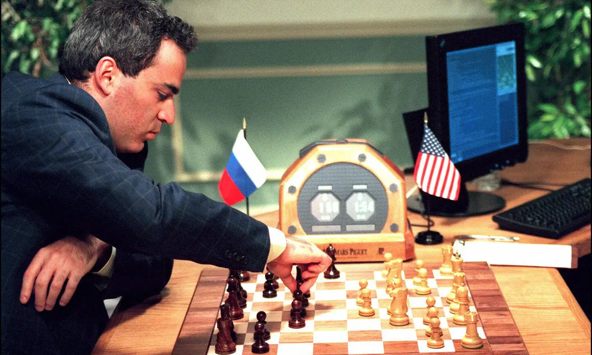

# Game Theory
Game theory, a fascinating branch of mathematics with widespread applications in various disciplines, offers a systematic framework for analyzing strategic interactions among rational decision-makers. Originating from economics, game theory has evolved to become a crucial tool in fields such as political science, biology, sociology, and artificial intelligence. At its core, game theory investigates how individuals, referred to as players, make decisions when their outcomes depend not only on their own choices but also on the actions of others. It explores scenarios where conflicting interests or cooperation shape the dynamics, emphasizing the interplay of strategies and the resulting outcomes.

Notable concepts within game theory include Nash equilibrium, where no player has an incentive to change their strategy unilaterally, and the distinction between zero-sum and non-zero-sum games, where the sum of gains and losses is either constant or variable. The pervasive influence of game theory underscores its significance in unraveling the complexities of decision-making, offering valuable insights into human behavior and strategic reasoning across a spectrum of real-world scenarios.

## Optional: Watch this video on game theory:

<iframe src="https://www.youtube.com/embed/M3oWYHYoBvk" frameborder="0" webkitallowfullscreen mozallowfullscreen allowfullscreen style="position: absolute; top: 0; left: 0; width: 100%; height: 100%;"></iframe>

## Game Playing in AI

The evolution of game-playing artificial intelligence (AI) has marked significant milestones in the realm of computational achievement. 

**In 1950**, the world witnessed the emergence of the first computer player for **checkers**. 

The year **1994** saw a historic moment when the computer program **Chinook** became the first-ever computer champion, ending the remarkable 40-year reign of human champion Marion Tinsley. Utilizing a complete 8-piece endgame, Chinook's victory marked a pivotal moment in the intersection of artificial intelligence and board games. 

The landmark event continued in **2007** when checkers, as a game, was declared solved by computational methods.

**Chess**, a game long regarded as the pinnacle of intellectual prowess, witnessed a groundbreaking event in **1997** when Deep Blue defeated human champion Gary Kasparov in a six-game match. Deep Blue's computational capabilities were awe-inspiring, examining 200 million positions per second and employing sophisticated evaluation methods, some undisclosed, to extend search lines up to 40 ply. 

  
  Deep Blue computer beats world chess champion – archive, 1996

Fast forward to **2016**, and the game of **Go** experienced a revolution with AlphaGo defeating a human opponent. AlphaGo's success was attributed to its utilization of Monte Carlo Tree Search and a learned evaluation function. 

These triumphs in game-playing AI underscore the instrumental role of games in tracking the progress of artificial intelligence, offering tangible benchmarks for advancements in computational abilities and strategic decision-making.

## Different Types of Games
 

**Deterministic** games are those in which the outcome is fully determined by the moves of the players. Games like chess, checkers, and Go are deterministic. 

**Stochastic** games are those in which chance or randomness is involved in the outcome of the game. Games like backgammon, snakes and ladders, and Monopoly are stochastic.

**Zero sum** games are those in which the sum of the payoffs of all players is zero. In other words, the gain of one player is equal to the loss of the other player. Chess, checkers, and tic-tac-toe are zero sum games.

**Perfect information** games are those in which the players have complete information about the state of the game at any point in time. Chess, checkers, and tic-tac-toe are perfect information games. Poker, on the other hand, is not a perfect information game because the players do not know the cards held by the other players.
