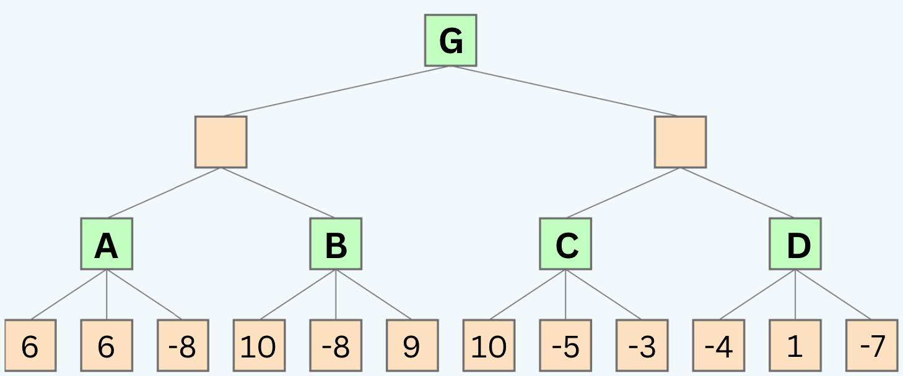

# Optimization Techniques
By now, I hope you've developed a strong awareness of the necessity to optimize our algorithms. Optimization isn't just a desirable feature in most AI problems; it's often a must. Without it, your solution may simply be unfeasible – it won't work! 

We've witnessed the limitations of our breadth-first search and depth-first search algorithms when faced with the 15-puzzle problem, underscoring the pressing need for optimization.

### Too Slow to be Practical
While MiniMax stands out as a great algorithm for adversarial search, it's just **too slow to be practical** in its basic form for many games. Our tic-tac-toe game is too small for the difference to be noticeable, but if we were to play a game of chess, we'd be waiting a very long time for the computer to make a move. The number of all possible games in tic-tac-toe is `9! = 362,880`, which is a very small number compared to chess for example which has a game tree of` 10^120` states.

## 1) Minimax with Alpha-Beta Pruning
Alpha-beta pruning is a way of finding the optimal minimax solution while avoiding searching subtrees of moves which won't be selected. 

It is named alpha-beta pruning because it introduces two additional parameters, alpha and beta, into the minimax function. Alpha is the best value that the maximizer currently can guarantee at that level or above. Beta is the best value that the minimizer currently can guarantee at that level or above. These values are used to prune the tree (More examples and explanation below).

**Heads up!** Your assignment will include implementing the minimax algorithm with alpha-beta pruning to create a game-playing agent for tic-tac-toe.

### Watch this video [updated] on alpha-beta pruning with an example:

<iframe width="100%" height="480" src="https://www.youtube.com/embed/n6mbgKICrVU" title="YouTube video player" frameborder="0" allow="accelerometer; autoplay; clipboard-write; encrypted-media; gyroscope; picture-in-picture; web-share" allowfullscreen></iframe>

## Quiz Question:
Use the following game tree to answer the following questions:

 

### Questions:

- 1: If we use alpha-beta pruning, what are the values of the nodes labeled A, B, C, and G?
- 2: If we use alpha-beta pruning, which nodes will be pruned?

**Note:** that the tree is 4 levels deep, not 3. So from top to bottom, the player alternates between MAX and MIN 4 times.

Take your time to trace the algorithm on the above tree before seeing the staff solution below. Remember, this is a crucial step in your learning process. Don't rush through it.

🧩 Unfold the solution below and match it with your solution.

Solution

- 1: After running the whole algorithm, the values of the nodes are:

A = 6 , B = 10, C = 10, D = 1, G = 6

- 2: The nodes that will be pruned are: -8 , 9 
    

## 2) Depth-Limiting
Another optimization technique is depth-limiting. Depth-limiting is a way of limiting the depth of the search tree. In other words, we can stop searching after a certain number of moves. This is a very simple technique, but it can be very effective. 

In fact, it is used in many games, including chess. In chess, the depth limit is usually set to 3 or 4 moves. This is because the number of possible moves in chess is so large that it is not practical to search the entire tree. Applying depth-limiting requires an evaluation function to estimate the utility of a state when the depth limit is reached.

## Heuristic Evaluation Functions
A heuristic evaluation function is a function that estimates the utility of a state without doing a complete search (without looking at all of the possible moves). Suppose that, due to limited computational resources, we can only reach a depth of 3 in our search tree. In this case, we need an evaluation function to estimate the utility of the states at that depth level. 

### Examples of Heuristics:

In chess, a simple heuristic is to count **the total value of pieces on the board for each player**. Each piece is assigned a value (e.g., pawn = 1, knight = 3, rook = 5, etc.), and the player with a higher total value is generally considered to be in a better position. This heuristic helps to evaluate the board's utility without exploring every possible future move.

In pathfinding problems, such as finding the shortest path in a maze, a common heuristic is the **straight-line distance** from the current position to the goal. This heuristic helps to prioritize which paths to explore first, even without searching the entire maze.

 In games like Connect Four, a heuristic could be **the number of three-in-a-row combinations** each player has, as these are one step away from a winning four-in-a-row. This helps to estimate the utility of a board state by highlighting positions close to winning, without needing to explore every game continuation.

 We can use any of these heuristics to estimate the utility of a state at a given depth without further exploring the tree. The better the heuristic, the better the estimate. 

### Watch this video to learn more about these optimization techniques:
 

<iframe width="100%" height="480" src="https://www.youtube-nocookie.com/embed/WbzNRTTrX0g?si=5q7UU_LrJKlj71zM&amp;start=5777" title="YouTube video player" frameborder="0" allow="accelerometer; autoplay; clipboard-write; encrypted-media; gyroscope; picture-in-picture; web-share" allowfullscreen></iframe>

 

### If you need more explanation, watch these 2 videos:

- [Alpha-Beta Pruning Example](https://www.youtube.com/watch?v=A7AO152vy50)
- [Alpha-Beta Pruning wStep by Step Example](https://www.youtube.com/watch?v=xBXHtz4Gbdo)

## More Optimization Techniques
Besides the above optimization techniques, there are many other techniques that can be used to improve the performance of our algorithms. Here are some of them:

**Dynamic Programming**: Breaks the problem down into simpler sub-problems and stores the results of these sub-problems to avoid redundant calculations. This is particularly useful for problems exhibiting overlapping subproblems and optimal substructure.

**Iterative Deepening**: Combines the space efficiency of depth-first search with the completeness of breadth-first search. It incrementally increases the depth limit until the goal is found.

**Simulated Annealing**: An optimization technique that tries to avoid getting stuck in local optima by allowing less optimal moves in the early stages of the search.

**Beam Search**: A heuristic search algorithm that is a combination of BFS and DFS but limits the number of children expanded at each level, keeping only a predetermined number of best nodes at each level.

**Branch and Bound**: Used in optimization problems, this technique systematically enumerates candidate solutions by splitting them into smaller subsets (branching) and using bounds to eliminate suboptimal solutions.

**Bidirectional Search**: This method runs two simultaneous searches—one forward from the initial state and the other backward from the goal—hoping that the two searches meet in the middle. This can dramatically reduce the search space.

**Parallelization**: This technique involves running multiple searches in parallel. This can be done by running multiple searches on different processors or by running multiple searches on the same processor using multithreading.

And many more...

## Summary
- Optimization is a crucial part of AI. Without it, our algorithms may be too slow to be practical. 
- Alpha-beta pruning is a way of finding the optimal minimax solution while avoiding searching subtrees of moves which won't be selected.
- Depth-limiting is a way of limiting the depth of the search tree. In other words, we can stop searching after a certain number of moves. This is a very simple technique, but it can be very effective.
- A heuristic evaluation function is a function that estimates the utility of a state without doing a complete search ( without looking at all of the possible moves). It works well with depth-limiting.
- Beside the above optimization techniques, there are many other techniques that can be used to improve the performance of our algorithms including: Dynamic Programming, Iterative Deepening, Simulated Annealing, Beam Search, Branch and Bound, Bidirectional Search, Parallelization, and many more...