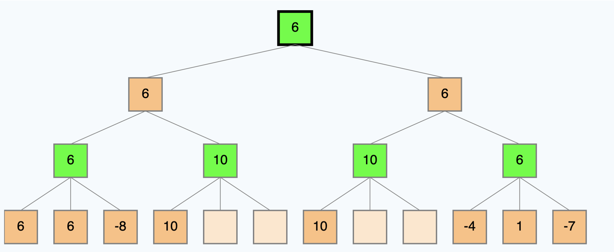

# Optimization Techniques
By now, I hope you've developed a strong awareness of the necessity to optimize our algorithms. Optimization isn't just a desirable feature in most AI problems; it's often a must. Without it, your solution may simply be unfeasible – it won't work! We've witnessed the limitations of our breadth-first search and depth-first search algorithms when faced with the 15-puzzle problem, underscoring the pressing need for optimization.

While MiniMax stands out as a great algorithm for adversarial search, it's just too slow to be practical in its basic form for many games. Our tic-tac-toe game is so small to notice the difference, but if we were to play a game of chess, we'd be waiting for a very long time for the computer to make a move. The number of all possible games in tic-tac-toe is 9! = 362,880, which is a very small number compared to chess for example which has a game tree of 10^120 states.

## Minimax with Alpha-Beta Pruning
Alpha-beta pruning is a way of finding the optimal minimax solution while avoiding searching subtrees of moves which won't be selected. It is called alpha-beta pruning because it passes 2 extra parameters in the minimax function, called alpha and beta. Alpha is the best value that the maximizer currently can guarantee at that level or above. Beta is the best value that the minimizer currently can guarantee at that level or above. These values are used to prune the tree (More examples and explanation below).

## Depth-Limiting
Another optimization technique is depth-limiting. Depth-limiting is a way of limiting the depth of the search tree. In other words, we can stop searching after a certain number of moves. This is a very simple technique, but it can be very effective. In fact, it is used in many games, including chess. In chess, the depth limit is usually set to 3 or 4 moves. This is because the number of possible moves in chess is so large that it is not practical to search the entire tree. 

## Heuristic Evaluation Functions
Another useful optimization technique is heuristic evaluation functions. A heuristic evaluation function is a function that estimates the utility of a state without doing a complete search ( without looking at all of the possible moves). 

### Watch this video to learn more about these optimization techniques:
 

<iframe width="100%" height="480" src="https://www.youtube-nocookie.com/embed/WbzNRTTrX0g?si=5q7UU_LrJKlj71zM&amp;start=5777" title="YouTube video player" frameborder="0" allow="accelerometer; autoplay; clipboard-write; encrypted-media; gyroscope; picture-in-picture; web-share" allowfullscreen></iframe>

 

### Watch this video on alpha-beta pruning with an example:

<iframe width="100%" height="480" src="https://www.youtube.com/embed/zp3VMe0Jpf8" title="YouTube video player" frameborder="0" allow="accelerometer; autoplay; clipboard-write; encrypted-media; gyroscope; picture-in-picture; web-share" allowfullscreen></iframe>

### If you need more explanation, watch these 2 videos:

- [Alpha-Beta Pruning Example](https://www.youtube.com/watch?v=A7AO152vy50)
- [Alpha-Beta Pruning wStep by Step Example](https://www.youtube.com/watch?v=xBXHtz4Gbdo)

## Quiz Question:
Use the following game tree to answer the following questions:

 

### Questions:

- 1: If we use alpha-beta pruning, what are the values of the nodes labeled A, B, C, and G?
- 2: If we use alpha-beta pruning, which nodes will be pruned?

**Note:** that the tree is 4 levels deep, not 3. So from top to bottom, the player alternates between MAX and MIN 4 times.

Take your time to trace the algorithm on the above tree before seeing the staff solution below. Remember, this is a crucial step in your learning process. Don't rush through it.

🧩 Unfold the solution below and match it with your solution.

Solution

- 1: After running the whole algorithm, the values of the nodes are:
    - A = 6
    - B = 10
    - C = 10
    - D = 6
    - G = 6

- 2: The nodes that will be pruned are: -8 , 9 , -5 , -3
    

