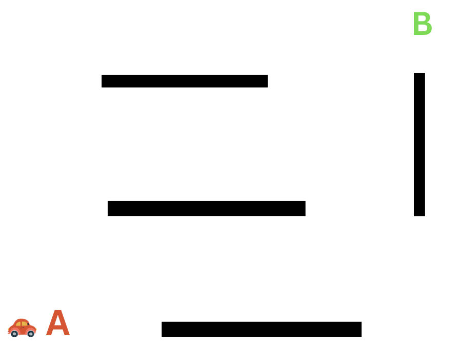
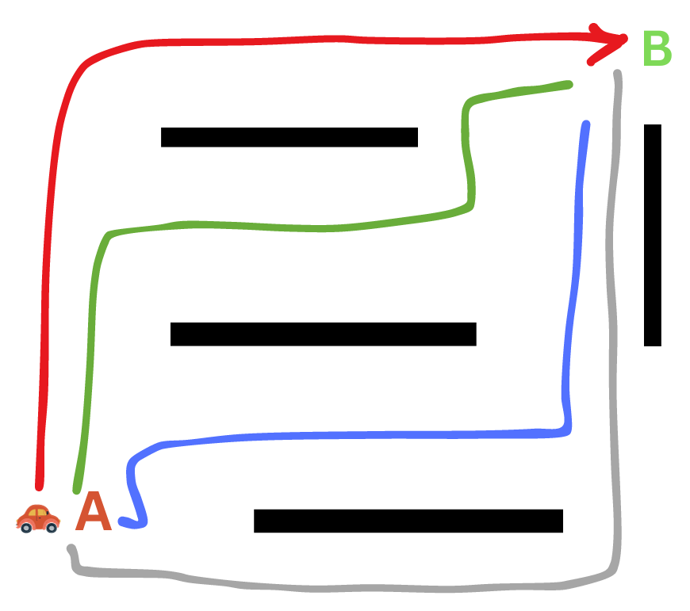

# Intelligence with Search

_Estimated time to finish: 60-90 minutes_

## Search Problems

A search problem refers to a specific class of challenges in which an agent or algorithm is tasked with locating a solution within a clearly defined problem space. This problem space consists of a range of states or configurations, and the primary objective is to determine a series of actions that will guide us from an initial state to a desired goal state.

_Let's clarify this with an Example_

Consider the scenario of a car moving from point A to point B, as illustrated below:

<p align="center">

</p>

To reach point B, the car can follow various paths, as shown in the image below:

<p align="center">


</p>
Each of these paths represents distinct solutions to our problem. The decisions made throughout the journey generate various states or configurations for the car.

**This is a search problem because:**

- We have an agent (the car) that is trying to find a solution (the path) within a defined problem space (the road).
- The problem space, or state space, consists of various states or configurations (the different positions of the car).
- The goal is to find a sequence of actions (the path) that will lead from an initial state (the starting position of the car) to a desired goal state (the destination).

## Understanding Our Objective

One might question whether we are genuinely searching for something in this context. You can think of the path itself as the object of our search. Our mission is to discover the path leading us to point B (by searching).

I understand selecting an arbitrary path might seem like a trivial task. However, the problem becomes more challenging when we consider other goals, such as finding the shortest path or the fastest path. These goals will lead to distinct problem formulations and, consequently, result in different solutions.

### Give it a try!

Think of another example of a search problem.

Take 5 minutes to think about that and try to come up with some examples that fit this category. Your understanding of this concept is valuable for your learning! Don't be lazy; give it a shot. Share it with your colleagues below when you're done.

<p align="center">

</p>

### Share it!

Look at the examples shared by your peers and instructors below, and share yours with them. Make sure to write your name or nickname beside your example.

[[[PADLET]]]

## Modeling Search Problems

To tackle these problems with a computer, we aim to create a computer-friendly representation, a computational model. A typical model of a search problem consists of the following:

### State Space:

This represents the different configurations of the problem space. For instance, the different positions of the car, the different arrangements of tiles in a puzzle, or the different configurations of a robot.

### Initial State:

The starting state of the problem. For example, the starting position of the car, the initial arrangement of tiles in a puzzle, the initial position of a robot, etc.

### Goal State:

The desired state of the problem. For example, it could be the car's destination, the desired puzzle tile arrangement, or the robot's target position.

### Actions:

Actions are the possible moves or steps that can transition the system from one state to another. These can include actions like moving up, down, left, or right.

### Goal Test:

A function that determines whether a given state is a goal state. For instance, checking if the car has reached its destination, if the puzzle tiles are in the correct order, or if the robot has arrived at its destination.

### Transition Model:

The transition model (or Successor Function) is a function that accepts a state and an action as input and yields a new state as output. For example, the transition model for the car problem would take the car's current position and the desired direction, `Up` for example, as input and return the new position as output.

### Solution:

The solution is a series of actions that lead from the initial state to the goal state. This could be the path the car takes from its starting point to its destination, the sequence of moves needed to solve the puzzle, or the route the robot follows to reach its goal.

## Modeling the Car's Journey

Let's explore our previous example of a car journeying from point A to point B and frame it as a search problem.

### State Space:

To model the state space, we need to consider all the possible configurations of the car. To do that, we need to decide how we will represent the car's position and the environment in which it is moving. To simplify things, we can represent the car's position as a coordinate on a grid. For example, the car's position at point A can be represented as `(1,0)`, and its position at point B can be represented as `(6,6)`. The state space will be all the possible positions of the car on the grid.

<p align="center">

</p>

⚡ Do you feel a spark in your brain right now after seeing this image?⚡

The moment I saw this image, I felt something in my brain! It's the feeling of moving from very abstract thought with absolutely no idea how to model it to having a clearer idea of how to do it. A grid? Come on, it's a list in Python.

```python
# 6 * 6 grid with blocked cells marked with 0
# blocked cells are the cells that the car can't navigate to.
# In our example, blocked cells are: (2,3) (2,4) (3,2) (3,3) (3,4)
space = []
blocked_cells = [(2, 3), (2, 4), (3, 2), (3, 3), (3, 4)]
GRID_SIZE = 6
for i in range(GRID_SIZE):
    for j in range(GRID_SIZE):
        if (i, j) in blocked_cells:
            space.append(0)
        else:
            space.append(1)

```

So, **state space** is all the possible positions of the car on the grid. This is a finite set of states, and we can represent it as a **list** in Python.

### Initial State:

After modeling the state space, it is clear now that our initial state is the position of the car at point A, which is `(1,0)`. We can represent the initial state as a tuple in Python.

```python
initial_state = (1, 0)
```

### Goal State:

The goal state is the position of the car at point B, which is `(6,6)`. Similarly, We can represent the goal state as a tuple in Python.

```python
goal_state = (6, 6)
```

### Actions:

Actions are the possible moves or steps that can transition the system from one state to another. In our example, the car can move up, down, left, or right. We can represent the actions as a list in Python.

```python
actions = ["up", "down", "left", "right"]
```

### Transition Model

At a specific state (cell), the agent can take one of the possible actions: up, down, left, or right. For each specific action, the agent will end up in a new state (cell).

`transition_model = fn(state, action) -> new_state`

Now, take 10 minutes and try to write a transition model function for our can example. It's a function that takes a state and an action as input and returns a new state as output. The state in our car example is the position of the car within the grid. The action is the direction the car is moving in.

Don't rush through it; take the 10 minutes and try. This is a crucial step in your learning process. If you can't do it, that's totally fine. You can check the solution below. But, please, try to do it first.

<p align="center">

</p>

Unfold the sample code below for an idea of how a transition model for this environment can be implemented.

<Details>

<Summary>Transition Model Function</Summary>

```python
def transition_model(state, action):
    """Return the state that results from executing the given
    action in the given state. The action should be a string
    taken from the list ['up', 'down', 'left', 'right'] and
    state should be a tuple of the form (x, y) where x and y
    are integers.
    """
    x, y = state
    if action == 'up':
        return (x, y + 1)
    elif action == 'down':
        return (x, y - 1)
    elif action == 'left':
        return (x - 1, y)
    elif action == 'right':
        return (x + 1, y)
    else:
        raise ValueError(f"Unknown action: {action}")
```

</Details>

## 🎉 Congratulations!🎉

You have just completed modeling your first search problem!

## Solution

We haven't yet discussed the goal test and the solution. Our focus on this lesson was on modeling the problem. We will discuss the goal test and the solution in the next lesson.

## More Practice

If you feel confident about modeling search problems, you can move on to the next lesson in which we discuss searching algorithms. If not, please try the exercises in the link below. Remember to reach out for help if you need.

<!--
We hear you saying, "I want to practice more." We got you covered! I have prepared a set of exercises for you to practice modeling search problems.


the `1st Search Model Badge. ⭐`
Write your name or nickname in the form below to get it.

If you came up with a different model, that's totally fine. There are many ways to model a problem. The important thing is that you understand the concept and can model a problem in a way that makes sense to you.

Self-check!
Need more exercises to practice modeling search problems? Try the exercises in this link.

If you feel confident about modeling search problems, you can move on to the next lesson. If not, please try the exercises in the link above. Reach out for help here.

A 5-point (optional) exercise
Read the problem in this link and explain it in your own words to one of your colleagues. Then, try to solve it together. Submit your solution to this link. These 5 points will be added to your final project grade.
Share the link with your colleagues on Discord.
