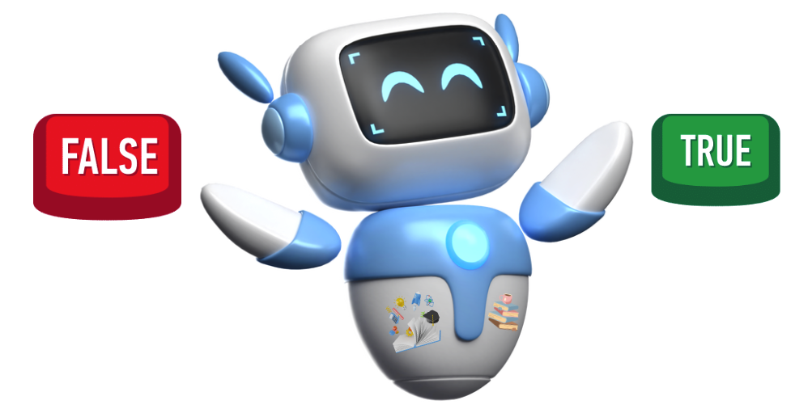

# Introduction to Logic and Knowledge Representation

  

Humans are logical beings. We use logic to reason about the world, and draw conclusions from facts. For example, if it’s sunny outside, we might decide to go for a walk. If it’s raining, we might decide to stay indoors. Can a computer do the same? Can a computer draw conclusions from facts and reason about the world?

We’ve seen how to achieve intelligence when we planned with search, modeled and used algebra with constraint satisfaction, learned from data with machine learning and deep learning, and learned by experience with reinforcement learning.

This week, we’ll explore how to achieve intelligence through logic and knowledge representation. We’ll start by understanding the basics of logic and knowledge representation, and then explore how to use logic to build intelligent systems. Let's start by asking the question: What is knowledge?

By the end of this lesson, you will be able to:
- Use propositional logic to represent facts and rules
- Use propositional logic to draw conclusions from facts and rules
- Use propositional logic to build an intelligent system like a medical diagnosis assistant
- Use first-order logic to represent more complex facts and rules utilizing quantifiers and predicates

Your assignment for this lesson is to build a home security system using propositional logic.