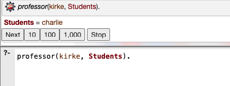

# First Order Logic
First Order Logic is a type of logic that extends propositional logic by allowing us to represent more complex statements and reason about them. In first order logic, we can use quantifiers to express statements about objects and predicates to express relationships between objects.


<iframe width="100%" height="450" src="https://www.youtube.com/embed/HWQLez87vqM?si=T1bdAs8p7Y2QnPW5&amp;start=5910&end=6437" title="YouTube video player" frameborder="0" allow="accelerometer; autoplay; clipboard-write; encrypted-media; gyroscope; picture-in-picture; web-share" allowfullscreen></iframe>

## Constant Symbols
In first order logic, a constant is a symbol that represents a specific object in a domain. For example, we can use the constant Solomon to represent the object 'Solomon' and the constant Math to represent the subject 'Math'.

## Predicate Symbols
In first order logic, a predicate symbolically represents a property or relationship that can be true or false for objects. It takes objects as arguments. For example, we can use the predicate `Student(x)` to represent the statement "x is a student". Another example is the predicate `TakesCourse(x, y)` which represents the statement "x takes the course y".

Examples of predicate symbols:
- `Student(Solomon)`: This predicate indicates that 'Solomon' is a student.
- `TakesCourse(Solomon, Math)`: This predicate indicates that 'Solomon' takes the course 'Math'.
- `¬TakesCourse(Solomon, JavaEE)`: This predicate indicates that 'Solomon' does not take the course 'JavaEE'.


## Quantifiers
Quantifiers are used to express more complex statements about objects. The two main quantifiers in first order logic are:

- **Universal Quantifier (∀)**: This quantifier is used to express that a statement is true for all objects in a domain. For example, the statement 'All students take Prog1 class' can be expressed as:

    `∀x Student(x) → TakesCourse(x, Prog1)`.

- **Existential Quantifier (∃)**: This quantifier is used to express that a statement is true for at least one object in a domain. For example, the statement 'Some students take JavaEE class' can be expressed as:

    `∃x Student(x) ∧ TakesCourse(x, JavaEE)`.


## Logic Programming : A New Programming Paradigm
First order logic is the foundation of logic programming, a programming paradigm that uses logical inference to solve problems. In logic programming, we can use first order logic to represent the rules and facts about a problem, and then use a logical inference engine to derive new facts and solve problems.

The most popular logic programming language is **Prolog**, which is based on first order logic and is used in artificial intelligence and natural language processing.

Logic programming is a general-purpose programming paradigm that can be used to solve a wide range of problems, including constraint satisfaction problems, planning problems, and natural language processing problems.

Here is an example of a Prolog program that uses first order logic to represent the rules and facts about courses, students, and professors:

```prolog
studies(charlie, csc135).
studies(olivia, csc135).
studies(jack, csc131).
studies(arthur, csc134).

teaches(kirke, csc135).
teaches(collins, csc131).
teaches(collins, csc171).
teaches(juniper, csc134).


professor(X, Y) :- 
    teaches(X, C), studies(Y, C).

## Queries 
?- studies(charlie, What). // charlie studies what? OR What does charlie study?
?- professor(kirke, Students). // Who are the students of professor kirke.  
```

Here is a sample run output from [Online SWI-Prolog Interpreter](https://swish.swi-prolog.org/)



An extensive discussion on Logic Programming is beyond the scope of this class but it is important to know about it and be able to identify potential uses of logic programming in your engineering career.


## Summary
- First order logic extends propositional logic by allowing us to represent more complex statements and reason about them.
- In first order logic, we can use constant symbols to represent specific objects in a domain, predicate symbols to represent relationships between objects, and quantifiers to express more complex statements about objects.
- The two main quantifiers in first order logic are the universal quantifier (∀) and the existential quantifier (∃).
- The **universal** quantifier is used to express that a statement is true for all objects in a domain, while the **existential** quantifier is used to express that a statement is true for at least one object in a domain.
