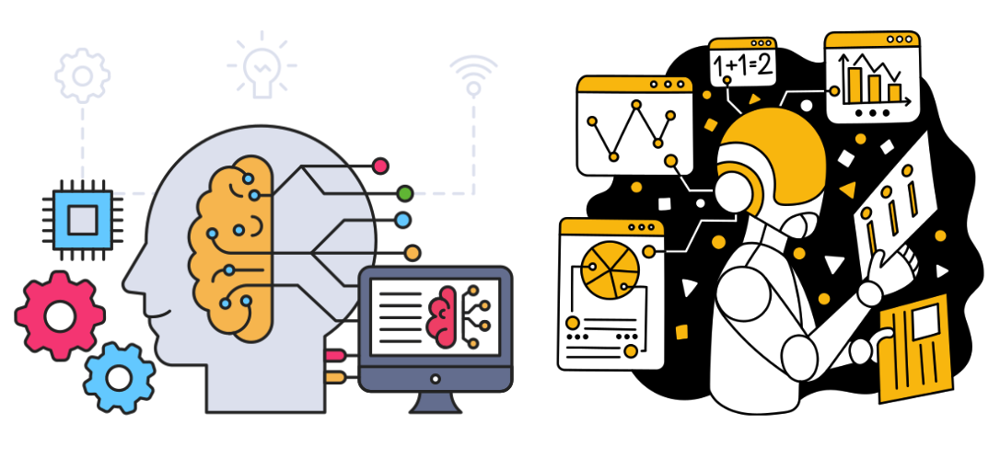

# Supervised Machine Learning!

This week, we embark on an exciting journey into the world of machine learning, exploring its fundamentals and applications in various projects. Our lesson will cover a broad range of topics, including:

- The essence of machine learning
- Key types of machine learning: Supervised, Unsupervised, and Reinforcement Learning
- Regression and Classification techniques
- And more

In the previous weeks, we discussed various approaches to achieving intelligence: tweaking algorithms for improved search, modeling constraints and rules for constraint satisfaction problems (CSPs), and learning from experience and rewards in Reinforcement Learning (RL). This week, we shift our focus to deriving **intelligence from data**.

## Intelligence by Learning from Data
Can intelligence emerge from data analysis? Absolutely. A significant portion of Machine Learning is dedicated to this very concept.

Learning from data involves developing algorithms and models capable of analyzing, interpreting, and making predictions or decisions based on data. This process requires **training models on large datasets to identify patterns and relationships** not immediately apparent. As models are exposed to more data, their predictive and decision-making capabilities improve.

## What is Machine Learning?
The conceptual framework of Machine Learning is straightforward: we leverage data, examples, experiences, and observations to teach computers how to learn.

Arthur Samuel defined machine learning as a subfield of computer science that enables computers to **learn without being explicitly programmed**.

## Explicitly Programmed vs. Learning from Data
- Explicitly programmed: Writing a program for a specific task.

- Learning from data: Providing numerous examples of inputs and outputs for the machine to learn from, enabling it to predict outputs for new inputs.

Consider the challenge of identifying a person from a photograph. Writing a program for direct comparison, such as pixel-by-pixel analysis, is impractical, due to the variability in photos. Machine learning overcomes this by using labeled photographs to teach computers to identify people in images, exemplifying AI learning.

## Types of Learning:
Machine Learning encompasses three primary learning types:

- **Supervised Learning:** (Classification, Regression): Learning a function that maps inputs to outputs from example input-output pairs. This includes tasks like email spam classification, tumor malignancy classification, and stock price forecasting.

- **Unsupervised Learning:** (Clustering, Dimensionality Reduction): Finding patterns in unlabeled data, such as grouping customers by purchasing behavior or reducing the number of data features for efficiency.

- **Reinforcement Learning:** Learning from the outcomes of actions in an environment to maximize some notion of cumulative reward.

### Supervised Learning
Supervised learning is a type of machine learning predominantly used in many real-world applications, witnessing rapid advancements and innovations. It involves learning a function that maps an input to an output based on example input-output pairs, a process also known as function approximation.

This approach entails providing the machine with numerous examples of inputs and outputs (labels), enabling it to learn from these examples and predict the output for any new input. The algorithm attempts to identify patterns within the data, creating a model capable of replicating the same underlying rules with new data. Remarkable, isn't it?

**Model**: An algorithmic formula designed to produce an outcome with new data, based on the principles derived from the training data. Once the model is developed, it can be applied to new data and evaluated for accuracy.

Examples of supervised learning algorithms include regression analysis, decision trees, k-nearest neighbors, neural networks, and support vector machines.

### Examples of supervised learning applications include:

- Regression: Estimating a continuous value:
  - Forecasting a house's price in dollars based on its features.
  - Predicting a person's age based on their medical records.
  - Forecasting stock prices.
  
- Classification: Predicting a label (category) from a set of labels.
  - Classifying an email as spam or not spam.
  - Identifying a tumor as malignant or benign.
  - Recognizing images of handwritten digits.
  - Facilitating face recognition.
  - Categorizing news articles into different categories.

  
### Unsupervised Learning
Unsupervised learning algorithms seek patterns in unlabeled data. For instance, consider data about a company's customers where the goal is to identify patterns. The aim is to find groups of customers with similar purchasing behaviors, despite the absence of predefined labels for these groups. An unsupervised learning algorithm might determine that the data can be segmented into two distinct groups or clusters.

### Examples of unsupervised learning include:
- Clustering: Aggregating similar data points.
  - Sorting customers by their purchasing habits.
  - Organizing news articles by their topics.
  - Grouping patients based on their medical histories.

- Dimensionality Reduction: Decreasing the number of data features.
  - Data compression: Minimizing the data size.

- Anomaly Detection: Identifying outliers within the data.
  - Detecting fraud.
  - Identifying manufacturing defects.
  - Diagnosing medical issues.

We will commence with supervised learning, starting with regression. 

Let's dive in! 🚀

