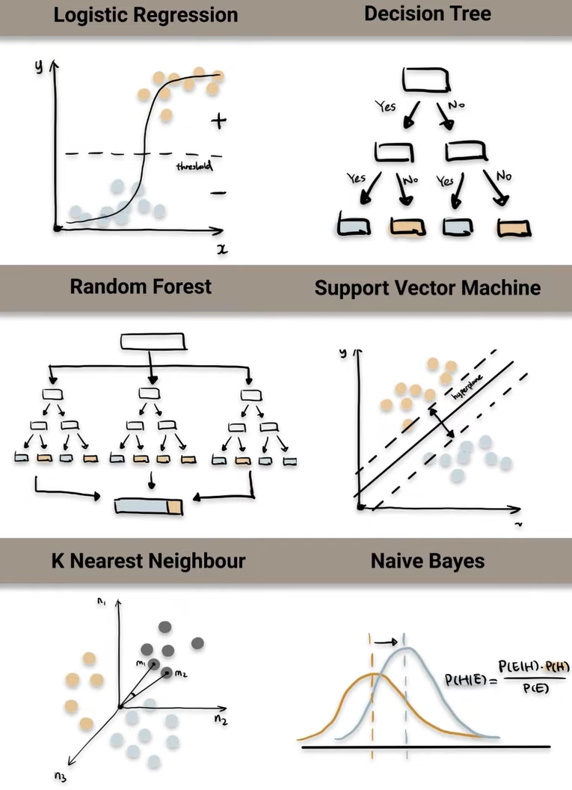

# Classification Algorithms
In the last lesson, we learned about the classification problem and how to solve it using the logistic regression algorithm. In this lesson, we will highlight other classification algorithms that are widely used in machine learning.

  

Watch this (trimmed) video to learn more about 6 common classification algorithms:

<iframe width="100%" height="450" src="https://www.youtube.com/embed/e-lHu0U9UY4?si=_NtUP_d5wNp-Zum6&amp;start=125&end=265" title="YouTube video player" frameborder="0" allow="accelerometer; autoplay; clipboard-write; encrypted-media; gyroscope; picture-in-picture; web-share" allowfullscreen></iframe>
