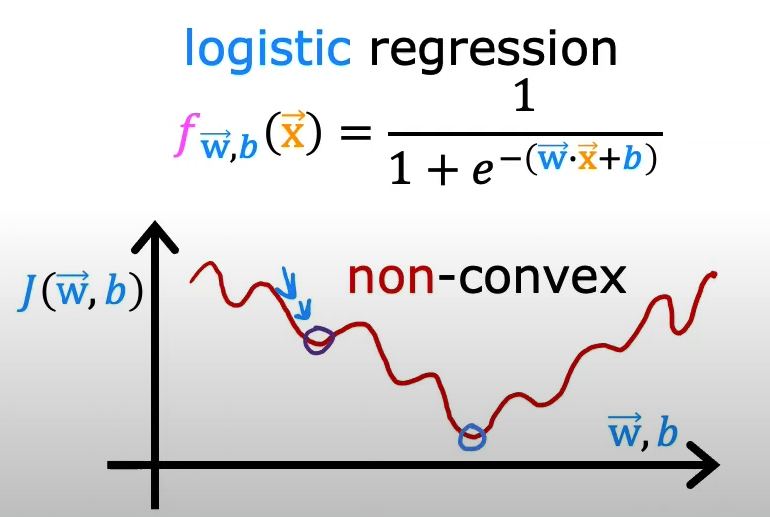
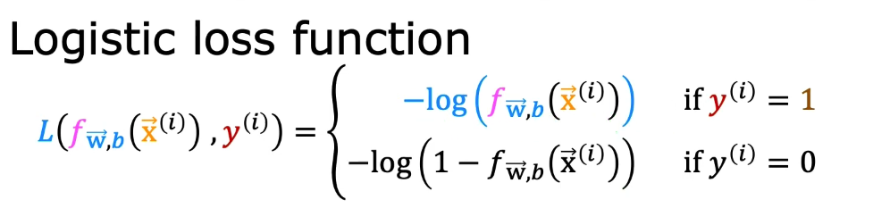
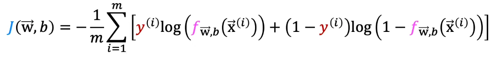

# Logistic Regression and Classification
In this lesson, we will learn about classification and logistic regression.

## Classification
While regression is used to predict continuous values, classification is used to predict classes, such as "spam," or "not spam," or "cancer" and "no cancer," or "cat," "dog," "bird," "fish," etc.

A binary classification, a sub-type of classification, predicts a binary output `{0,1}, positive and negative`, or `yes and no`. For example, a binary classifier may predict whether an email is spam or not spam.

A multi-class classification predicts a multi-class output `{0,1,2,3}` or `{cat, dog, bird, fish}`. 

## Approaching Classification Problems
At its core, we are still using the regression mindset. We are still trying to find the best parameters to fit the data. The only difference is that we are trying to fit the data to a binary or multi-class **output**, not a continuous one.

### From Regression to Classification:
<iframe width="100%" height="450" src="https://www.youtube.com/embed/p-ltr1C7u2o?si=FinL09vCUNb3JlaJ&amp;start=274&end=540" title="YouTube video player" frameborder="0" allow="accelerometer; autoplay; clipboard-write; encrypted-media; gyroscope; picture-in-picture; web-share" allowfullscreen></iframe>

## Logistic Regression
Logistic regression is a classification algorithm used to assign observations to a discrete set of classes. Unlike linear regression which outputs continuous number values, logistic regression transforms its output using the logistic function to return a probability value which can then be mapped to two or more discrete classes.

<iframe width="100%" height="450" src="https://www.youtube.com/embed/xuTiAW0OR40?si=IVZ0K6JDJmpiG7KV&amp;start=0&end=500" title="YouTube video player" frameborder="0" allow="accelerometer; autoplay; clipboard-write; encrypted-media; gyroscope; picture-in-picture; web-share" allowfullscreen></iframe>

### The sigmoid function
As mentioned in the video, the sigmoid function is an S-shaped curve that can take any real-valued number and map it into a value between the range of `0` and `1`. This is exactly what we need because we want to map the output of the regression model function to probability values between `0` and `1`.

## Cost Function for Logistic Regression:
<iframe width="100%" height="450" src="https://www.youtube.com/embed/vq4Ie5xWhww?si=pt9n8NfRQ-HnwOXO&amp;start=0&end=656" title="YouTube video player" frameborder="0" allow="accelerometer; autoplay; clipboard-write; encrypted-media; gyroscope; picture-in-picture; web-share" allowfullscreen></iframe>

**Notes on the Video:**
- Recall that we use gradient descent to minimize the cost function and find the best parameters for the model.
- The shape of the cost function we used for linear regression (Mean Squared Error) is convex, which means that it has only one minimum. This makes it easy to find the global minimum.
- We can't use the same cost function (MSE) for logistic regression because the resulting cost function would be non-convex. This would make it difficult to find the global minimum.
    
- The cost (loss) function of logistic regression is defined as:
    

Let's now use gradient descent to minimize the cost function of logistic regression.

## Gradient Descent for Logistic Regression:
<iframe width="100%" height="450" src="https://www.youtube.com/embed/6SZUnXEHCns?si=PnEtFy1oH6UjIJAF&amp;start=0&end=315" title="YouTube video player" frameborder="0" allow="accelerometer; autoplay; clipboard-write; encrypted-media; gyroscope; picture-in-picture; web-share" allowfullscreen></iframe>

**Notes on the Video:**
- Using the loss function of logistic regression, instead of the MSE of linear regression, we can use gradient descent to minimize the cost function and find the best parameters for the model.

