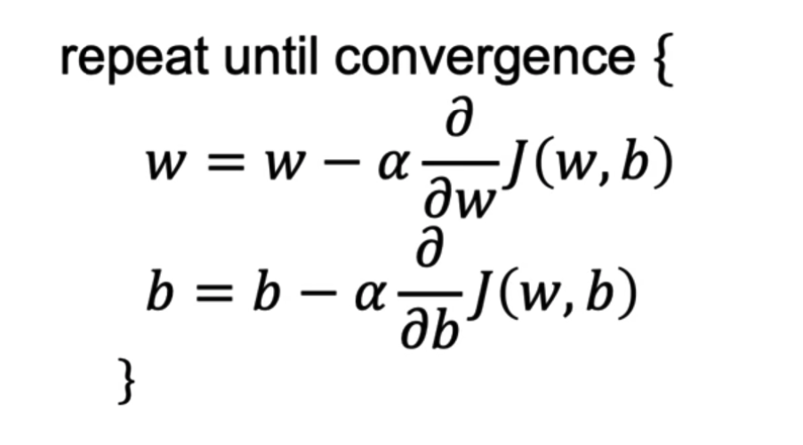

# Gradient Descent
We have learned about linear regression and how to use it to predict the value of an output variable based on the value of one input variable(feature). We have also learned about the cost function and how to use it to measure the error of the model. In this lesson, we will learn about gradient descent, a popular optimization algorithm used to **minimize the cost function**.

### Watch the following videos in the given order:

#### Introduction to Gradient Descent:

<iframe src="https://www.youtube.com/embed/WtlvKq_zxPI" frameborder="0" webkitallowfullscreen mozallowfullscreen allowfullscreen style="position: absolute; top: 0; left: 0; width: 100%; height: 100%;"></iframe>

#### Gradient Descent Implementation:

<iframe src="https://www.youtube.com/embed/w_2vCijLiiM" frameborder="0" webkitallowfullscreen mozallowfullscreen allowfullscreen style="position: absolute; top: 0; left: 0; width: 100%; height: 100%;"></iframe>

## Key points from the videos:

### Gradient Descent
Gradient descent is an optimization algorithm used to minimize the cost function. The cost function is a function that measures the error of the model. The cost function for linear regression is the mean of squared error. 

The equation of the gradient descent algorithm is as follows:

- The idea of gradient descent is to start with a random value for the coefficients and then iteratively update the coefficients in the direction of the gradient of the cost function until we reach a local minimum.

- The derivative term in the gradient descent equation tells us in which direction we should update the coefficients. In combination with the learning rate, the derivative term tells us how much we should update the coefficients.

- If we are already at a local minimum, the derivative term will be zero and the coefficients will not be changed.

#### The Learning Rate and Number of Iterations:

<iframe src="https://www.youtube.com/embed/k0h8emRAAHE" frameborder="0" webkitallowfullscreen mozallowfullscreen allowfullscreen style="position: absolute; top: 0; left: 0; width: 100%; height: 100%;"></iframe>

- The learning rate is a hyperparameter that controls how much we update the coefficients in each iteration. 
- The learning rate is usually set to a small positive number between `0` and `1`. 
- If the learning rate is too small, the algorithm will take a long time to converge. If the learning rate is too large, the algorithm may overshoot the minimum and potentially never converge.
- The number of iterations is another hyperparameter that controls the number of iterations the algorithm will run. If the number of iterations is too small, the algorithm may not converge. If the number of iterations is too large, the algorithm will take a long time to converge.

## Gradient Descent for Linear Regression:

<iframe width="100%" height="450" src="https://www.youtube.com/embed/RGL_XUjPkGo?si=Nwu-bSM7ioDnFaEA&amp;start=0&end=110" title="YouTube video player" frameborder="0" allow="accelerometer; autoplay; clipboard-write; encrypted-media; gyroscope; picture-in-picture; web-share" allowfullscreen></iframe>

## Practice Quiz:

Q. Which of the following are true statements? Select all that apply.

1. To make gradient descent converge, we must slowly decrease alpha (α)  over time.

2. Gradient descent is guaranteed to find the global minimum for any function J(θ0, θ1).

3. Gradient descent can converge even if α is kept fixed. (But α cannot be too large, or else it may fail to converge.)

4. For the specific choice of cost function J(θ0, θ1) used in linear regression, there are no local optima other than the global optimum.

Click here for the solution

Ans: 3, 4

1. To make gradient descent converge, we must slowly decrease alpha (α) over time. (**False**). We don't have to decrease α over time. It can be fixed and the algorithm will still converge to the optimal value. 

2. Gradient descent is guaranteed to find the global minimum for any function J(θ0, θ1). (**False**). Gradient descent is not guaranteed to find the global minimum for any function. It may find a **local minimum** instead.

3. Gradient descent can converge even if α is kept fixed. (But α cannot be too large, or else it may fail to converge.) (**True**). If α is too large, gradient descent may fail to converge. However, if α is small **enough**, gradient descent will converge even if α is not decreased over time.

4. For the specific choice of cost function J(θ0, θ1) used in linear regression, there are no local optima (other than the global optimum).( **True**). This is because the cost function in linear regression (mean of squared error) is convex, meaning any local minimum is also a global minimum.

