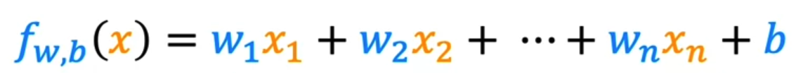
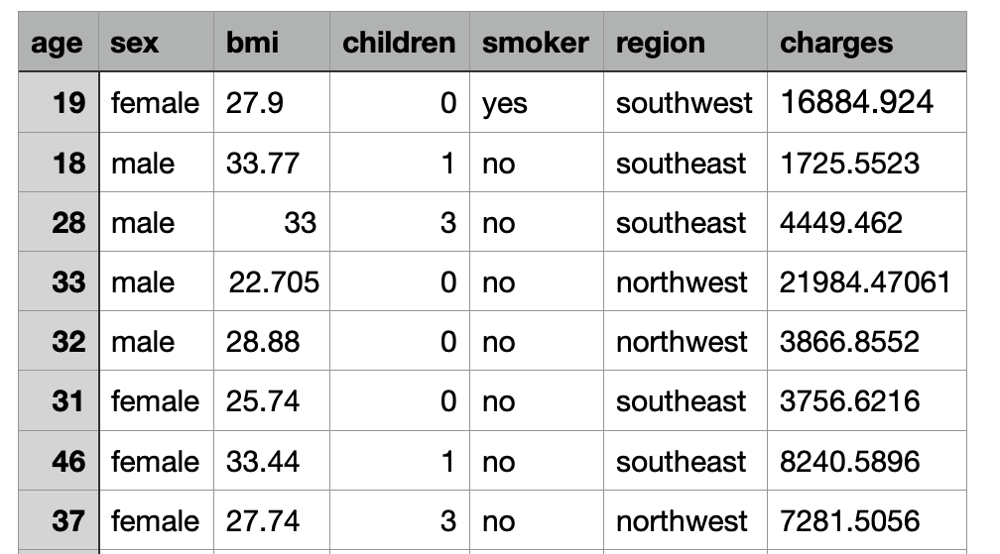

# Linear Regression with Multiple Variables
In our previous lessons, we learned about linear regression. More specifically, One-variable linear regression in which we had one input variable (feature) and one output variable. In this lesson, we will learn about multiple linear regression in which we have more than one input variable (multiple features). It is also known as multivariate linear regression.

### Watch this video to learn about multiple linear regression:

<iframe src="https://www.youtube.com/embed/jXg0vU0y1ak" frameborder="0" webkitallowfullscreen mozallowfullscreen allowfullscreen style="position: absolute; top: 0; left: 0; width: 100%; height: 100%;"></iframe>

## Multiple Linear Regression
In multiple linear regression:
- We have more than one input variable that contribute in predicting the output variable.
- The equation of the line is a linear combination of the input variables.

    

### Multiple Linear Regression Example
In this insurance dataset, we have the following features: age, sex, bmi, children, smoker, and region. We want to predict the charges (output variable) based on these features. Here is a sample of the data:

With x1, x2, ..., x6 being the age, sex, bmi, children, smoker, and region features, respectively, the equation is as follows.

`fw,b(x) = w1x1 + w2x2 + .. + w6x6 + b`

The model should learn the values of the coefficients w1, w2, ..., w6 that minimize the error between the predicted charges and the actual charges.

As we saw in the video, a common way to represent the features mathematically is by using vectors.

where X = [x1, x2, .. x6] and W = [w1, w2, .. w6]

### Gradient Descent on Multiple Linear Regression
The gradient descent algorithm for multiple linear regression is the same as the one for one-variable linear regression. The only difference is that we have more than one coefficient to update. The gradient descent equation for multiple linear regression is as follows.

where `w` is a vector of the coefficients `[w1, w2, ... wn]` and `x` is a vector of the features `[x1, x2, ... xn]`.

### Watch this video to learn about gradient descent for multiple regression:

<iframe width="100%" height="450" src="https://www.youtube.com/embed/YjpCQof9tI8?si=I8bgt9iPaQWHN_Pm&amp;start=0&end=274" title="YouTube video player" frameborder="0" allow="accelerometer; autoplay; clipboard-write; encrypted-media; gyroscope; picture-in-picture; web-share" allowfullscreen></iframe>

## Polynomial Regression
Now that we have learned about multiple linear regression, let's see how we can use it to fit a polynomial function (a function that has a non-linear relationship between the input and output variables).

### Watch this video to learn about polynomial regression:
<iframe width="100%" height="450" src="https://www.youtube.com/embed/IFkRKJ5iBDE?si=vvxIFx60aDWuPb1Q&amp;start=0&end=228" title="YouTube video player" frameborder="0" allow="accelerometer; autoplay; clipboard-write; encrypted-media; gyroscope; picture-in-picture; web-share" allowfullscreen></iframe>

## Key points from the video:
- Polynomial regression is a form of regression in which the relationship between the variables are modeled as an nth degree polynomial.
- **Feature Engineering** practices are very important in regression. 