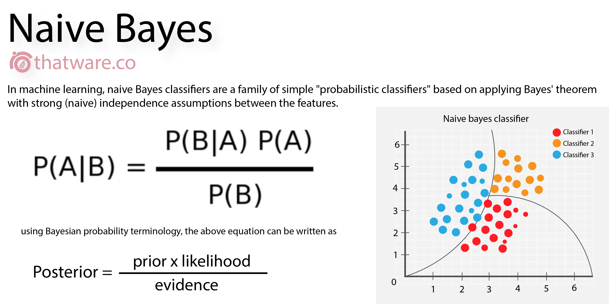

# Naive Bayes Classifier
In our previous lessons, we learned about the classification problem and how to solve it using the logistic regression algorithm. In this lesson, we will highlight another classification algorithm that is widely used in machine learning: the Naive Bayes classifier.

The Naive Bayes classifier is a simple probabilistic classifier based on applying Bayes' theorem with strong (naive) independence assumptions. It is a fast, accurate, and reliable algorithm that is widely used for text classification, spam filtering, and recommendation systems.

  

### How Naive Bayes Works
Watch the following video to learn how the Naive Bayes classifier works:

<iframe width="100%" height="450" src="https://www.youtube.com/embed/nuUitgvWso8?si=S66XivVBDneDENF9" title="YouTube video player" frameborder="0" allow="accelerometer; autoplay; clipboard-write; encrypted-media; gyroscope; picture-in-picture; web-share" allowfullscreen></iframe>

### Notes on the Video
- **Bayes' Theorem**: It is a fundamental theorem in probability theory that describes the probability of an event, based on prior knowledge of conditions that might be related to the event. It is named after Thomas Bayes.

- **Naive Bayes Classifier**: It is a simple probabilistic classifier based on applying Bayes' theorem with strong (naive) independence assumptions. It is widely used for text classification, spam filtering, and recommendation systems.
