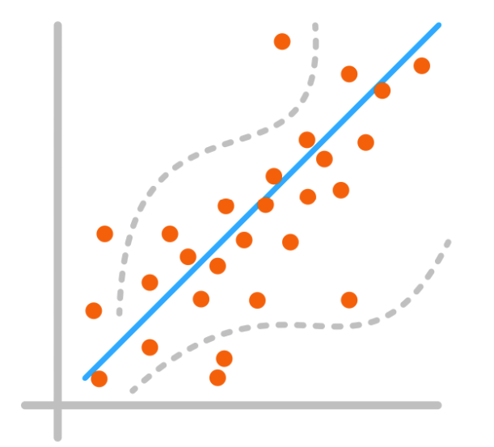
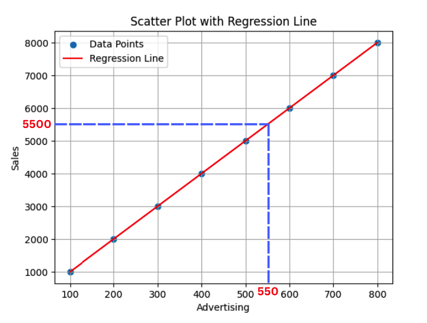
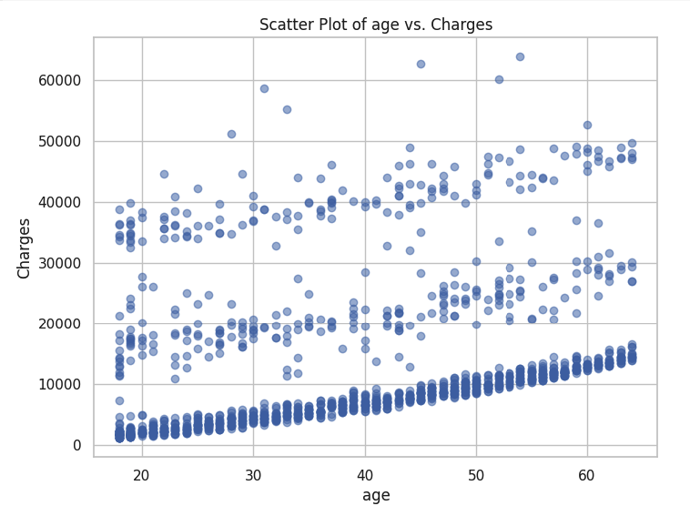
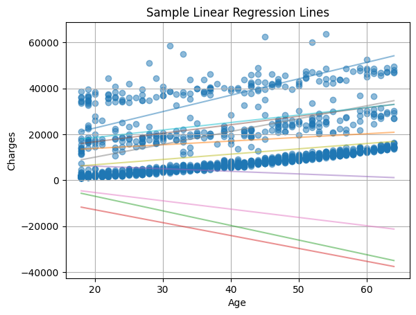
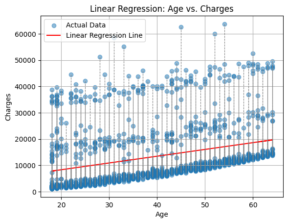
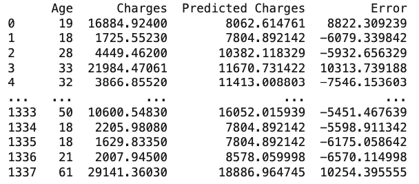
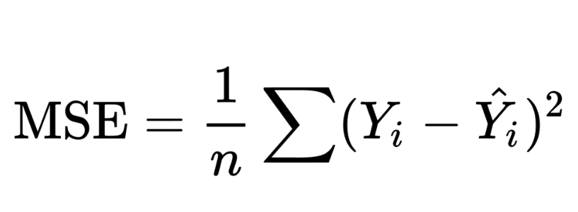
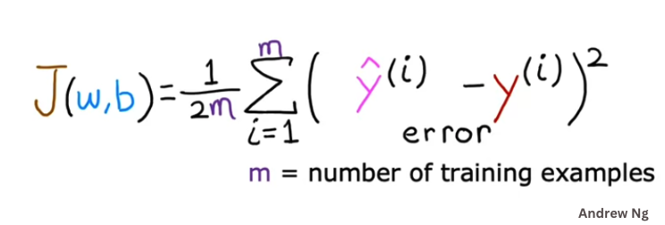
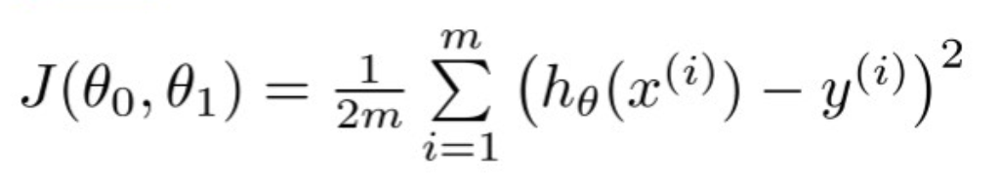

# Linear Regression 
<p align="center">
  
</p>
Isn't it fascinating to think about the possibility of predicting a person's height based on their weight? Or foreseeing a house's price based on its size and location? Imagine the advantage it would bring to your business if you could anticipate the revenue generated by an advertising campaign simply by analyzing the expenditure. These examples offer just a brief glimpse of the wide range of problems that can be addressed through regression analysis.

## What is Regression?
In its simplest form, regression is a statistical method used to model the connection between a dependent variable and one or more independent variables. The dependent variable is the variable we aim to predict, while the independent variables are the variables used to predict the outcome. 

<aside>
The first time I learned about regression was during my graduate studies in a statistics class. I was fascinated by the idea of predicting the future based on past data.
</aside>

An example of a simple regression problem is predicting the price of a house based on its size, number of rooms, and location. In this case, the price of the house is the dependent variable, while the size, number of rooms, and location are the independent variables.

The technique of regression analysis involves developing a mathematical model that describes the relationship between the dependent and independent variables.

In machine learning,the key idea behind regression is that, given that we have enough data, we can learn the relationship between the independent and dependent variables from the data. We can then use this learned relationship to predict the outcome of future events.Regression is a form of **supervised learning**.

<!-- 
For instance, consider using regression to model the relation between a sports team's performance (the variable to predict) and the various training routines administered to the players (the variable used to predict the outcome). This enables us to predict the team's performance based on their training routines.


The primary objective of regression is to determine the most suitable line or curve that characterizes the relationship between the variables. This regression line or curve serves as a tool to anticipate outcomes in future scenarios. Mathematically speaking, lines and curves are functions represented by equations.


Graphically, regression can be represented as a line or a curve that best fits the data points. The line or curve is the model that describes the relationship between the independent and dependent variables.

**Example:**

If we have a line modeling the relationship between advertising expenditure and resulting sales, we can utilize it to forecast sales based on advertising spending.


<p align="center">
  
</p>

Given the above plot, if the amount of money spent on advertising is 550, the resulting sales is forcated to 5500.

<p align="center">
  
</p>
-->

## Types of Regression
There are several types of regression, but the most common ones in machine learning are:
- **Linear Regression:** Models the linear relationship between the dependent and independent variables. It assumes a straight-line relationship.

- **Polynomial Regression:** Models the relationship between the dependent and independent variables as an nth-degree polynomial. It assumes a non-linear relationship.

- **Logistic Regression:** Models the relationship between the dependent and independent variables by estimating the probability that a given input belongs to a specific category. It is used for classification problems.


We will start with **One-variable Linear Regression** and then move on to other types of regression in the upcoming lessons.

## One-variable Linear Regression
When we have one input variable (feature), we call it one-variable linear regression. Later on, we will learn about multiple variable linear regression, in which we have more than one input variable (multiple features).


### Goal
Our goal in **Linear Regression** is to find the best fit line (equation) that describes the relationship between the variables that can later be used to predict the outcome of future events.

Here is a sample dataset that contains the amount of money spent on advertising and the resulting sales. The goal is to predict the amount of sales based on the amount of money spent on advertising.

| Advertising | Sales |
|-------------|-------|
| 100         | 1000  |
| 200         | 2000  |
| 300         | 3000  |
| 400         | 4000  |
| 500         | 5000  |
| 600         | 6000  |
| 700         | 7000  |
| 800         | 8000  |

Can you predict the sales when the money spent on advertising is 1170? 

Data usually is not that simple. But let's illustrate the idea of regression using this simple example first and then we will move on to more complex examples.

Here is a scatter plot of the data:
<p align="center">
  
</p>

This dataset forms a perfect straight line. The equation of a straight line is `Y = wX + b`. The value of `w` is the slope of the line. The value of `b` is the y-intercept of the line. 

Using any two points on the line, or from the data table, we can calculate the slope of the line and the y-intercept of the line. Let's use the first and the last points to calculate the slope and the y-intercept of the line.

```
w (slope) = (y2 - y1) / (x2 - x1) = (5000 - 1000) / (500 - 100) = 4000 / 400 = 10
```

We can calculate the y-intercept of the line using the slope of the line and any point on the line like this:

```
b = y - wx = 1000 - 10 * 100 = 1000 - 1000 = 0
```
So, the equation of the line is `y = 10x + 0 = 10x`. 

Having the equation of the regression line, we can predict the outcome of any future events. For example, if you want to predict the sales when you spend `3750` on advertising, you can predict that the resulting sales will be `10 * x = 37500`. 

This was a very simple example but we've learned a lot. 
- We learned that the equation of a straight line is `y = wx + b`. 
- We learned the parameters of the line `w` and `b`. 
- We learned how to calculate the parameters of the line. 
- We learned how to use the equation of the line to predict the outcome of future events.

### Example: Car Price Prediction
Here is a video that explains the basics of linear regression with a simple example. Please watch it and then we will continue our discussion.

<div style="position: relative; padding-bottom: 56.25%; height: 0;">
<iframe src="https://www.youtube.com/embed/Wo9Vt7Sc_E0" frameborder="0" webkitallowfullscreen mozallowfullscreen allowfullscreen style="position: absolute; top: 0; left: 0; width: 100%; height: 100%;"></iframe>
</div>

</br>

Now, let's move on to a more complex example. Here is a part of a dataset that contains the age of a person and the insurance cost of that person.

<p align="center">
  
</p>

Can you predict the insurance cost of a person knowing their age? Can you draw a line on that plot that describes the relationship between the age of a person and their insurance cost 🤔? 

It is not that easy, isn't it? Let's try to draw a line that describes the relationship between the age of a person and their insurance cost. Here are a few lines that I drew:

<p align="center">
  
</p>

Just by looking at the graph, we can determine which lines are better than the others but, among the lines that are close to the data points, it is still not easy to determine which one is better. 

Let's discuss a systematic way to determine which line is better than the others. But before we do that, let's learn how can we find these lines different lines.

## Parameters

We can draw multiple candidate lines by adjusting the parameters. The line's parameters are `w` and `b`. We can experiment with different values of `w` and `b` to create different lines. Here are a few lines that I created by varying the line's parameters:

<p align="center">
  
</p>


What values of `w` and `b` do we use? Initially, we'll rely on our intuition to make educated guesses about parameter values. Later on, we will utilize a technique called **gradient descent** to find the best parameter values for us. 

## Best Fit Line
**How can we determine which line is the best fit?** One approach to accomplish this is by calculating the distance between the data points and the line.
<p align="center">
  
</p>

The smaller the distance between all points and the line, the better the line. This distance between a point and a line is referred to as the **error**. 

## Cost Function
Ideally, we would like the distance between the points and the line to be zero, but that is rare in real-life scenarios. Therefore, our objective is to identify the line with the smallest distances (**smallest error**) between the points and the line. 

In a dataset showing the relationship between the age of a person and their insurance cost, here is a sample of the errors for one line:
<p align="center">
  
</p>

### Error
As you can see, the raw data does not tell us much. We need to find a way to summarize the errors in a way that is more meaningful. The average of the errors, for example, might be a good way to summarize the errors but having negative and positive errors might cancel each other out. In practice, there is a better method called the **mean of squared errors** to summarize the errors. Here is the equation of the mean of squared errors:

<p align="center">
  
</p>

What the equation says is that we calculate the difference between the actual value and the predicted value for each point, square the difference, and then calculate the average of all the squared differences.


This is also called the **cost function**. The cost function is a function that maps some values of one or more variables onto a real number intuitively representing some "cost" associated with the event. This is precisely what we need to effectively utilize these error values.


If you feel you need more explanation, please watch [this video](https://www.youtube.com/embed/taPvVyJVc_A).

In machine learning, we use a slightly modified version of the mean of squared errors. Here is the formula we use in machine learning:
<p align="center">
  
</p>

Here is the explanation of the formula:
- `J(w,b)` is the cost function. It is a function of the parameters of the line `w` and `b`.
- `m` is the number of data points. The division by `2m` is to make the calculation easier.
- `y^(i)` is the predicted value of the `i`th data point
- `y(i)` is the actual value of the `i`th data point
- `∑` is the summation symbol. It means we need to add all the values of the expression that follows it.


### Theta Notation
In some references, the regression equation is modeled using `θ0` and `θ1` values instead of `w` and `b`. The equation of the line is then expressed as `hθ(x) = θ0 + θ1x`, where `θ0` and `θ1` are the y-intercept and the slope of the line, respectively. This approach stems from the assumption that our goal begins with a hypothesis, `h`, and we aim to find the best hypothesis that accurately describes the relationship between the variables.

The cost function, represented as `J(θ0, θ1)`, takes the following form: 

<p align="center">
  
</p>

### Cost Function Videos
If you feel you need more explanation of the cost function and how it is calculated, please watch the following videos:
- [Cost Function](https://www.youtube.com/watch?v=CFN5zHzEuGY)
- [Cost Function Intuition](https://www.youtube.com/watch?v=peNRqkfukYY)


## Example:
Let's apply what we've learned so far using an example. Here is a sample dataset that contains the amount of money spent on advertising and the resulting sales. The goal is to predict the amount of sales based on the amount of money spent on advertising.

| Advertising | Sales |
|-------------|-------|
| 100         | 1000  |
| 200         | 1400  |
| 300         | 2300  |
| 400         | 2300  |
| 500         | 3500  |


## Finding the Best Fit Line
Remember that the goal of regression is to find the best fit line (equation) that describes the relationship between the variables that can later be used to predict the outcome of future events.

To do so, we need to find the parameters of the line: `w` and `b` that will find the best fit line. In other words, we need to find the values of `w` and `b` that will **minimize the cost function**. 

Here is a manual way of finding the best fit line. We will try different values of `w` and `b` and calculate the cost function for each set of values. Then we will select the set of values that gives the smallest cost function.


### Trying w =1 and b = 5
```
Y^ = wx + b = 1x + 5 = x + 5
```

| Advertising (x) | Sales (y)| w | b   | y^  |  y  | Y^-y  | (y^- y)^2 |
|-------------|-------|---|---|-----|-----|-----------|------------|
| 100         | 1000  | 1 | 5 | 105 | 1000| -895      |  864025    |
| 200         | 1400  | 1 | 5 | 205 | 1400| -1195     |  1425025   |
| 300         | 2300  | 1 | 5 | 305 | 2300| -1995     |  3980025   |
| 400         | 2300  | 1 | 5 | 405 | 2300| -1895     |  3582025   |
| 500         | 3500  | 1 | 5 | 505 | 3500| -2995     |  8975025   |


The calculated cost function with `w=1` and `b=5` for our dataset is: `7,772,102.5`. Seems like a very large number. Let's try another set of values for `w` and `b`. 

### Trying  w =2 and b = 50:

| Advertising | Sales | w | b   | y^  |  y  | Y^-y  | (y^- y)^2 |
|-------------|-------|---|----|-----|-----|-------|--------------|
| 100         | 1000  | 2 | 50 | 250 | 1000| -750  |  562500      |
| 200         | 1400  | 2 | 50 | 450 | 1400| -950  |  902500      |
| 300         | 2300  | 2 | 50 | 650 | 2300| -1650 |  2722500     |
| 400         | 2300  | 2 | 50 | 850 | 2300| -1450 |  2102500     |
| 500         | 3500  | 2 | 50 | 1050| 3500| -2450 |  6002500     |


The calculated cost function with w=2 and b=50 for our dataset is: `1,231,000.0`. Better.

### Trying w =5 and b = 500:

| Advertising | Sales | w | b   | y^  |  y  | Y^-y  | (y^- y)^2 |
|-------------|-------|---|-----|-----|-----|-------|--------------|
| 100         | 1000  | 5 | 500 | 1000| 1000| 0     |  0           |
| 200         | 1400  | 5 | 500 | 1500| 1400| 100   |  10000       |
| 300         | 2300  | 5 | 500 | 2000| 2300| -300  |  90000       |
| 400         | 2300  | 5 | 500 | 2500| 2300| 200   |  40000       |
| 500         | 3500  | 5 | 500 | 3000| 3500| -500  |  250000      |


The calculated cost function with w=5 and b=500 for our dataset is: `39,000`. Much better.

### Trying w =2 and b = 1000:

| Advertising | Sales | w | b   | y^  |  y  | Y^-y  | (y^- y)^2 |
|-------------|-------|---|-----|-----|-----|-------|--------------|
| 100         | 1000  | 2 | 1000| 1200| 1000| 200   |  40000       |
| 200         | 1400  | 2 | 1000| 1400| 1400| 0     |  0           |
| 300         | 2300  | 2 | 1000| 1600| 2300| -700  |  490000      |
| 400         | 2300  | 2 | 1000| 1800| 2300| -500  |  250000      |
| 500         | 3500  | 2 | 1000| 2000| 3500| -1500 |  2250000     |


The calculated cost function with w=2 and b=1000 for our dataset is: `319,000.0`. Up again.

### Trying w =2 and b = 500:

| Advertising | Sales | w | b   | y^  |  y  | Y^-y  | (y^- y)^2 |
|-------------|-------|---|----|-----|-----|-------|--------------|
| 100         | 1000  | 2 | 500| 600 | 1000| -400  |  160000      |
| 200         | 1400  | 2 | 500| 800 | 1400| -600  |  360000      |
| 300         | 2300  | 2 | 500| 1000| 2300| -1300 |  1690000     |
| 400         | 2300  | 2 | 500| 1200| 2300| -1100 |  1210000     |
| 500         | 3500  | 2 | 500| 1400| 3500| -2100 |  4410000     |


The calculated cost function with w=2 and b=500 for our dataset is: `777,100.0`. Up again.

If we decide to stop here, we can use the equation of the line `y = 5x + 500` to predict the outcome of future events. For example, if you want to predict the sales when you spend `3750` on advertising, you can predict that the resulting sales will be `5 * x + 500 = 5 * 3750 + 500 = 19,750`.


### Results
These were 5 iterations. We tried 5 different values of `w` and `b`. The smallest cost we could get is `39,000.` So, the best fit line we could find so far is the one with `w=5` and `b=500`.

Can we do better? We can if we try more values of `w` and `b` but we will hire the computer to do that for us in the next lesson.


## Welcome to Learning!

What we saw above is a core part of how machines learning algorithms works. It tries to "**learn**" the best fit line by trying different values of the **parameters** and calculating the cost function for each set of values. Then it selects the set of values that gives the smallest cost.


Solve the exercise in the next section to practice what you've learned so far.

## Summary
- Regression is a form of supervised learning employed to model the relation between one or more variables, allowing us to forecast outcomes based on this relationship.

- The primary objective of regression is to determine the most suitable line or curve that characterizes the relationship between the variables. This regression line or curve serves as a tool to anticipate outcomes in future scenarios.

- The equation of a straight line is `y = wx + b`. The value of `w` is the slope of the line. The value of `b` is the y-intercept of the line. The slope of the line is the change in y divided by the change in x. The y-intercept of the line is the value of y when x is 0.

- The "cost" or "loss" function is a function that maps some values of one or more variables onto a real number intuitively representing some "cost" associated with the event. This is precisely what we need to effectively utilize these error values.

- The common cost function used in machine learning is **the mean of squared errors**. Here is the formula we use:
<p align="center">
  
</p>


