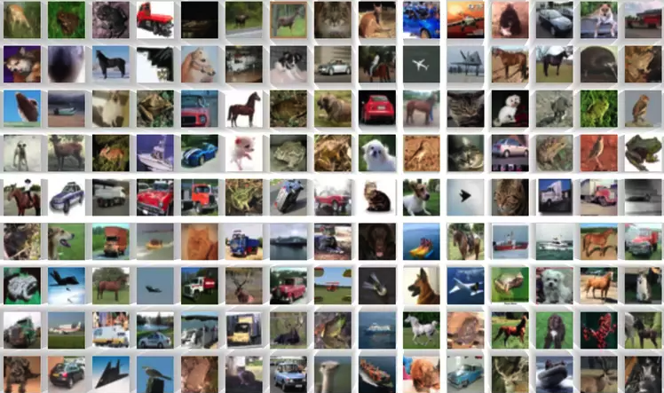

# Neural Networks and Computer Vision

  

    
CIFAR-10 Dataset

Welcome to the fascinating world of Neural Networks! This week, we embark on an exciting journey to explore the fundamentals of neural networks and their applications across a variety of projects. 

By the end of this week, you will have the opportunity to construct an image classifier using a Convolutional Neural Network (CNN). Additionally, you'll learn how to effectively train and evaluate your model using TensorFlow and Keras, two powerful tools in the field of deep learning. 

Your assignment for this week will be to build a CNN model that recognizes faces

Let's dive in! 🚀