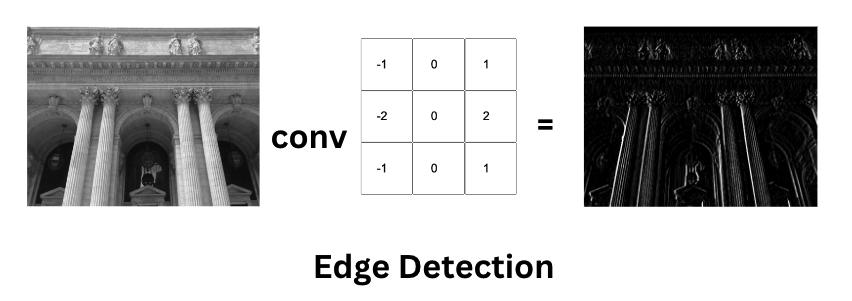
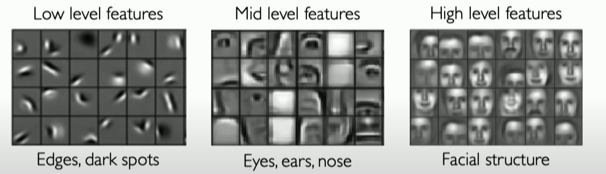

# Convolutional Neural Networks (CNNs)
Convolutional Neural Networks (CNNs) stand as the cornerstone of deep learning applications in computer vision. Invented by Yann LeCun in the 1990s and continuously refined, CNNs excel in automatically learning spatial hierarchies of features from images. This capability has made them indispensable for a wide range of computer vision tasks, including image classification, object detection, and image segmentation.

Understanding CNNs is crucial for grasping the essence of deep learning and its application in analyzing visual data.

## The Convolution Operation
At the heart of CNNs is the convolution operation, a specialized mathematical process that extracts features from input data using a kernel (or filter). This small matrix moves across the input data, applying a dot product at each step to produce a feature map, highlighting important features while reducing the size of the data.

The convolution operation transforms the input image in a manner that may seem almost magical, emphasizing features like edges and textures, which are vital for the subsequent layers of the CNN to build upon.

<!-- Here is a mathematical example of the convolution operation: -->

    

    
    
Convolution Operation

Watch this video to understand the convolution operation in more detail:

<iframe width="100%" height="450" src="https://www.youtube.com/embed/B-M5q51U8SM?si=XU-FZ3IigAGqWGcy" title="YouTube video player" frameborder="0" allow="accelerometer; autoplay; clipboard-write; encrypted-media; gyroscope; picture-in-picture; web-share" allowfullscreen></iframe>

 
 

## Understanding Feature Extraction in CNNs

Feature extraction in CNNs unfolds through the network's convolutional layers, which learn to identify features directly from the data. Initial layers might capture basic elements such as edges and corners, while deeper layers can discern more intricate details like textures and object parts. This hierarchical learning process enables CNNs to tackle complex visual recognition tasks effectively.

    
    

Watch this (trimmed) video to understand how CNNs learn features from data:
<iframe width="100%" height="450" src="https://www.youtube.com/embed/NmLK_WQBxB4?si=dzQ_R-kT8709dAjz&amp;start=759&end=1343" title="YouTube video player" frameborder="0" allow="accelerometer; autoplay; clipboard-write; encrypted-media; gyroscope; picture-in-picture; web-share" allowfullscreen></iframe>

 

In our upcoming lessons, we'll dive into practical demonstrations of CNNs in action, showcasing their power in solving real-world computer vision challenges. 

