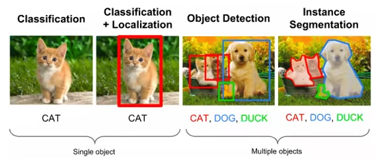
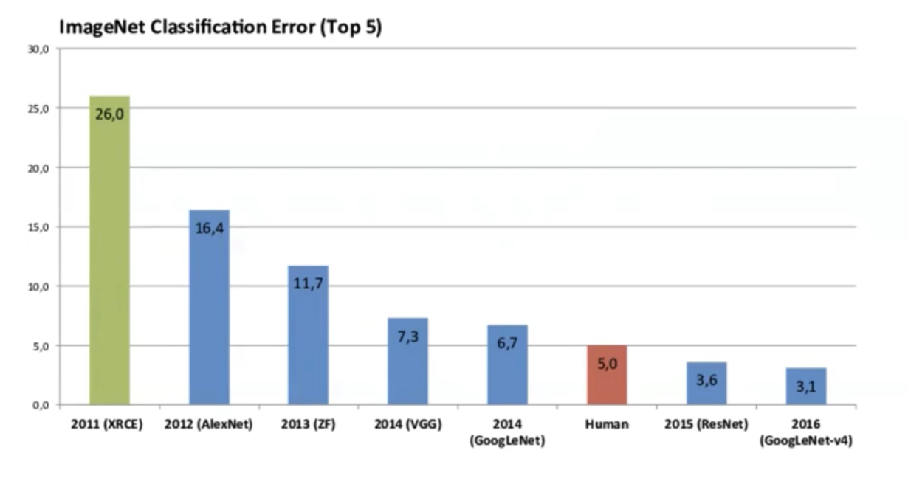

# Computer Vision

Computer Vision is a transformative field within artificial intelligence that empowers computers and systems to extract meaningful information from digital images, videos, and other visual inputs. This field merges techniques from machine learning and traditional image processing to enable the interpretation and analysis of **visual** data.

## Key Tasks in Computer Vision

Computer vision encompasses a range of tasks, each aimed at understanding visual data in some form. These include:

- Image Classification: Assigning a label to an image from a set of predefined categories.
- Object Detection: Identifying objects within an image and determining their boundaries.
- Image Segmentation: Dividing an image into segments to simplify its representation.

While machine learning algorithms, particularly those involving neural networks, play a crucial role in modern computer vision, the field also benefits from traditional image processing techniques. These foundational techniques, like filtering, edge detection, and image enhancement, are essential for preprocessing and improving image data for further analysis.

    
    
Basic Computer Vision Tasks: Berkeley CS198

    

## Neural Networks in Computer Vision

Our exploration into neural networks revealed their potential in addressing computer vision challenges, such as image classification. However, standard neural networks face limitations in dealing with the complexity and scale of image data. This is due to their inability to efficiently handle large input sizes and to preserve the spatial structure of images (more on this later).

## The Advent of Deep Learning in Computer Vision

Deep learning, a subset of machine learning, utilizes deep neural networks to uncover complex patterns in data. Its emergence has significantly advanced the field of computer vision, primarily through the use of Convolutional Neural Networks (CNNs). CNNs are adept at learning spatial hierarchies of features from images, making them particularly suited for computer vision tasks.
<!-- 
## Feature Extraction
Feature extraction is a crucial step in all computer vision tasks. It is the process of obtaining the most relevant information from an image, hence producing an expressive representation of the image.

Prior to 2012, the advent of deep learning, feature extraction was done using handcrafted features, such as Histogram of Oriented Gradients (HOG), Scale-Invariant Feature Transform (SIFT), and Local Binary Patterns (LBP). However, deep learning has revolutionized feature extraction by enabling the automatic learning of features from data.

### Convolutional Neural Networks (CNNs)
Convolutional Neural Networks (CNNs) are the most popular deep learning models used in computer vision. They are designed to automatically and adaptively learn spatial hierarchies of features from images. 
This approach has been invented by Yann LeCun in the 1990s and has been refined over the years. CNNs have been used in various computer vision tasks, such as image classification, object detection, and image segmentation.

understanding CNNs will help you understand what is deep learning and how it is used in computer vision. -->

The breakthroughs in AI, particularly in computer vision, are largely attributed to the availability of large datasets and the computational capacity to train extensive models. The role of GPUs in this context cannot be overstated, as they have significantly accelerated the training processes.

Below is a comparison of some popular CNN architectures used in computer vision, including AlexNet, VGG, GoogLeNet, and ResNet. These models have been instrumental in advancing the field of computer vision, particularly in the ImageNet Large Scale Visual Recognition Challenge (ILSVRC).

    
    
ImageNet Models Comparison: MIT6.S191

As we delve deeper into CNNs and their applications in computer vision, we'll explore how these models are constructed, trained, and utilized in various tasks, providing a deeper understanding of both deep learning and computer vision.

