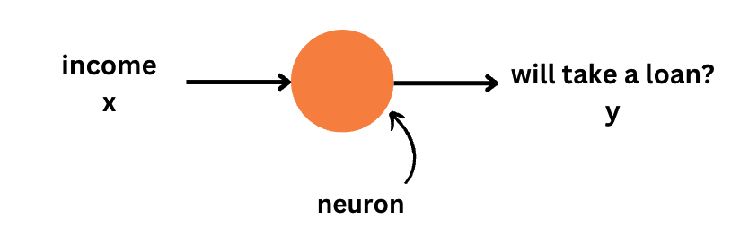

# Neural Networks
Neural networks, or more specifically, artificial neural networks (ANNs), represent a computational approach inspired by the human brain's structure and function. They are designed to learn from data, making them powerful tools for tasks such as classification, prediction, and more.


## Neurons: The Building Blocks

At the heart of a neural network is the **neuron**. A neuron receives input, processes it through computation, and then outputs a result. It is the fundamental unit that makes up a neural network.


Consider a neuron that takes an individual's income as input and predicts whether they are likely to take out a loan. 


<p align="center">
  
</p>

You already know how to do similar tasks using linear regression. A neuron is like a linear regression model with a few additional components. As in linear regression, a neuron takes an input (income), multiplies it by a weight, adds a bias, and generates an output. However, the neuron also includes an activation function, which introduces non-linearity to the output.


## Activation Functions: Introducing Non-linearity

AActivation functions play a critical role in introducing non-linearity to the neuron's output. This is crucial because it allows the model to handle complex, non-linear data. A commonly used activation function is the Rectified Linear Unit (ReLU), which outputs the input value if it is positive and zero otherwise.

<p align="center">
  
</p>


## Constructing a Simple Neural Network
A neural network is essentially a series of neurons connected together. The output of one neuron feeds into the input of another. For example, in a simple network:
<p align="center">
  
</p>
One neuron might predict an individual's ability to save money based on their income and number of dependents. Another could assess risk-taking behavior based on age and business ownership. A final neuron might use these predictions to determine the likelihood of taking out a loan.

## Deep Neural Networks: Beyond the Basics

When a neural network includes multiple layers of neurons, it becomes a **deep neural network**. These layers allow for the modeling of complex relationships and patterns in the data.


<p align="center">
  
</p>

### Watch the following video for a reiteration of the concepts we discussed above using a different example.

<iframe width="100%" height="450" src="
https://www.youtube.com/embed/n1l-9lIMW7E?si=YQ6ut8tho1g19Zxh&amp;start=11" title="YouTube video player" frameborder="0" allow="accelerometer; autoplay; clipboard-write; encrypted-media; gyroscope; picture-in-picture; web-share" allowfullscreen></iframe>

## Coding a Neural Network Layer

To grasp the inner workings of neural networks, you can implement a layer in Python with just a few lines of code:


```python
import numpy as np

class Layer:
    def __init__(self, input_size, output_size):
        self.weights = np.random.rand(input_size, output_size)
        self.bias = np.random.rand(output_size)

    def output(self, input):
        return np.dot(input, self.weights) + self.bias  # Linear operation plus bias

```
This simple example initializes a layer with random weights and biases, demonstrating how input is transformed through the layer.


**[Optional]** Here's an interesting video that demonstrates how to code a neural network layer from scratch using Python.

<iframe width="100%" height="450" src="https://www.youtube.com/embed/lGLto9Xd7bU?si=RaIq5OqQ1gWDmHXC&amp;start=9&end=777" title="YouTube video player" frameborder="0" allow="accelerometer; autoplay; clipboard-write; encrypted-media; gyroscope; picture-in-picture; web-share" allowfullscreen></iframe>


Note that the previous two examples don't involve learning. Learning, as we know, involves adjusting the weights and biases in a neural network to improve its performance. We will learn more about this in the next sections.


<!--
Another example of perceptons :

https://www.youtube.com/watch?v=hImSxZyRiOw&t=234s

>

<!--
drowziness detection 
https://www.kaggle.com/code/adinishad/driver-drowsiness-using-keras 
https://medium.com/ai-techsystems/driver-drowsiness-detection-using-cnn-ac66863718d
https://cainvas.ai-tech.systems/use-cases/driver-drowsiness-detection-app/


study the examples well
think of an assignment for the students
>

<!--

-->
