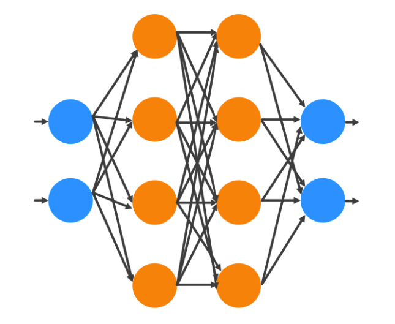

# Neural Network Types
Neural networks come in various shapes and sizes, each designed to solve a specific problem. Watch the video below for a brief overview of the different types of neural networks:

<iframe width="100%" height="450" src="https://www.youtube.com/embed/BYGpKPY9pO0?si=cYWSE7Tja4kaS8or&amp;start=11" title="YouTube video player" frameborder="0" allow="accelerometer; autoplay; clipboard-write; encrypted-media; gyroscope; picture-in-picture; web-share" allowfullscreen></iframe>

## Test Your Understanding

- Q1. What is the difference between text, audio, and image data?
- Q2. What are the use cases of a CNN (Convolutional Neural Network)?
- Q3. What are the use cases of an RNN (Recurrent Neural Network)?
- Q4. Which type of neural network is shown in the image below?

    

- Q5. Which type of neural network is shown in the image below?
    

