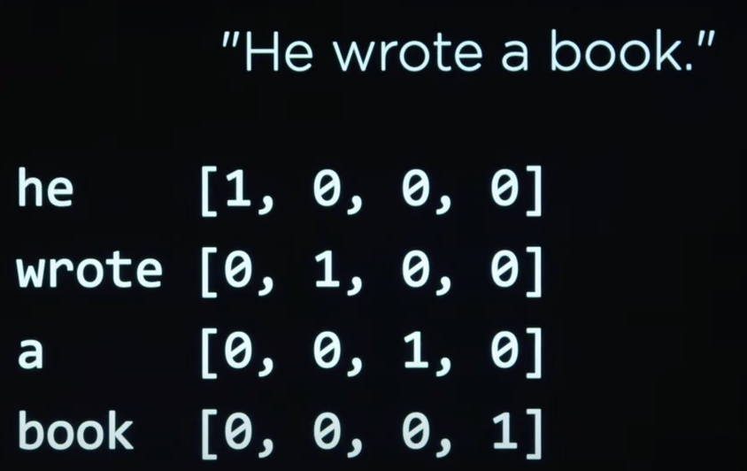

# Word Representation
To make our job easier while working with text on a computer, we need to represent words in a way that will help us solve a certain task, such as text classification or named entity recognition. In this lesson, we will discuss different ways to represent words and documents like one-hot encoding, word embeddings, and bag-of-words.


### One-hot encoding
One simple way to represent words is to use one-hot encoding, where each word is represented by a vector of zeros, except for one element that is one. This technique is commonly used in machine learning models to represent categories numerically instead of using words. In NLP, here is how it looks:

<p align="center">
  
</p>

This is a very simple approach; however, simplicity comes at a cost. To represent each word in a text, we need a vector of size equal to the size of the vocabulary, which can be very large. Also, this approach does not capture the meaning of words and it does not take into account the context in which the words are used. Two words that have similar meanings will have totally different one-hot encodings.


## Distributed Representation and Word Embeddings
To address the meaning problem, we can store words using real numbers, where each word is represented by a vector of real numbers and each element of the vector represents a feature of the word. Words with similar meanings will have vector values close to each other. This approach is called **distributed representation**. To generate these vectors, we can utilize machine learning models trained on large amounts of text data. Based on the context, the computer can learn words with similar or related meanings.

### Word2vec
Word2Vec is a popular model for word distributional representation, developed by researchers at Google. It operates on the principle that words which appear in similar contexts often share similar meanings. Word2vec employs a shallow neural network to learn word representations from extensive text corpora.


Watch this video to delve deeper into word representation and Word2vec:

<iframe width="100%" height="450" src="https://www.youtube.com/embed/QAZc9xsQNjQ?si=QkkgT698kTdUjcTa&amp;start=1873&end=2433" title="YouTube video player" frameborder="0" allow="accelerometer; autoplay; clipboard-write; encrypted-media; gyroscope; picture-in-picture; web-share" allowfullscreen></iframe>


I'm blown away by the king-queen example in the above video. It's amazing how `word2vec` can capture the meaning of words.

The code utilized in the video is available [here](https://cdn.cs50.net/ai/2023/x/lectures/6/src6/vectors/vectors.py)

### Word Embeddings
Word embedding, a form of distributed representation, captures semantic relationships between words by mapping them to dense, low-dimensional vectors within a continuous vector space. Word2Vec serves as a specific algorithm for word embedding.


✅ Try this [interesting tool](https://projector.tensorflow.org/) to experiment with word embeddings. Clicking on one word reveals clusters of similar words: 'toy' clusters with 'Disney', 'LEGO', 'PlayStation', and 'console'.

Here's a Python example for word embedding:

```python
from gensim.models import Word2Vec
from nltk.tokenize import word_tokenize
import nltk
nltk.download('punkt')

# Example sentences
sentences = [
    "The quick brown fox jumps over the lazy dog.",
    "The cat is cute.",
    "The dog is friendly."
]


# Tokenize the sentences
tokenized_sentences = [word_tokenize(sentence.lower()) for sentence in sentences]

# Train the Word2Vec model
model = Word2Vec(sentences=tokenized_sentences, vector_size=100, window=5, min_count=1, workers=4)

# Get the word vectors
word_vectors = model.wv

# Print the word vector for a specific word
print("Vector representation of 'dog':", word_vectors['dog'])

# Find similar words
similar_words = word_vectors.most_similar('dog')
print("Words similar to 'dog':", similar_words)
```

### Bag-of-Words
Bag-of-Words (BoW) is a simple and popular method for representing text data. It is based on the idea that the order of words in a document does not matter, and that the presence of words in a document is more important than the order of the words. In our previous section when we talked about cleaning text by removing stop words and punctuation, we were preparing the text for BoW.

BoW represents a document as a vector of word counts. Each element in the vector represents the count of a word in the document. The size of the vector is equal to the size of the vocabulary. Here's an example of how to use BoW in `nltk`:


```python
from sklearn.feature_extraction.text import CountVectorizer
corpus = [
    'This is the first document.',
    'This document is the second document.',
    'And this is the third one.',
    'Is this the first document?',
]
vectorizer = CountVectorizer()
X = vectorizer.fit_transform(corpus)
print(vectorizer.get_feature_names_out())
print(X.toarray())
```

The output of this code will be:

```
['and' 'document' 'first' 'is' 'one' 'second' 'the' 'third' 'this']
[[0 1 1 1 0 0 1 0 1]
 [0 2 0 1 0 1 1 0 1]
 [1 0 0 1 1 0 1 1 1]
 [0 1 1 1 0 0 1 0 1]
]
```

In the above sample, we can see that the word "document" appears once in the first document (first text in the corpus list), twice in the second document, 0 times in the third, and once in the fourth.


### Document-Term Matrix (DTM):
DTM represents documents as rows and words (terms) as columns in a matrix. Each cell in the matrix represents the frequency of a particular word in a particular document.

This format is called the document-term matrix. Each row in the matrix represents a document, and each column represents a word in the vocabulary. The value in each cell represents the count of the word in the document. The document-term matrix can be used as input to machine learning models for tasks such as text classification, topic modeling, and sentiment analysis.

For example, if we have three documents ["The cat is cute.", "The dog is cute too.", "The cat and the dog are friends."], and a vocabulary of ["the", "cat", "is", "cute", "dog", "too", "and", "are", "friends"], the DTM might look like:


|      | the | cat | is | cute | dog | too | and | are | friends |
|------|-----|-----|----|------|-----|-----|-----|-----|---------|
| Doc1 | 1   | 1   | 1  | 1    | 0   | 0   | 0   | 0   | 0       |
| Doc2 | 1   | 0   | 1  | 1    | 1   | 1   | 0   | 0   | 0       |
| Doc3 | 2   | 1   | 1  | 0    | 1   | 0   | 1   | 1   | 1       |


### Comparison
Each of the above techniques has its own advantages and disadvantages, and the choice of representation depends on the specific task at hand. Let's summarize the differences between word embedding, DTM, and BoW:

### Word Embedding:
Represents words as dense vectors in a continuous vector space, capturing semantic similarities.
**Advantages**:
- Captures semantic relationships between words effectively.
- Handles out-of-vocabulary words by learning continuous representations.
- Useful for various NLP tasks like classification, sentiment analysis, and translation.

**Disadvantages**:
- Requires substantial training data and computational resources.
- May struggle with rare or domain-specific words.

Suitable for tasks like sentiment analysis, language translation, and document clustering.


### Document-Term Matrix (DTM):
Represents term frequencies in documents as a matrix, with rows for documents and columns for terms.
**Advantages**:
- Provides a simple and interpretable representation of text data.
- Easy to implement and understand.
- Compatible with various machine learning algorithms.
**Disadvantages**:
- Doesn't capture semantic relationships between words.
- Memory-intensive for large datasets due to high dimensionality.

Suitable for sentiment analysis, topic modeling, and spam detection.


### Bag of Words (BoW):
The Bag of Words (BoW) model represents documents as unordered collections of word frequencies.

**Advantages**:
- Simple and intuitive representation of text data.
- Easy to implement and understand.
- Compatible with various machine learning algorithms.
**Disadvantages**:
- Loses information about word order and context.
- Doesn't capture semantic relationships between words.
- Memory-intensive for large datasets due to high dimensionality.


###  Use Cases
1. **One-hot Encoding:**
   - Typically used in tasks where categorical data, such as words or features, need to be represented as numerical vectors.
   - Commonly employed in simple classification tasks or as input to machine learning models that require numerical inputs.

2. **Distributed Representation and Word Embeddings (Word2Vec):**
   - Widely utilized in natural language processing (NLP) tasks to capture semantic relationships between words.
   - Suitable for tasks like sentiment analysis, language translation, and document clustering.
   - Especially effective in scenarios where contextual understanding and semantic relationships are crucial.

3. **Bag-of-Words (BoW):**
   - Frequently used in text classification tasks where word order is not important.
   - Suitable for sentiment analysis, topic modeling, and spam detection.
   - Often applied in scenarios where the presence of specific words matters more than their sequence.

4. **Document-Term Matrix (DTM):**
   - Commonly used in text mining and information retrieval tasks.
   - Ideal for tasks like document clustering, keyword extraction, and topic modeling.
   - Effective in scenarios where understanding the frequency distribution of words across documents is essential.

## Summary
In this lesson, we explored key techniques for representing text in Natural Language Processing (NLP), covering one-hot encoding, Word2Vec, Bag-of-Words (BoW), and Document-Term Matrix (DTM). Each method offers unique strengths for tasks like text classification, sentiment analysis, and topic modeling. Understanding these techniques is essential for effective text analysis in NLP applications.
