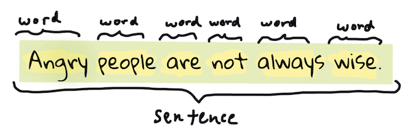

# Tokenization
Probably the first thing most NLP algorithms have to do is to split the text into **tokens**, this is called tokenization. Tokenization is the process of breaking a text into words, phrases, symbols, or other meaningful elements.

<p align="center">
  
  <p align="center">
    <em>Tokenizing a sentence from <strong>Pride and Prejudice</strong>. Infographic by <a href="https://twitter.com/jenlooper">Jen Looper</a></em>
</p>

You've probably built some tokenizers yourself, even if you didn't realize it. For example, if you've ever used the `split` method in Python, you've tokenized a string. However, tokenization is **not** always as simple as splitting a string by spaces. For example, in the sentence "Good muffins cost $3.88 in New York.  Please buy me... two of them.\n\nThanks.", the ellipsis ("..."), the dollar sign ("$"), and the newline characters ("\n") are all tokens that should be separated from the words.

Luckily, there are many libraries that provide tokenization methods that can handle these edge cases. Natural Language Toolkit (`nltk`) library provides a `word_tokenize` method that can handle these edge cases. Here's an example of how to use it:

```python
# pip install nltk to install nltk 

from nltk.tokenize import word_tokenize
text = "Good muffins cost $3.88\nin New York.  Please buy me... two of them.\n\nThanks."
tokens = word_tokenize(text)
print(tokens)
```
This code will output:

```
['Good', 'muffins', 'cost', '$', '3.88', 'in', 'New', 'York', '.', 'Please', 'buy', 'me', '...', 'two', 'of', 'them', '.', 'Thanks', '.']
```

The library [spaCy](https://spacy.io/usage/spacy-101) also provides a tokenizer that can handle these edge cases. Here's an example of how to use it:

```python
# pip install spacy # to install the spacy 
# spacy download en_core_web_sm # to download the english model

import spacy
nlp = spacy.load("en_core_web_sm")
doc = nlp("Good muffins cost $3.88\nin New York.  Please buy me... two of them.\n\nThanks.")
tokens = [token.text for token in doc]
print(tokens)
```
This code will output:

```
['Good', 'muffins', 'cost', '$', '3.88', '\n', 'in', 'New', 'York', '.', ' ', 'Please', 'buy', 'me', '...', 'two', 'of', 'them', '.', '\n\n', 'Thanks', '.']
```

The `sent_tokenize` method in `nltk` and `spaCy` can be used to tokenize sentences. Here's an example of how to use it in `nltk`:

```python
from nltk.tokenize import sent_tokenize
text = "Good muffins cost $3.88\nin New York.  Please buy me... two of them.\n\nThanks."
sentences = sent_tokenize(text)
print(sentences)
```
This code will output:

```
['Good muffins cost $3.88\nin New York.', 'Please buy me... two of them.', 'Thanks.']
```

And here's an example of how to use it in `spaCy`:

```python
import spacy
nlp = spacy.load("en_core_web_sm")
doc = nlp("Good muffins cost $3.88\nin New York.  Please buy me... two of them.\n\nThanks.")
sentences = [sent.text for sent in doc.sents]
print(sentences)
```
This code will output:

```
['Good muffins cost $3.88\nin New York.', 'Please buy me... two of them.', 'Thanks.']
```

Keras also provides a tokenizer that can be used to tokenize text. Here's an example of how to use it:

```python
from keras.preprocessing.text import Tokenizer

# Example text data
texts = [
    "This is an example sentence.",
    "Another example sentence to tokenize."
]

# Initialize tokenizer
tokenizer = Tokenizer()

# Fit tokenizer on texts
tokenizer.fit_on_texts(texts)

# Convert texts to sequences of tokens
sequences = tokenizer.texts_to_sequences(texts)

# Print tokenized sequences
print("Tokenized sequences:")
for seq in sequences:
    print(seq)
```
The output of this code will be:

```
Tokenized sequences:
[3, 4, 5, 1, 2]
[6, 1, 2, 7, 8]
```
This code initializes a Keras Tokenizer, fits it on the example texts, and then converts the texts into sequences of tokens. Additionally, it builds a word index that can be used to convert tokens back into words. Finally, it prints the tokenized sequences.

Here's an example of how to use the word index to convert tokens back into words:

```python
# Convert tokens back into words
print("Words:")
word_index = tokenizer.word_index
for seq in sequences:
    words = [list(word_index.keys())[list(word_index.values()).index(word_id)] for word_id in seq]
    print(" ".join(words))
```

### Different Tokenization Approaches
Besides the word and sentence tokenization, there are other tokenization approaches that are used in NLP, such as:
- **Subword Tokenization**: This approach splits words into smaller units, such as characters or subwords. This is useful for languages like Turkish, where words can be very long and complex. It is also useful for languages like English, where words can be combined to form new words, such as "unbelievable" and "incredible".

- **Byte Pair Encoding (BPE)**: This is a subword tokenization approach that is used in many NLP models such as GPT-2 and GPT-3. It is based on the frequency of pairs of characters in a corpus of text. 

- **WordPiece Tokenization**: This is a subword tokenization approach that is used in many NLP models, such as BERT. It is based on the frequency of words in a corpus of text. It is useful for languages like English, where words can be combined to form new words, such as "unbelievable" and "incredible".

- **Character Tokenization**: This approach splits words into characters. This is useful for languages like Chinese, where there are no spaces between words.

- And more...

## N-grams
N-grams are sequences of n words. For example, "I am" is a 2-gram (or bigram), "I am learning" is a 3-gram (or trigram), and "I am learning NLP" is a 4-gram (or 4-gram). N-grams are used in many NLP tasks, such as language modeling, machine translation, and text generation.

<p align="center">
  
  <p align="center">
    <em>N-grams. Infographic by <a href="https://twitter.com/jenlooper">Jen Looper</a></em>
</p>

We can consider that N-grams are sequences of the tokens we generated in the tokenization process. For example, if we have the sentence "I am learning NLP", the 2-grams (or bigrams) would be "I am", "am learning", and "learning NLP". The 3-grams (or trigrams) would be "I am learning" and "am learning NLP". And the 4-grams would be "I am learning NLP".

You can use the `ngrams` method in the `nltk` library to generate n-grams. Here's an example of how to use it:

```python
import nltk
from nltk.util import ngrams

# Example sentence
sentence = "The quick brown fox jumps over the lazy dog."

nltk.download("punkt")

# Tokenize the sentence
tokens = nltk.word_tokenize(sentence)

# Generate n-grams
n = 2  # Example for bigrams
bigrams = list(ngrams(tokens, n))

# Print the bigrams
print("Bigrams:", bigrams)
```
This code will output:

```
[nltk_data] Downloading package punkt to /root/nltk_data...
[nltk_data]   Unzipping tokenizers/punkt.zip.

Bigrams: [('The', 'quick'), ('quick', 'brown'), ('brown', 'fox'), ('fox', 'jumps'), ('jumps', 'over'), ('over', 'the'), ('the', 'lazy'), ('lazy', 'dog'), ('dog', '.')]
```

N-grams play pivotal roles across various NLP tasks, including language modeling, machine translation, and text generation. Moreover, they are integral components within numerous NLP models, exemplified by GPT-2 and BERT.

## Part-of-Speech Tagging
Every word that has been tokenized can be tagged as a part of speech - a noun, verb, or adjective. The sentence "the quick red fox jumped over the lazy brown dog" might be POS tagged as fox = noun, jumped = verb.

<p align="center">
  
  <p align="center">
    <em>POS tagging a sentence from <strong>Pride and Prejudice</strong>. Infographic by <a href="https://twitter.com/jenlooper">Jen Looper</a></em>
</p>

In information retrieval and search engines, part-of-speech tagging (POS tagging) helps in improving search engine results by understanding the context of search queries. For example, distinguishing between nouns and verbs can help prioritize search results based on the user's intent. It could also be used in other NLP tasks, such as named entity recognition, text classification, and sentiment analysis.

You can use the `pos_tag` method in the `nltk` library to POS tag a sentence. Here's an example of how to use it:

```python
import nltk
from nltk.tokenize import word_tokenize

# Sample sentence
sentence = "The quick brown fox jumps over the lazy dog."

# Tokenize the sentence
tokens = word_tokenize(sentence)

# Perform POS tagging
pos_tags = nltk.pos_tag(tokens)

# Print the POS tags
print("POS tags:")
print(pos_tags)
```


## Named Entity Recognition
Named Entity Recognition (NER) is the process of identifying and classifying named entities in a text. Named entities are real-world objects such as persons, locations, organizations, dates, and more. NER is a fundamental task in information extraction and text analysis, and it is used in a wide range of applications such as question answering, information retrieval, and machine translation.

NER can be used to extract structured information from unstructured text data. For example, in the sentence "Apple is headquartered in Cupertino, California", NER can be used to identify "Apple" as an organization and "Cupertino, California" as a location.

Example:

```python
import nltk

# Sample text
text = """
Barack Obama was born in Hawaii. He served as the 44th President of the United States from 2009 to 2017.
"""

# Tokenize the text into sentences
sentences = nltk.sent_tokenize(text)

# Tokenize each sentence into words and perform part-of-speech tagging
tagged_sentences = [nltk.pos_tag(nltk.word_tokenize(sentence)) for sentence in sentences]

# Perform named entity recognition (NER)
named_entities = nltk.ne_chunk_sents(tagged_sentences, binary=False)

# Function to extract named entities from the named entity chunk tree
def extract_entities(tree):
    entities = []
    if hasattr(tree, 'label') and tree.label():
        if tree.label() == 'NE':
            entities.append(' '.join([child[0] for child in tree]))
        else:
            for child in tree:
                entities.extend(extract_entities(child))
    return entities

# Extract named entities from each chunk tree
named_entities_list = []
for tree in named_entities:
    for entity in extract_entities(tree):
        named_entities_list.append(entity)

# Print named entities
print("Named Entities:")
for entity in named_entities_list:
    print(entity)
```


## Text Segmentation
Before we tokenize a text, specifically a long text, we might need to segment it into paragraphs, sections, or other meaningful units. This is called text segmentation. 

> Text segmentation is the process of dividing a text into meaningful units, such as paragraphs, sections, or chapters.

This process could be as simple as splitting a text by newline characters or as complex as using machine learning algorithms to identify the boundaries of paragraphs or sections. It's important to note that n`ltk and `spaCy` do not provide built-in methods for segmenting text into paragraphs or sections.

## Exercises
Open a python file in your local dev environment, install the required libraries,  and complete the following exercises.
- **Exercise 1**: Tokenize the following sentence using the `word_tokenize` method in `nltk`: "Welcome to your professional community"

- **Exercise 2**: Tokenize the following sentence using the spaCy tokenizer: "Welcome to your professional community"

- **Exercise 3**: Generate bigrams for the following sentence: "While spaCy can be used to power conversational applications, it’s not designed specifically for chat bots, and only provides the underlying text processing capabilities.".

