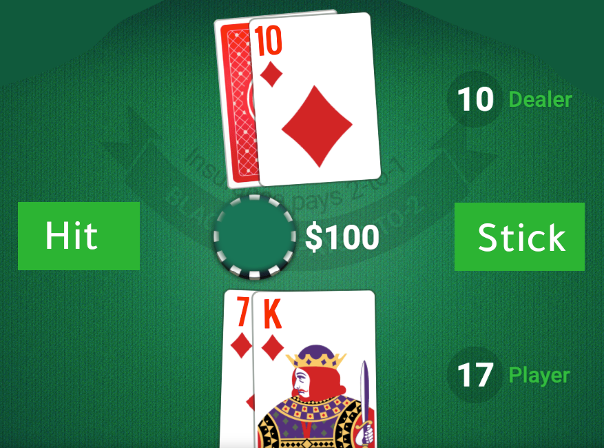

# MDP Exercise
## Blackjack
Blackjack is a card game where the goal is to beat the dealer by obtaining cards that sum closer to 21 (without going over 21) than the dealer's cards. The game starts with the dealer having one face up and one face down card, while the player has two face up cards. All cards are drawn from an infinite deck.

The card values are:
- Face cards (Jack, Queen, King) have a point value of 10.
- Aces can either count as 11, which is referred to as a 'usable ace', or as 1, depending on which value benefits the player's hand more.
- Numerical cards (2-10) have a value equal to their number. 

The player has the sum of cards held. The player can request additional cards (**hit**) until they decide to stop (**stick**) or exceed 21 (**bust**, immediate loss).

After the player sticks, the dealer reveals their facedown card, and draws cards. If the dealer goes bust, the player wins.

If neither the player nor the dealer busts, the outcome (win, lose, draw) is decided by whose sum is closer to 21.

If you are not familiar with Blackjack, I would suggest to look at the following rules of Blackjack and try a few games [online](https://games.washingtonpost.com/games/blackjack).

## Questions:
#### 1. What are the states and the actions for this MDP?
#### 2. Give an example of a possible reward and a possible transition probability.

### ⚠️ Please try to solve the exercise before looking at the solution. This is important for your learning.

Click here for hints

- In a certain point in time during the game, what states we have in terms of the score of the players. What about winning?. Look at this screenshot from a blackjack game:

 - What are are the available actions for the user to take?

Click here to see the solution

### Q1 : 
- **Sates**:
    - Each state has the player's current total hand value, the dealer's visible card value, and whether the player has a usable Ace or not.
    - The state space includes all valid combinations like: (7,14,False), (5,7,True). Each tuple represents the player's current sum, the dealer's facing card value, and whether or not the player has a usable Ace.
    - The possible values for the player's current sum range from 4 to 21. The minimum sum of 4 assumes scenarios where the lowest cards are drawn, like two 2s, and does not account for the flexibility of the Ace being used as 1 or 11. The dealer's facing card value can be any value from 1 to 10. The player's usable Ace can be either True or False. 
    - The "bust" state is an extra state that happens when the player's total exceeds 21 (for example, the user has the cards 5 and 10, then draws another card whose value is 10. This will make a total of 25 (bust)).

- **Actions**: The actions available to a player in our model of Blackjack are typically "Hit" and "Stick"

### Q2 :
- The **reward structure** in Blackjack is:
    - Winning a hand in Blackjack results in a reward equal to the bet placed. For simplicity, we can make a reward of `1` for the winning state.
    - Losing a hand results in losing the bet. For simplicity, we can make a reward of `-1` for the losing state.
    - A draw results in a reward of `0` (no change in the player's money (the bet is returned)).

- The **transition function** in Blackjack defines the probability of moving to state s' after taking an action a. For example, the probability of reaching the state (17, 8, False) from the state (10, 8, False), when a hit action is taken, is modeled like this: `P(s' = (17, 8, False) | s = (10, 8, False), a = 'hit') = 0.077`. This probability assumes a reshuffled or effectively infinite deck where the likelihood of drawing a 7, with 8 such cards in a 104-card deck, remains constant.
