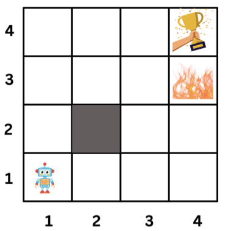
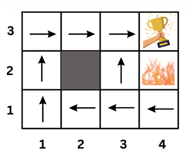
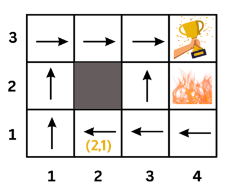
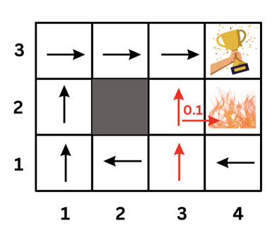
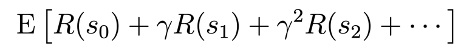
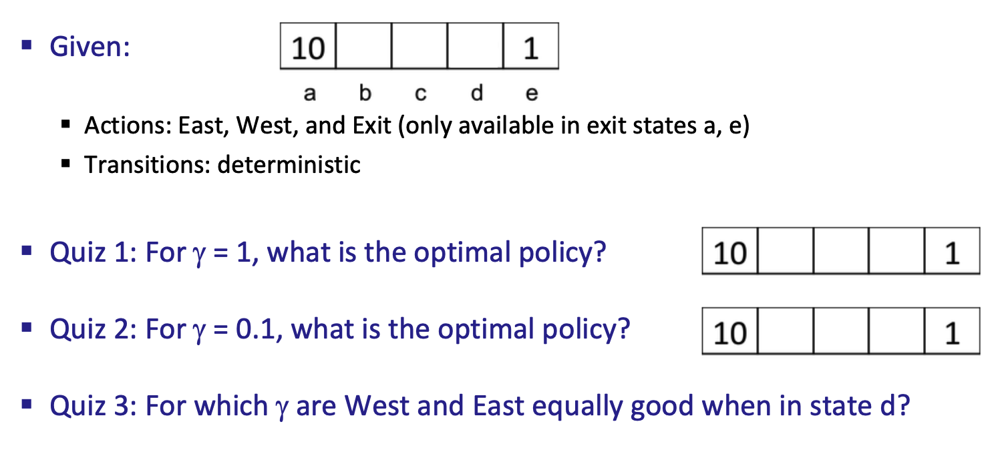
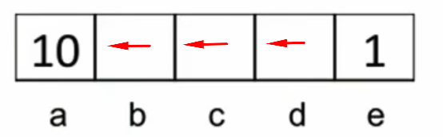
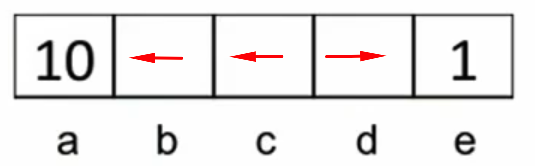

# Markov Decision Processes
Now that we have learned about the Reinforcement Learning (RL) framework, let's discuss how we can formulate a problem as an RL problem using the Markov Decision Process (MDP) formalism.

Markov Decision Processes (MDPs) provide a mathematical framework for modeling decision making in situations where outcomes are partly random and partly under the control of a decision maker. 

The word "**Markov**" in MDP refers to the fact that the future can be determined only from the present state (i.e., the future is independent of the past).

A Markov decision process formalism consists of the following elements:

- **A set of states s ∈ S**: The different states the agent/world can be in. For example, in autonomous helicopter flight, the states might be the set of all possible positions and orientations of the helicopter. In a simple grid world, the states might be the set of all possible positions (cells) of the robot.

- **A set of actions (A)**: The set of actions the agent can take. For example, the set of all possible directions in
which you can push the helicopter’s control sticks or move the robot in the grid world (`up`, `down`, `left`, `right`).

- **A reward function R:** The reward function is a function of the state. It returns the reward value of being in a state `s`. The notation for the reward function is `R(s)`, `R(s,a)`, or R`(s,a,s')`. `s'` is the state you reach after taking an action a while being in a state `s`.

- **A transition probability model Pa(s,s'):** 
 is the probability of reaching the next state `s'` (pronounced s-prime) if we take action `a` while being in state `s`. Sometimes, the transition probability model is notated as `P(s'|s,a)` or `T(s,a, s')`. You can think of it as **the model of the world.** 

    In the helicopter flight example, if the helicopter is in state `s` and we push the control sticks in a certain direction, the helicopter will move in that direction **with some probability** as the helicopter might be affected by the wind.

    If a robot is moving in a simple grid world, being in a certain position/cell let's say cell `1,2` and you want to move it to position `2,2`. The world grid model might tell us that each action you take has an `0.8` probability of being executed successfully. So, when we direct the robot to move up, the robot might move up with a probability of `0.8`, move right with a probability of `0.1`, or move left with a probability of `0.1`.

## Simple Grid World Example 
To explain the MDP formalism, let's consider a simple MDP. The agent is in a grid world and can move up, down, left, or right. The agent receives a reward of `-0.2` for each step and a reward of `10` for reaching the goal. The agent receives a reward of `-5` for reaching the cliff. The agent can't move outside the grid world and can't move into the wall. 

What are the elements of the MDP for this grid world?

- **States** are the 15 cells in the grid world. State (2,2) is blocked.
- **Actions** are the four directions the agent can move (up, down, left, right).
- **Transition Probability:** In this example, we will model our world such that the agent will move in the direction it chooses with probability `0.8`. The agent will move in a random direction with probability `0.2`. For example, if the agent chooses to move up, it will move up with probability `0.8` and move left or right with probability `0.1` each. So, the transition probability model is as follows:
    - `P(s' = (1, 2) | s = (1, 1), a = up) = 0.8 `:  Being at state (1, 1) and taking action up, the probability of ending up at state (1, 2) is 0.8.
    - `P(s' = (1, 1) | s = (1, 1), a = up) = 0.1`: Being at state (1, 1) and taking action up, the probability of ending up at state (1, 1) is 0.1.
    - `P(s' = (0, 1) | s = (1, 1), a = up) = 0.1`: Being at state (1, 1) and taking action up, the probability of ending up at state (0, 1) is 0.1.
        
    <aside>These transition probabilities are not fixed for each environment. It is quite common to use data to learn the transition probabilities of the world.</aside>

- **Reward Function**: To incentivize the robot to reach the goal cell, 
we will put a `+10` reward there. Also, to discourage the robot from falling 
off the cliff, we will put a `-5` reward there. The robot will receive
 a `-0.2` reward for each step. `R(s) =-0.2` 
 for all states except the goal and the cliff. 
 
 The `-0.2` 
  is like charging the robot for each step it takes. 
  The robot should try to minimize the number of steps
   it takes to reach the goal. 
   

## Policy

The goal of the Markov Decision Process is to find a good policy `π` for the decision maker. A policy is a function that maps states to actions (π: S → A). The policy tells the agent what action to take in each state. The goal is to find the policy that maximizes the expected total reward. 

**Optimal Policy**: The optimal policy is the policy that maximizes the expected total reward. 
The optimal policy is denoted by π*. Below is an example of an optimal policy. 

What this policy says is, for example, if the agent is at state `(2,1)`, it should go `left`. That is `π(2,1) = left` 

An interesting position to examine in the previous policy is position `(3,1)`. You might think that the optimal policy is to go `up` because that path is shorter. However, if the agent goes `up`, there is a 0.1 probability that it will end up at the cliff (moving right after moving up). So the safer path is to go `left` and then `up`.

Note that this policy is heavily dependant on the transition probabilities we assumed for our world. If the transition probabilities change, the optimal policy could change too.

> Solving the MDP problem is finding the optimal policy.

## Markov Decision Process (MDP) Videos:
Here are some (optional) videos that explain the same concepts above. If you feel you need more explanation, you can watch them.
- [Markov Decision Process (MDP) - States ](https://www.youtube.com/watch?v=Jk2V9yA82YU)
- [Markov Decision Process (MDP) - Actions](https://www.youtube.com/watch?v=BxIG76-C37k)
- [Markov Decision Process (MDP) - Transition Model](https://www.youtube.com/watch?v=Jw3ZnWFjDfM)
- [Markov Decision Process (MDP) - Reward Function](https://www.youtube.com/watch?v=Jw3ZnWFjDfM)

- [Markov Decision Process (MDP) - Policy](https://www.youtube.com/watch?v=dkBZ9YKuOVA)

## Discount Factor (γ)

Another important concept in MDPs is discounting. It addresses the fact that future rewards are worth less than immediate rewards. It is reasonable for agents to prefer immediate rewards over future rewards and to look forward to maximizing their total reward.

<aside>

**Discounting helps reinforcement learning algorithms to converge faster.**
</aside>

In MDPs, we use a discount factor `γ` (gamma) to discount future rewards. It is a value between 0 and 1 and it **decays** after each step.

<aside>
In finance, the discount factor is used to model the fact that money is worth more today than in the future. A 100 dollar today is worth more than a 100 dollar a year from now.
</aside>

Here is a formula that shows how the discount factor is used to calculate the expected total reward:

**E** is the expected total reward the agent will receive if it starts at state `s0`.

**Note** that we don't discount the immediate reward `R(s0)`. We discount the future rewards by multiplying them by multiples of `γ`. the discount factor value decays after each step by multiplying the future rewards by multiples of `γ`: `γ`, `γ^2`, `γ^3`, `γ^4`, and so on. 

Example:
- If we have a sequence of rewards: `r0 = 1`, `r1 = 2`, and `r2 = 3`, what is the expected total utility of this sequence of rewards if: 
    1. No discounting is used? 
    2. If  `γ = 0.5`? 

Click here to see the answer

1. If no discounting is used, the expected total utility is `1 + 2 + 3 = 6`.

2. If `γ = 0.5`, the expected total utility is `1 + 2*0.5 + 3*0.5^2 = 2.75`.

## Discounting Quiz:
In the image below, we have 5 states: a, b, c, d, and e. The reward function is `R(s) = 0` for all states except `a` and `e`. `R(a) = 10` and `R(e) = 1`. You can move `right` or `left`. 

You can also `exit` from state `a` or `e`. The environment is deterministic (transition probability is 1). Answer the questions below.

Reference: Berkeley CS188 Intro to AI

* Your answer should be in the form of a policy. For example, if you are at state `b`, you should move `left`. If you are at state `c`, you should move `right` etc. Think about the total reward you will get at each state taking into account the discount factor `Y`.

Click here to see the answers

Q1: For Y = 1 (No Discounting):

- If I'm at state `a`, I will `exit` and get reward of 10.
- If I'm at state `b`, I will move `left` because the sum of rewards is 10 (0+10).
- If I'm at state `c`, I will move `left` because the sum of rewards is 10 (0+0+10).
- If I'm at state `d`, I will move `left` because the sum of rewards is 10 (0+0+0+10).
- If I'm at state `e`, and have the option to move `left` or exit, I will move left because the sum of rewards is 10.
quiz-policy1.png

Q2: For Y = 0.1:

- If I'm at state `a`, I will exit and get reward of 10.

- If I'm at state `b`, I will move left because the sum of discounted rewards is 1 (0+0.1 * 10). If I move right, the sum of discounted rewards is 0.001 (0.1^0*1).

- If I'm at state `c`, I will move left because the sum of rewards is 0.1 (0+0.1*0+0.1^2 * 10). If I move right, the sum of rewards is 0.001 (0+0.1 * 0+0.1^2 * 0+0.1^3 * 10).

- If I'm at state `d`, I will move `right` because the sum of rewards is 0.1 (0+0.1). If I move left, the sum of rewards is 0.001 (0+0.1 * 0+0.1^2 * 0+0.1^3 * 10).

        
Q3: Solving the linear equation 0*Y+ 0*Y^2 + 10Y^3 = 1*Y, we get **Y = 0.316.**

# Summary:
- Markov Decision Processes (MDPs) provide a mathematical framework for modeling decision making in situations where outcomes are partly random and partly under the control of a decision maker.
- The word "Markov" in MDP refers to the fact that the future can be determined only from the present state (i.e., the future is independent of the past).
- A Markov decision process formalism consists of the following elements: a set of states **S**, a set of actions **A**, a reward function **R**, and a transition probability model **P**.
- The goal of the Markov Decision Process is to find a good policy π for the decision maker. A policy is a function that maps states to actions (π: S → A). The policy tells the agent what action to take in each state. The goal is to find the policy that maximizes the expected total reward.
- The optimal policy is the policy that maximizes the expected total reward. The optimal policy is denoted by π*.
- The discount factor is a value between 0 and 1 and it decays after each step. It is used to model the fact that the future rewards are worth less than its value due to the delay in receiving them.

