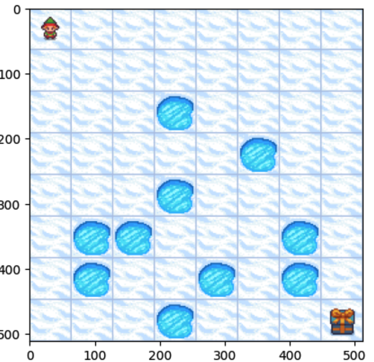

# Value Iteration Frozen Lake Example

    

To understand the application of the policy iteration algorithm in the Frozen Lake environment, please follow this Colab notebook. It provides step-by-step instructions and interactive exercises that demonstrate the algorithm's implementation.
 

