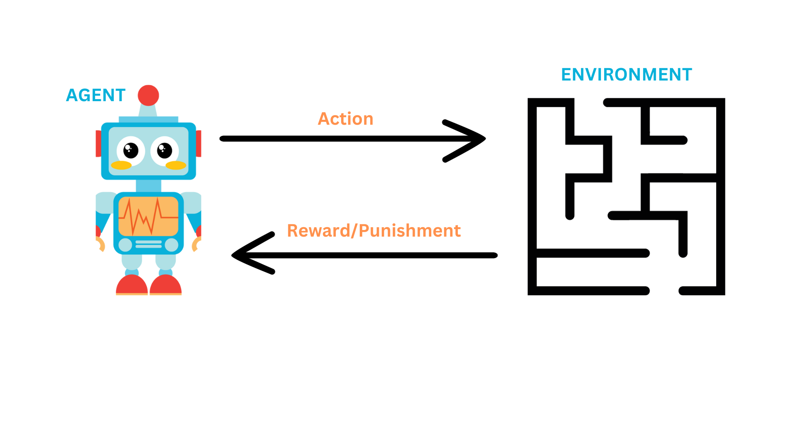
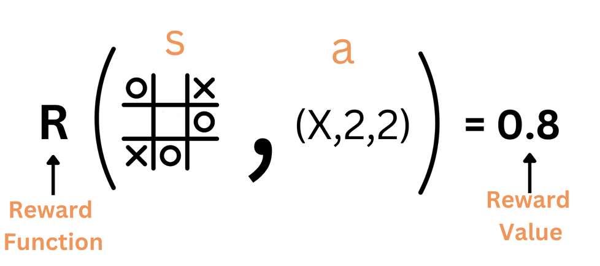
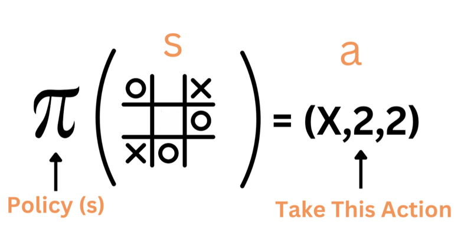

# Reinforcement Learning Framework

## Agent-Environment Interaction
In reinforcement learning, the agent takes an action and the environment responds by giving the agent a **reward**. The reward can be positive or negative. The machine learns to take the actions that maximize the reward. 


### Robot Navigating Maze Example
Let's say we have a robot that is navigating a maze. The robot is the agent and the maze is the environment. 
The robot takes an action, such as moving forward, and keeps moving forward until it reaches a terminal state. Once the robot reaches a terminal state, the robot gets a reward. The reward can be positive or negative. The robot repeats this process, typically many times, until it learns to take the right actions that maximize the reward.

Wait, isn't this the same as search algorithms? It's close, but not quite.

- In reinforcement learning, we have states in which the agent can be in. However, the full state of the environment is not observable. The agent does not know what state it is in. It just takes an action and goes to a new state.
- The environment is non-deterministic. If you take an action `𝑎`, it is not guaranteed that this action will lead to the expected result. For example, if a robot takes the left action, it might, with a certain probability, move to the right.
- As in search, we have actions that the agent can take. The agent takes an action and goes to a new state. 
- There is no planning ahead. The agent does not keep track or search for the best path to take. It just takes an action and goes to a new state, hopefully, the state that leads to a positive reward at the end.
- The goal in search is to find a sequence of actions. The goal in reinforcement learning is to learn the optimal policy. The policy is a function that maps a state to an action. 


> You can think of reinforcement learning as a generalization of search problems where the agent does not know what actions to take until it tries them. 


# Tic-Tac-Toe as a RL problem
We addressed the tic-tac-toe problem before in our discussion of adversarial search. If you want to solve the tic-tac-toe problem using reinforcement learning, here is how you can do it:

## States
The states are all possible board configurations. An example of a state is shown below:

```
        | X |   | O |
s   =   | O | X |   |
        | X |   |   |
```
## Actions
The actions are the possible moves. An example of an action is `(x, 3, 3)`  which means that the agent places an X in the (3,3) cell.

## Reward
Given a state `s` and an action `a`, the reward is a function `R` that returns the expected reward of taking action `a` while being in state `s`.

Examples of rewards are:
- R(s, a) = `0.4`
- R(s, a) = `-0.2`

<p align="left">

</p>

This is **not** known to the agent in advance. The agent has to learn the reward function by itself. 

<!--
## Value Function
The value function `V(s)` is another important element in reinforcement learning. A value function is a function that estimates the expected cumulative future rewards an agent can obtain from a given state or state-action pair. 

-->

## Policy
The policy `π` is a function that maps a state to an action. Being in state `s`, what action should the agent take? After figuring out the reward function, the agent can solve an optimization problem to find the optimal policy. The optimal policy is the policy that maximizes the reward.

<p align="left">

</p>

So the policy is our solution to the problem. The policy is a function, or a look-up table, that maps a state to an action.

## Timing 
Because actions are taken in a sequence, we represent the timing of the actions by adding a time index `t` to the state `s` and action `a`. For example, the state `s` at time `t` is `s`<sub>`t`</sub>. The action `a` at time `t` is `a`<sub>`t`</sub>.

So the states are `s0, s1, s2, ...` and the actions are `a0, a1, a2, ...`.

The goal of reinforcement learning is to design a policy `π` that, given a state `s`<sub>`t`</sub>, tell us what actions to take to maximize the reward.


### Putting it all together. 

Watch the video below (~10 minutes) to reiterate and better understand the concepts we discussed above.


<iframe width="100%" height="450" src="https://www.youtube.com/embed/0MNVhXEX9to?si=3ZkFYEPzFTcvdAp8&amp;start=215&end=751" title="YouTube video player" frameborder="0" allow="accelerometer; autoplay; clipboard-write; encrypted-media; gyroscope; picture-in-picture; web-share" allowfullscreen></iframe>

The concepts of the **Value Function** and the **Discount Factor** explained in the video will be discussed in more detail in the next section.

## Summary
- Reinforcement learning is a type of machine learning that enables an agent to learn in an interactive environment by trial and error using feedback from its own actions and experiences.

- Reinforcement learning framework consists of the following key elements:
    - Agent
    - Environment
    - States
    - Actions
    - Reward Function
    - Policy
    - Value Function

- The goal of the reinforcement learning agent is to maximize the expected total reward it receives by learning a policy `π(s)` that maps states to actions.


