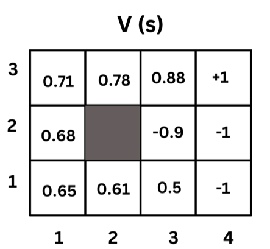
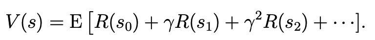
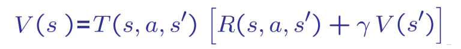
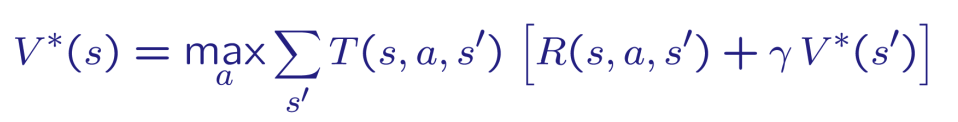
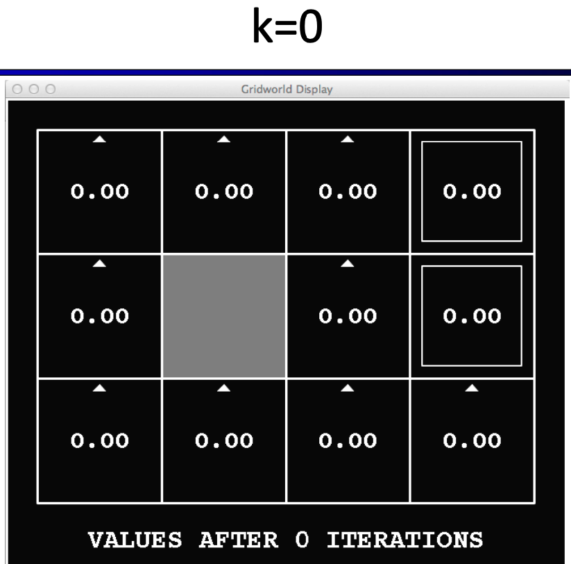
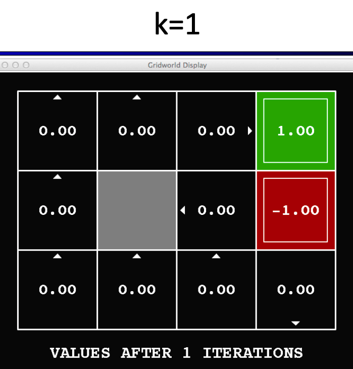
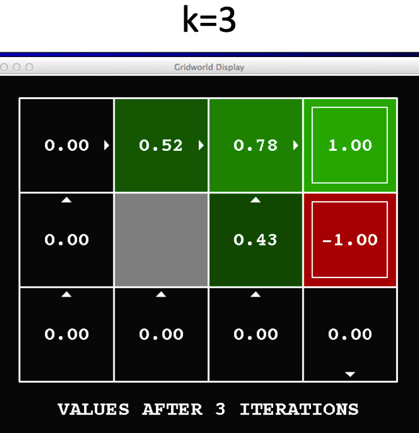
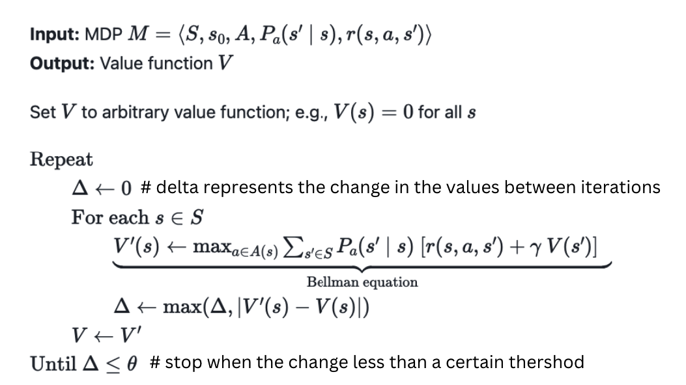
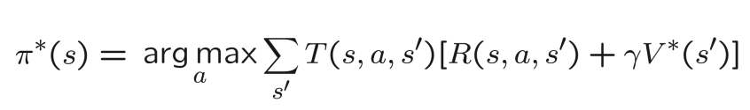

# Solving MDPs
Now that we have defined the MDP formalism, we can use it to solve reinforcement learning problems. The goal of the reinforcement learning agent is to maximize the expected total reward it receives by learning a policy `π(s)` that maps states to actions. So, given an MDP, how do we find the optimal policy? This is what we will learn in this lesson.

<aside class="aside-note" markdown="1">
Solving an MDP involves finding the optimal policy π* that maximizes the expected total reward.
</aside>

## Policy 
Recall that a policy is a function (π) that maps from the states to the actions. We say that we are executing some policy `π` if, whenever we are in state `s`, we take action `a = π(s)`. 


In our previous grid world example, an example of a policy is shown below:

```
π((1, 1)) = up
π((1, 2)) = up
π((1, 3)) = right
π((2, 1)) = left
π((2, 3)) = right
π((3, 1)) = left
π((3, 2)) = left
...
```
Thus, at any given state, the policy directs us on which action to take.

In a simple 4x4 grid world, there are 16 states and 4 actions per state. This results in 
4<sub>16</sub> , which is over 4 billion possible policies.

# Value Iteration Algorithm
There are different algorithms that can be used to find the optimal policy (solving MDPs). The algorithm we will use in this lesson is called **value iteration**. 

**Value iteration** is a dynamic programming algorithm that computes the optimal state value function by iteratively improving the estimate of a value function `V(s)`. 

But, what is the value function `V(s)`? Let's find out.

## Value Function V(s):
The value function `V(s)` tells us the expected total payoff (rewards) upon starting in a state `s`. These values are not known in advance. We have to learn them, as we will see later.

The **optimal value function** `V*(s)` is the maximum value function over all possible policies. If we can solve for the optimal value function `V*(s)`, we can find the optimal policy `π*` which is the policy that maximizes the value function `V*(s)`.

Here is an image that shows a sample value function output of each state:
<p align="left">

</p>


### Calculating the Values of the States
The value of each state is the expected total payoff (rewards) upon starting in that state. That is the immediate reward being at this state plus the discounted future rewards of the next states. 

<p align="center">

</p>

Which is equivalent to the general form using `s` and `s'` as follows:
V(s) = E [ R(s) + γ * V(s')]


That means the value function of state `s` is the immediate reward `R(s)` plus the value function value of the next state `s' taking into account **the probability of reaching that state**. So we can use the following formula to express that:



Where: T(s, a, s') is the probability of reaching state `s'` from state `s` taking action `a`.

In fact, we can reach different states from the same state `s` by taking different actions. So, we sum over all possible states `s'` that we can reach from state `s`. Then, to get the optimal value function, we take the maximum value of all possible actions.




Now, you might want to read the previous section again! It's a bit confusing at first, but it will make sense as we go.

If you feel you need more explanation, you can watch this video that explains the value function and the value iteration algorithm in detail:

**Stop at time 49:00**


[](https://youtu.be/d5gaWTo6kDM?si=99R4BkgZ4PVcaAtH&t=327)


### Example:
Assume that a robot in a 4x4 grid world and the transition probabilities are as follows:
- Each action has a 0.8 probability of moving in the intended direction and a 0.2 probability of moving in each of the other directions.
- The discount factor `γ` is 0.9
- The immediate reward `R(s)` is `0` for all states except the cup state which has a reward of `1` and the fire state which has a reward of `-1`.

Given the above information, we can calculate the value function of each state using the Bellman equation as follows:

V(s) = R(s) + γ * Σ<sub>s'</sub> P<sub>ss'</sub> * V(s')

Initially, the value function of each state is zero. Then, we take steps to update the values using the Bellman equation. So, V<sub>0</sub>(s) = 0 for all s.
<p align="left">

</p>


Then, starting from V<sub>1</sub>(s), we can calculate the value function of each state using the Bellman equation. For example, let's calculate the value function of state (1,1):

**State (1,1):**

We have 2 possible actions: `up` and `right`. If we take the `up` action, we have a `0.8` probability of moving to state (1,2) and `0.1` probability of moving to each of the other states. 

**V(s=(1,1), a="up")** = `0 + 0.9 * (0.8 * V(s=(1,2)) + 0.1 * V(s=(1,1)) + 0.1 * V(s=(2,1))) = 0` because the current values of V(s=(1,2)) and V(s=(2,1)) are zero.

Same for the `right` action:

**V(s=(1,1), a="right")** = `0 + 0.9 * (0.8 * V(s=(2,1)) + 0.1 * V(s=(1,1)) + 0.1 * V(s=(1,2))) = 0` because the current values of V(s=(1,2)) and V(s=(2,1)) are zero.


In this iteration, V1, most of the other states will have a value of zero as well. Let's calculate the value function of state (3,3):

**V(s=(3,3), a="terminate")** = `1 + 0.9 * (0.8 * 0 + 0.1 * 0 + 0.1 * 0) = 1`

After 1 iteration, the value function of each state is updated as follows:
<p align="left">

</p>

Note the arrows in the image above. For each state, we calculate the value function of **each action and take the maximum value**. For example, the value function of state (1,1) is the maximum value of the value function of the `up` action and the value function of the `right` action.

Doing the same calculations for the next iteration, we will end up with the following value function for V3(s):
<p align="left">

</p>


### When do we stop? 
We stop when the value function converges to a stable value. That is, when the value function of each state does not change much between iterations or we exceed a maximum number of iterations we set.

### Value Iteration Algorithm
Now The value iteration algorithm should be clear. We start with an initial estimate of the value function `V(s)` and iteratively update the estimate of the value function `V(s)` until it converges to the optimal value function `V*(s)`. We stop when the change in the value function is less than a threshold or we exceed a maximum number of iterations we set.

<p align="center">

</p>


## Optimal Policy
Now that we have the optimal value function `V*(s)`, we can find the optimal policy `π*`. Recall that the optimal policy returns the action that maximizes the expected total reward and we know from the previous equation which action maximizes the expected total reward. So basically, we can find the action that maximizes the expected total reward and use it as the optimal policy.

<p align="center">

</p>

