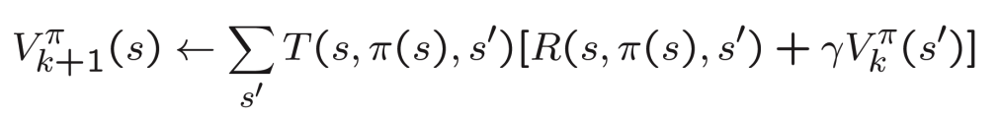

# Policy Iteration
Another common method for solving MDPs is policy iteration. Policy iteration operates as follows:

1. **Initialize a policy arbitrarily**. That means, for each state, we have to choose an action randomly. 

    An example of a random policy in a grid world could be:
    ```
    policy = {
        (1, 1): 'up',
        (1, 2): 'up',
        (1, 3): 'Right',
        (2, 1): 'up',
        (2, 2): 'Right',
        (2, 3): 'up',
        (3, 1): 'up'
        (3, 2): 'Right'
        (3, 3): 'up'
    }
    ```
    This is totally arbitrary. We can choose any policy we want.

2. **Policy Evaluation**: Given a policy π, calculate the value function V<super>π<super> for the policy π. To do this, we will do the following:

- For each state, we calculate the value function using the following formula:
    <p align="center">
      
    </p>

    `k` is the number of steps we take. This means that, after taking k+1 steps, the value of the state s is the sum of the immediate reward and the discounted value of the next state. That's close to the value iteration algorithm we have seen before except that, **we are not taking the action that maximizes the expected value** of the next state, but we are following the policy `π`. So, the immediate reward is `R(s, π(s), s')` which is the reward I get taking the action defined by `π(s)` in state `s` and reaching state `s'`. The discounted value of the next state is also calculated using the value function of the next state folowing the policy `π`.

    The input to the value function is the policy π. The output is the value function V<super>π<super> for the policy π. This is a system of linear equations that can be solved using linear algebra.

3. **Policy Improvement**: from the current state values we have from step1, consider all actions and choose the action that maximizes the expected values of the next states. This is the same as doing one iteration of the value iteration algorithm.

4. **Policy Iteration**: Repeat steps 2 and 3 until the policy converges.


## Value Iteration vs Policy Iteration

For small MDPs (i.e. few hundred states), policy iteration is often very fast and converges with very few iterations. However, for MDPs with large state spaces (i.e. 10 thousands or more), solving for Vπ explicitly would involve solving a large system of linear equations, and could be difficult. In these problems, value iteration may be preferred. For this reason, in practice value iteration seems to be used more often than policy iteration. 


If you feel you need more explanation, you can watch this video that explains the value function and the value iteration algorithm in detail:

**You may stop at time 58:15**

[](https://youtu.be/d5gaWTo6kDM?si=99R4BkgZ4PVcaAtH&t=3021)


## Solving Mini-Blackjack using Policy Iteration

<iframe width="100%" height="450" src="https://www.youtube.com/embed/W1SeLDiL3fg?si=peQoW-W62FppszJM&amp;start=1055&end=1369" title="YouTube video player" frameborder="0" allow="accelerometer; autoplay; clipboard-write; encrypted-media; gyroscope; picture-in-picture; web-share" allowfullscreen></iframe>


