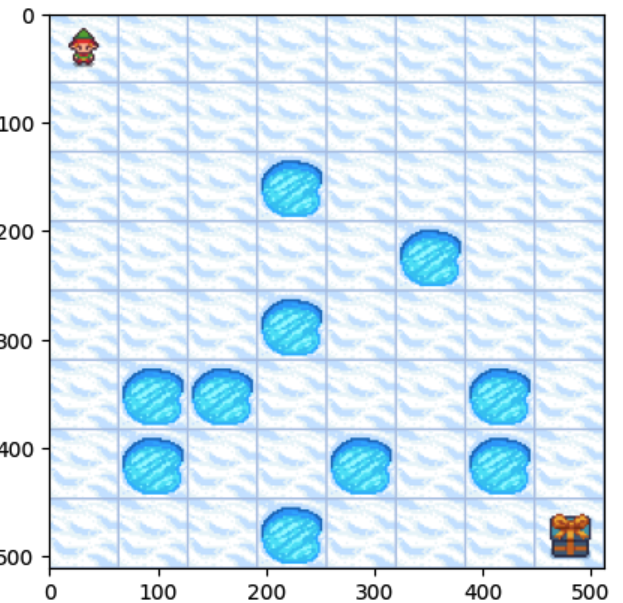

# Value Iteration Frozen Lake Example

<p align="center">
    
</p>


Gymnasium is an open source Python library for developing and comparing reinforcement learning algorithms. It provides a family of environments for testing reinforcement learning algorithms. Commonly used environments include the Frozen Lake environment, the CartPole environment, Blackjack environment, and the Mountain Car environment.

Each environment has an observation space and an action space. The observation space is the set of all possible states in the environment. The action space is the set of all possible actions that an agent can take in the environment.

##  Introduction to Gymnasium and Frozen Lake environment
Gymnasium is an open source Python library for developing and comparing reinforcement learning algorithms by providing a standard API to communicate between learning algorithms and environments. It is a fork of OpenAI's Gym library by its maintainers.


This practice lesson consists of two parts. The first part is a brief introduction to the Gymnasium library and the Frozen Lake environment. The second part is a demonstration of the value iteration algorithm on the Frozen Lake environment.

### Part 1: Introduction to Gymnasium and Frozen Lake environment
Follow this colab notebook to learn about the Gymnasium library and the Frozen Lake environment. The notebook includes a brief introduction to the Gymnasium library and the Frozen Lake environment.

</br>

<a href = "https://colab.research.google.com/drive/1EUJHhnUaQEEneJrCHZdx3d7T3U1zD7tC#offline=true&sandboxMode=true" target="_blank" >

</a>

### Quiz
After you have completed the Colab notebook, answer the following questions:

1. How do you show the states and actions for the Frozen Lake environment?
2. What does the variable `env.unwrapped.P` represent in an environment?
3. **[True/False]** In the Frozen Lake environment, where the action `0` means moving to the left, if the agent is in state `2,2` and takes action `0`, the agent will certainly move to state `1,2`.


<Details>
<Summary>Click here for the answers</Summary>
1. You can show the states and actions for the Frozen Lake environment using the following code:

```python
print(env.observation_space)
print(env.action_space)
```
2. The variable `env.unwrapped.P` represents the transition probabilities of the environment. It is a dictionary where the keys are the states, and the values are the possible actions and the next states with the corresponding probabilities.

3. False. The transition probabilities are not deterministic. The agent may move to state `1,2` with certain probability (0.33 in this case).

</Details>

### Part 2: Value Iteration on Frozen Lake environment
Follow this colab notebook to learn about the value iteration algorithm and how to apply it to the Frozen Lake environment.

</br>

<a href = "https://colab.research.google.com/drive/1b5fED_S8Rjdf54rwFqJFZkye-JvXGXaD#offline=true&sandboxMode=true" target="_blank" >

</a>


